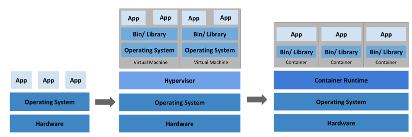
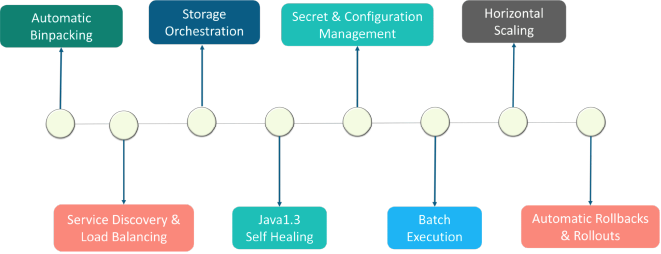
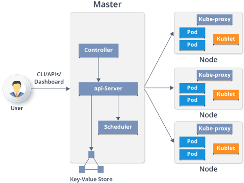

# K8S，必知必会

1.  Docker 和容器技术：在学习 Kubernetes 之前，你需要了解 Docker 和容器技术。Docker 是一种流行的容器化平台，它允许你将应用程序和服务打包成轻量级的容器。学习 Docker 将帮助你理解 Kubernetes 的基本概念和工作原理。
    
2.  Linux 基础知识：Kubernetes 运行在 Linux 上，因此你需要熟悉 Linux 的基本知识和命令行工具，如文件和目录管理、用户和权限管理、进程管理等。
    
3.  Kubernetes 架构和核心组件：Kubernetes 由多个组件组成，包括 Master 和 Node 节点、API Server、Controller Manager、Scheduler、etcd 等。学习这些组件的功能和相互关系是理解 Kubernetes 的关键。
    
4.  Kubernetes 应用部署和管理：学习如何使用 Kubernetes 部署和管理应用程序，包括创建 Pod、Deployment、Service 和 Ingress 等对象，并了解它们的作用和使用方法。
    
5.  Kubernetes 网络和存储：了解 Kubernetes 中的网络和存储概念，如 Service、Ingress、PersistentVolume 和 PersistentVolumeClaim 等。掌握这些概念可以帮助你在 Kubernetes 中创建可靠和高可用的应用程序。
    
6.  Kubernetes 安全：学习如何在 Kubernetes 中实现安全性，包括使用 RBAC（基于角色的访问控制）、Secret、NetworkPolicy 等功能。
    
7.  Kubernetes 调试和故障排除：了解 Kubernetes 中的调试和故障排除技术，如 kubectl 命令行工具、日志记录、事件和指标等，可以帮助你快速诊断和解决问题。


## 1. 历史变迁





- Automatic Binpacking 自动装箱

- Service Discovery & LB 服务发现与负载

- storage orchestration 存储协调

  - Rook

    - Rook是一款面向Kubernetes的开源云本地存储协调器，为多种存储解决方案提供平台、框架和支持，从而与云本地环境进行本地集成。

      Rook将存储软件转变为自管理、自伸缩和自修复的存储服务。它通过自动化部署、引导、配置、供应、伸缩、升级、迁移、灾难恢复、监视和资源管理来实现这一点。Rook使用底层云本地容器管理、调度和编排平台提供的功能来执行其职责。

- **Self healing 自我修复**

  Kubernetes的自修复特性，确保集群始终以最佳状态运行。Kubernetes可以自我检测两种类型的对象——podstatus和containerstatus。Kubernetes的编排功能，可以根据所需的配置监视和替换不健康的容器。同样，Kubernetes可以修复pod。

    - **pod的阶段、探测和重启策略**
      - 在Kubernetes中的pod阶段提供了对pod位置的洞察。我们可以有
        - Pending Pods——创建但不运行
        - Running Pods——运行所有的容器
        - Succeeded Pods——成功完成容器生命周期
        - Failed Pods——至少一个容器失效，所有容器终止
        - Unknown Pods
      - Kubernetes对pod执行了liveliness和readiness探测，以检查它们是否按照期望的状态工作。
        - liveliness探测器将检查容器的运行状态。如果一个容器探测失败，Kubernetes将终止它，并根据重启策略创建一个新的容器。
        - readiness探测器将检查容器的服务请求服务功能。如果容器探测失败，Kubernetes将删除相关pod的IP地址。
        - 探测包括
          - ExecAction——在容器中执行命令。
          - TCPSocketAction——实现TCP检查，指向一个容器的IP地址。
          - HTTPGetAction——实现一个HTTPGet检查，指向一个容器的IP地址。
        - 每个探测给出三个结果之一：
          - Success：容器通过了诊断。
          - Failure：容器诊断失败。
          - Unknown：诊断失败，所以不应该采取行动。

    Kubernetes可以自愈应用程序和容器，但是当节点有问题时，如何自愈呢？为了让Kubernetes继续自我修复，它需要一组专用的基础设施，可以随时访问自修复节点。基础设施必须由自动化驱动，并由预测分析提供支持，以便预先修复问题。底线是，在任何给定的时间点，基础设施节点应该维护不间断服务所需的数量。

- Secret & Configuration Management  密钥与配置管理

- Batch Execution 批处理

  - There are three main types of task suitable to run as a Job:
    - Non-parallel Jobs
    - Parallel Jobs with a *fixed completion count*
    - Parallel Jobs with a *work queue*

- Horizontal Scaling 水平扩展

- Automatic Rollbacks & Rollouts  自动回滚&发布





## 2. 架构





- **Master**
  - Api-Server
    - 集群的管理总线和数据中心（etcd）
  - Scheduler
    - 任务调度
  - Control Manager
    - 资源管理
    - Deployment
    - rc
    - rs
    - ns
    - endpoint
  - KV 存储
    - 数据存储
- **Node**
  - Kubelet
    - etcd
  - Kube-poxy
    - 资源管理
    - ns
    - endpoint
  - Container runtime
    - Docker,containerd,CRI-O
    - 符合k8s CRI (Container Runtime Interface)
- k8s 不直接管理容器，管理pod.
- scheduler -> api server -> 存储信息，指令，数据 在etc -> kubelet 扫描 etcd 获取相关指令，扫描相关请求 -> 发现请求 -> 执行在node请求


- CRI（Container Runtime Interface）：容器运行时接口，提供计算资源
- CNI（Container Network Interface）：容器网络接口，提供网络资源
- CSI（Container Storage Interface）：容器存储接口，提供存储资源


## 3. 基本概念和原理

### 核心概念定义

1. **容器（Container）**：容器是一种轻量级的虚拟化技术，它可以在一个容器内运行应用程序及其依赖项。容器可以帮助开发人员和运维人员更轻松地将应用程序部署到不同的环境中。容器使用Linux命名空间和cgroups等技术实现隔离。

2. **Pod**：Pod是Kubernetes中的最小调度单元，它是一个或多个容器的组合。Pod具有独立的IP地址和存储卷，可以共享存储和网络资源。Pod可以在Kubernetes中自动部署、扩展和管理。Pod中的容器共享网络命名空间，可以通过localhost相互通信。

3. **控制器（Controller）**：控制器是Kubernetes中的一种资源对象，用于管理Pod和其他Kubernetes对象的状态。控制器通过控制循环持续监控实际状态，并将其调整为期望状态。例如，Deployment控制器可以自动创建、扩展和缩小Pod的数量，以确保应用程序的高可用性。

4. **Service**：Service是一种Kubernetes对象，用于将一组Pod组合成一个服务。Service提供了一个稳定的DNS名称和IP地址，使得其他应用程序可以轻松地访问这个服务。Service还提供了负载均衡和服务发现的功能，实现了前端和后端的解耦。

5. **节点（Node）**：节点是Kubernetes集群中的一个工作机器，它可以运行一个或多个Pod。Kubernetes可以运行在各种不同的云提供商和硬件环境中。Kubernetes可以在节点之间自动调度Pod，以确保应用程序的高可用性和负载均衡。

6. **API Server**：API Server是Kubernetes集群中的中心组件，它负责管理和控制Kubernetes中的所有资源对象。API Server还提供了一组REST API，以供用户和其他组件进行交互。所有组件都通过API Server进行通信。

7. **etcd**：etcd是Kubernetes中的一种高可用性键值存储系统，它用于存储和管理Kubernetes中的所有配置数据和状态信息。etcd基于Raft算法实现一致性，可以在Kubernetes集群中提供数据的一致性和可靠性。

8. **Scheduler（调度器）**：Scheduler是Kubernetes控制平面的核心组件，负责将Pod调度到节点上。调度器会考虑资源需求、节点约束、亲和性规则等因素，选择最适合的节点。

9. **Controller Manager（控制器管理器）**：Controller Manager是Kubernetes控制平面的核心组件，负责管理和控制Kubernetes中的所有控制器对象，如Deployment、StatefulSet、DaemonSet等。它运行多个控制器进程，维护集群的期望状态。

### Label和Selector（标签和选择器）

**Label（标签）定义**：Label是附加到Kubernetes对象（如Pod、Service等）上的键值对，用于组织和选择对象的子集。

**Label的作用**：
- 标识对象的属性（如环境、版本、组件等）
- 用于对象的选择和过滤
- 支持多标签组合查询

**Selector（选择器）定义**：Selector用于根据Label选择匹配的对象。Kubernetes支持两种类型的选择器：
- **基于等式的选择器**：使用`=`、`==`、`!=`操作符
- **基于集合的选择器**：使用`in`、`notin`、`exists`操作符

**使用场景**：
- Service通过Selector选择后端Pod
- ReplicaSet通过Selector管理Pod
- Deployment通过Selector管理ReplicaSet

### 3.1 Pod

**Pod定义**：Pod是Kubernetes中最小的可部署和可管理的计算单元。Pod是一组一个或多个容器的集合，这些容器共享存储、网络资源，以及如何运行容器的规范。

**核心特性**：
- Pod是Kubernetes中的最小调度单元
- Pod中的容器总是被共同调度，共同运行在同一个节点上
- Pod中的容器共享网络命名空间和存储卷
- Pod是临时的、可替换的实体

**Pod的组成**：
- 一系列服务（容器）
- 共享的存储卷（Volumes）
- 网络命名空间（共享IP地址和端口）
- 容器运行规范（镜像、命令、环境变量等）

**Pod的共享上下文**：一个Pod的共享上下文是Linux namespace、cgroups和其它潜在隔离内容的集合。在Pod中，容器共享一个IP地址和端口空间，它们可以通过localhost发现彼此。

  - Pod 的上下文可以理解成 **多个** linux namespace 的联合：
    - PID namespace（同一个Pod中应用可以看到其它进程）
    - 网络 namespace（同一个Pod的中的应用对相同的IP地址和端口有权限）
    - IPC namespace（同一个Pod中的应用可以通过VPC或者POSIX进行通信）
    - UTS namespace（同一个Pod中的应用共享一个主机名称）

- 网络

  - 每一个Pod都会被指派一个唯一的Ip地址，在Pod中的每一个容器共享网络命名空间，包括Ip地址和网络端口。在同一个Pod中的容器可以同localhost进行互相通信。当Pod中的容器需要与Pod外的实体进行通信时，则需要通过端口等共享的网络资源。
    - 在同一个Pod中的容器，可以使用System V 或POSIX信号进行标准的进程间通信和共享内存。
    - 在不同Pod中的容器，拥有不同的IP地址，因此不能够直接在进程间进行通信。容器间通常使用Pod IP地址进行通信。

- 存储

  - Pod能够被指定共享存储卷的集合，在Pod中所有的容器能够访问共享存储卷，允许这些容器共享数据。存储卷也允许在一个Pod持久化数据，以防止其中的容器需要被重启。

- Pod是一个临时的实体，它有着自己的生命周期。在Pod被创建时，会被指派一个唯一的ID，并被调度到Node中，直到Pod被终止或删除。如果Pod所在的Node宕机，给定的Pod（即通过UID定义）不会被重新调度。相反，它将被完全相同的Pod所替代。

  - 例如存储卷，是说和Pod存在的时间一样长。如果Pod被删除，即使完全相同的副本被创建，则相关存储卷等也会被删除，并会Pod创建一个新的存储卷等。Pod本身就没有打算作为持久化的实体，在调度失败、Node失败和获取其它退出（缺少资源或者Node在维护）情况下，Pod都会被删除。

- 一般来说，用户不应该直接创建Pod，即是创建单个的Pod也应该通过控制器创建。在集群范围内，控制器为Pod提供自愈能力，以及副本和部署管理。

  - 如果Pod所在的Node失败，或者如果调度操作本身失败，则Pod将会被删除；

  

### 3.2 Pod控制器

**Controller（控制器）定义**：控制器是Kubernetes中的控制循环，它通过API Server监控集群的共享状态，并尝试将当前状态转变为期望的状态。

**控制器的工作原理**：
1. **声明式API**：用户声明期望状态（Desired State）
2. **控制循环**：控制器持续监控实际状态（Actual State）
3. **状态协调**：当实际状态与期望状态不一致时，控制器执行操作使其一致
4. **自愈能力**：自动处理Pod失败、节点故障等情况

**控制器的功能**：
- 通过Pod模板创建和管理多个Pod
- 在集群范围内处理副本数量
- 提供部署和滚动更新能力
- 提供自愈能力（自动重启失败的Pod）
- 处理节点故障时的Pod迁移

**常见的控制器类型**：
- Deployment：管理无状态应用
- StatefulSet：管理有状态应用
- DaemonSet：确保所有节点运行Pod副本
- ReplicaSet：维护Pod副本数量
- Job：运行一次性任务
- CronJob：运行定时任务

#### 3.2.1 [Deployment](https://kubernetes.io/docs/concepts/workloads/controllers/deployment/)

**Deployment定义**：Deployment是Kubernetes中用于管理无状态应用的工作负载资源，它提供了声明式的更新机制，用于管理Pod和ReplicaSet。

**核心特性**：
- **声明式更新**：提供声明式更新机制，描述期望状态，Deployment控制器以受控速率将实际状态转变为期望状态
- **ReplicaSet管理**：可以定义Deployment来创建新的ReplicaSet，或删除现有Deployment并采用其所有资源
- **自动管理**：自动管理ReplicaSet，用户不应直接管理Deployment拥有的ReplicaSet

**重要说明**：不要直接管理由Deployment拥有的ReplicaSet。Deployment会自动管理这些ReplicaSet。

##### Use Case

The following are typical use cases for Deployments:

- [Create a Deployment to rollout a ReplicaSet](https://kubernetes.io/docs/concepts/workloads/controllers/deployment/#creating-a-deployment). The ReplicaSet creates Pods in the background. Check the status of the rollout to see if it succeeds or not.

- [Declare the new state of the Pods](https://kubernetes.io/docs/concepts/workloads/controllers/deployment/#updating-a-deployment) by updating the PodTemplateSpec of the Deployment. A new ReplicaSet is created and the Deployment manages moving the Pods from the old ReplicaSet to the new one at a controlled rate. Each new ReplicaSet updates the revision of the Deployment.

- [Rollback to an earlier Deployment revision](https://kubernetes.io/docs/concepts/workloads/controllers/deployment/#rolling-back-a-deployment) if the current state of the Deployment is not stable. Each rollback updates the revision of the Deployment.

- [Scale up the Deployment to facilitate more load](https://kubernetes.io/docs/concepts/workloads/controllers/deployment/#scaling-a-deployment).

- [Pause the Deployment](https://kubernetes.io/docs/concepts/workloads/controllers/deployment/#pausing-and-resuming-a-deployment) to apply multiple fixes to its PodTemplateSpec and then resume it to start a new rollout.

- [Use the status of the Deployment](https://kubernetes.io/docs/concepts/workloads/controllers/deployment/#deployment-status) as an indicator that a rollout has stuck.

- [Clean up older ReplicaSets](https://kubernetes.io/docs/concepts/workloads/controllers/deployment/#clean-up-policy) that you don't need anymore.

  

**Deployment的工作机制**：
- **创建流程**：新建ReplicaSet，ReplicaSet再新建Pod
- **无状态应用**：适用于无状态应用部署
  - 无实时数据需要存储
  - 将服务抽离集群后，再放置回去，集群服务仍然可用
  - Pod之间可以相互替换

**Deployment的优势**：
- **ReplicaSet的高级封装**：在ReplicaSet基础上提供更强大的功能
- **滚动更新（Rolling Update）**：支持零停机时间的滚动更新
  - **工作原理**：逐步用新版本Pod替换旧版本Pod
    - 创建新版本的ReplicaSet
    - 逐步增加新版本Pod数量，同时减少旧版本Pod数量
    - 确保在更新过程中始终有足够的Pod提供服务
  - **更新策略**：
    - `maxSurge`：可以超过期望副本数的最大Pod数量（默认25%）
    - `maxUnavailable`：更新过程中不可用的最大Pod数量（默认25%）
  - **优势**：
    - 零停机时间
    - 可以随时暂停和恢复更新
    - 支持自动回滚
- **水平扩展/收缩（Scaling）**：可以轻松增加或减少Pod副本数量
- **自动回滚**：支持自动回滚到之前的版本

**标签和选择器**：
- **只认标签，不认owner**：Deployment通过标签选择器管理Pod，不关心Pod的所有者
- **最佳实践**：裸Pod最好不要设置与Deployment匹配的标签，避免被意外管理

**弹性扩容**：
- **HPA（Horizontal Pod Autoscaler）**：水平Pod自动扩展
  - 基于CPU和内存使用率自动调整副本数
  - 支持自定义指标（如请求数、队列长度等）
  - 可以设置最小和最大副本数

  

#### 3.2.2 [StatefulSet](https://kubernetes.io/docs/concepts/workloads/controllers/statefulset/)

**StatefulSet定义**：StatefulSet是Kubernetes中用于管理有状态应用的工作负载资源，它为Pod提供稳定的网络标识和持久化存储。

**有状态应用特性**：
- **有状态更新**：适用于有状态应用
  - 有实时数据需要存储
  - 将服务抽离集群后，再放置回去，集群服务可能不可用（因为状态丢失）
  - Pod之间不能随意替换

**StatefulSet的核心特性**：
- **稳定的网络标识**：
  - 每个Pod都有稳定的主机名：`<statefulset-name>-<ordinal>`
  - 新建ReplicaSet，新建Pod，但hostname保持不变
  - 通过Pod中的hostname来关联实时状态数据
- **持久化存储**：
  - 持久化数据依靠PVC（PersistentVolumeClaim）文件系统
  - 每个Pod都有独立的存储卷
  - Pod删除重建后，数据仍然保留
- **有序管理**：
  - **有序启动**：Pod按顺序启动（0, 1, 2...）
  - **有序销毁**：Pod按逆序销毁（2, 1, 0...）
  - 确保有状态应用的正确初始化顺序
- **稳定的标识**：
  - 维护有状态的Pod的网络、标识、存储
  - Pod的标识在重启和迁移后保持不变

**使用场景**：
- 数据库（MySQL、PostgreSQL等）
- 消息队列（RabbitMQ、Kafka等）
- 分布式存储系统
- 需要稳定网络标识和持久化存储的应用

#### 3.2.3 [DaemonSet](https://kubernetes.io/docs/concepts/workloads/controllers/daemonset/)

- 确保所有（或部分）节点运行指定的pod副本
- 一般用于守护进程，如日志收集、监控、存储

*DaemonSet* 确保全部（或者一些）Node 上运行一个 Pod 的副本。当有 Node 加入集群时，也会为他们新增一个 Pod 。当有 Node 从集群移除时，这些 Pod 也会被回收。删除 DaemonSet 将会删除它创建的所有 Pod。

使用 DaemonSet 的一些典型用法：

- 运行集群存储 daemon，例如在每个 Node 上运行 `glusterd`、`ceph`。
- 在每个 Node 上运行日志收集 daemon，例如`fluentd`、`logstash`。
- 在每个 Node 上运行监控 daemon，例如 Prometheus Node Exporter、`collectd`、Datadog 代理、New Relic 代理，或 Ganglia `gmond`。


一个简单的用法是，在所有的 Node 上都存在一个 DaemonSet，将被作为每种类型的 daemon 使用。 一个稍微复杂的用法可能是，对单独的每种类型的 daemon 使用多个 DaemonSet，但具有不同的标志，和/或对不同硬件类型具有不同的内存、CPU要求。

#### 3.2.4 ReplicaSet（副本控制器）

**ReplicaSet定义**：ReplicaSet是Kubernetes中的控制器，用于维护一组稳定的Pod副本集合。它确保指定数量的Pod副本始终在运行。

**核心功能**：
- **副本管理**：控制副本数量与预设的一致
- **Pod模板**：自带Pod的创建模板，根据目标Pod配置去创建、更新、销毁Pod
- **标签选择器**：通过Selector选中管理Pod
- **多标签支持**：支持基于多个标签选择Pod（多选）

**与Deployment的关系**：
- Deployment内部使用ReplicaSet来管理Pod
- 建议直接使用Deployments，而不是直接使用ReplicaSet
- Deployment提供了滚动更新、回滚等高级功能

**使用场景**：
- 需要确保指定数量的Pod始终运行
- 作为Deployment的底层实现
- 简单的副本管理需求

#### 3.2.5 ReplicaController（已弃用）

**ReplicaController定义**：ReplicaController是Kubernetes早期版本的副本控制器，功能与ReplicaSet类似，但功能更有限。

**与ReplicaSet的区别**：
- **标签选择器**：ReplicaController只支持基于等式的标签选择器（单选），而ReplicaSet支持基于集合的选择器（多选）
- **功能限制**：ReplicaController功能较少，不支持复杂的标签匹配
- **推荐使用**：新版Kubernetes推荐使用ReplicaSet替代ReplicaController

**状态**：已弃用，建议使用ReplicaSet或Deployment


### 3.3 Pod模板

**Pod模板（Pod Template）定义**：Pod模板是一个被包含在其他对象（例如：Deployment、StatefulSet、DaemonSet等）中的Pod规格定义。控制器使用Pod模板来创建实际的Pod实例。

**Pod模板的作用**：
- 定义Pod的规格（镜像、命令、环境变量、资源限制等）
- 控制器根据模板创建和管理Pod
- 修改模板会触发Pod的更新

**包含Pod模板的资源**：
- Deployment：使用Pod模板创建ReplicaSet，ReplicaSet再创建Pod
- StatefulSet：直接使用Pod模板创建有状态的Pod
- DaemonSet：使用Pod模板在每个节点上创建Pod
- Job：使用Pod模板创建一次性任务Pod
- CronJob：使用Pod模板创建定时任务Pod

#### 重启策略

- 通过`restartPolicy`字段设置重启策略：
  - Always：只要退出就会重启。
  - OnFailure：只有在失败退出（exit code不等于0）时，才会重启。
  - Never：只要退出，就不再重启
- 注意，这里的重启是指在Pod的宿主Node上进行本地重启，而不是调度到其它Node上。

#### 镜像拉取策略

- 通过`imagePullPolicy`字段设置镜像的拉取策略：
  - Always：不管本地是否存在镜像都会进行一次拉取。
  - Never：不管本地是否存在镜像都不会进行拉取。
  - IfNotPresent：仅在本地镜像不存在时，才会进行镜像拉取。
- 注意：
  - 镜像拉取策略的默认值为IfNotPresent，但:latest标签的镜像默认为Always。
  - 拉取镜像时docker会进行校验，如果镜像中的MD5码没有变，则不会拉取镜像数据。
  - 生产环境中应该尽量避免使用:latest标签，而开发环境中可以借助:latest标签自动拉取最新的镜像。


#### 私钥镜像仓库

- 在使用私有镜像拉取镜像时，需要为私有镜像仓库创建一个docker registry secret，并在创建容器中进行引用。

- 通过kubectl create secret docker-registry命令创建docker registry secret：

```bash
    $ kubectl create secret docker-registry regsecret --docker-server=<your-registry-server> \
    --docker-username=<your-name> --docker-password=<your-pword> --docker-email=<your-email>
    ```


#### 资源限制和请求

**资源管理定义**：Kubernetes使用资源限制（Limits）和资源请求（Requests）来管理容器的CPU和内存资源。

**资源限制（Resources Limits）**：
- 容器的资源限制通过`resources.limits`进行设置
- **CPU限制**：`spec.containers[].resources.limits.cpu`
  - 容器的CPU资源上限
  - 可以短暂超过，容器也不会被停止
  - 单位：可以是核心数（如`1`）或毫核（如`1000m`）
- **内存限制**：`spec.containers[].resources.limits.memory`
  - 容器的内存资源上限
  - **不可以超过**；如果超过，容器可能会被停止（OOMKilled）或调度到其它资源充足的Node上
  - 单位：可以是字节（如`128Mi`、`1Gi`）

**资源请求（Resources Requests）**：
- 资源请求通过`resources.requests`进行设置
- **CPU请求**：`spec.containers[].resources.requests.cpu`
  - 容器的CPU资源请求
  - 可以超过，但会影响调度决策
- **内存请求**：`spec.containers[].resources.requests.memory`
  - 容器的内存资源请求
  - 可以超过；但如果超过，容器可能会在Node内存不足时被清理（Evicted）

**调度机制**：
- Kubernetes在进行Pod调度时，Pod的资源请求是最重要的一个指标
- Kubernetes Scheduler会检查Node是否存在足够的资源
- 判断是否能够满足Pod的资源请求，从而决定是否可以运行Pod
- 调度器使用资源请求来确保节点有足够的资源，而不是使用资源限制

**资源配额（Resource Quota）**：
- 可以为命名空间设置资源配额
- 限制命名空间中所有Pod的总资源使用量
- 包括CPU、内存、存储、Pod数量等

**示例**：

```yaml
apiVersion: v1
kind: Pod
spec:
  containers:
  - name: app
    image: nginx
    resources:
      requests:
        memory: "64Mi"
        cpu: "250m"
      limits:
        memory: "128Mi"
        cpu: "500m"
```


### 3.4 健康检查

Kubernetes提供了三种类型的探针（Probe）来检测容器的健康状态：

#### 3.4.1 Liveness Probe（存活探针）

用于检测容器是否正在运行。如果存活探针失败，kubelet会杀死容器，然后根据重启策略进行处理。

- **用途**：检测容器是否处于运行状态
- **失败后果**：容器会被重启
- **适用场景**：检测应用死锁、无限循环等导致应用无响应但仍运行的情况

#### 3.4.2 Readiness Probe（就绪探针）

用于检测容器是否已经准备好接受流量。如果就绪探针失败，端点控制器会从Service的端点中移除该Pod的IP地址。

- **用途**：检测容器是否准备好接受请求
- **失败后果**：Pod会被标记为未就绪，从Service的负载均衡中移除
- **适用场景**：应用启动需要时间，在完全启动前不应接收流量

#### 3.4.3 Startup Probe（启动探针）

用于检测容器内的应用程序是否已经启动。如果提供了启动探针，则所有其他探针都会被禁用，直到启动探针成功为止。

- **用途**：检测容器内的应用是否已启动
- **失败后果**：如果启动探针失败，kubelet会杀死容器，并根据重启策略进行处理
- **适用场景**：启动时间较长的应用，避免在启动过程中被存活探针杀死

#### 3.4.4 探针的三种实现方式

1. **ExecAction**：在容器内执行指定命令。如果命令退出时返回码为0，则认为诊断成功。

```yaml
livenessProbe:
  exec:
    command:
    - cat
    - /tmp/healthy
  initialDelaySeconds: 5
  periodSeconds: 5
```

2. **TCPSocketAction**：对容器的IP地址上的指定端口执行TCP检查。如果端口打开，则诊断被认为是成功的。

```yaml
livenessProbe:
  tcpSocket:
    port: 8080
  initialDelaySeconds: 15
  periodSeconds: 20
```

3. **HTTPGetAction**：对容器的IP地址上指定端口和路径执行HTTP GET请求。如果响应的状态码大于等于200且小于400，则诊断被认为是成功的。

```yaml
livenessProbe:
  httpGet:
    path: /healthz
    port: 8080
    httpHeaders:
    - name: Custom-Header
      value: Awesome
  initialDelaySeconds: 3
  periodSeconds: 3
```

#### 3.4.5 探针参数

- `initialDelaySeconds`：容器启动后等待多少秒后开始第一次探测（默认值：0）
- `periodSeconds`：执行探测的时间间隔（默认值：10秒）
- `timeoutSeconds`：探测超时时间（默认值：1秒）
- `successThreshold`：探测失败后，最少连续探测成功多少次才被认定为成功（默认值：1）
- `failureThreshold`：探测成功后，最少连续探测失败多少次才被认定为失败（默认值：3）

### 3.8 初始化容器

在一个POD中，可以运行多个容器，同时它也可以拥有有一个或多个初始化容器，**初始化容器**在**应用程序容器**启动之前运行。

- 初始化容器与普通容器完全一样，只是：
  - 它们总是完全执行
  - 每一个初始化容器都必须在下一个初始化开始之前成功完成

- 如果Pod中的初始化容器失败，Kubernetes将会重复重启Pod，直到初始化容器成功执行。
  - 然而，如果Pod的重启策略为`Never`，则Pod不会重启。
- 初始化容器支持应用程序容器的所有字段和特性，包括资源限制、存储卷和安全设置等
- 初始化容器不支持健康检测探针，因为，它们必须在POD准备好之前完成运行。
- 如果为Pod指定了多个初始化容器，则这些初始化容器将会按顺序依次运行。
  - 每一个都必须在下一个运行之前成功运行。当所有的初始化容器都运行完成时，Kubernetes完成Pod的初始化，并像通常的方式一样运行应用程序容器。

**使用场景**：
- 等待其他服务就绪
- 初始化数据库或配置文件
- 下载依赖或数据

Kubernetes提供了多种机制来控制Pod如何被调度到节点上。

#### 3.5.1 NodeSelector（节点选择器）

最简单的节点选择约束形式。通过给节点添加标签，然后使用nodeSelector字段选择特定标签的节点。

```yaml
apiVersion: v1
kind: Pod
spec:
  nodeSelector:
    disktype: ssd
```

#### 3.5.2 Node Affinity（节点亲和性）

节点亲和性类似于nodeSelector，但提供了更强大的表达能力。

- **requiredDuringSchedulingIgnoredDuringExecution**：硬性要求，必须满足
- **preferredDuringSchedulingIgnoredDuringExecution**：软性要求，优先满足

```yaml
apiVersion: v1
kind: Pod
spec:
  affinity:
    nodeAffinity:
      requiredDuringSchedulingIgnoredDuringExecution:
        nodeSelectorTerms:
        - matchExpressions:
          - key: kubernetes.io/e2e-az-name
            operator: In
            values:
            - e2e-az1
            - e2e-az2
      preferredDuringSchedulingIgnoredDuringExecution:
      - weight: 1
        preference:
          matchExpressions:
          - key: another-node-label-key
            operator: In
            values:
            - another-node-label-value
```

#### 3.5.3 Pod Affinity（Pod亲和性）

允许根据已经在节点上运行的Pod的标签来约束Pod可以调度到哪些节点。

- **Pod Affinity**：倾向于将Pod调度到已经运行了特定Pod的节点上
- **Pod Anti-Affinity**：倾向于将Pod调度到没有运行特定Pod的节点上

```yaml
apiVersion: v1
kind: Pod
spec:
  affinity:
    podAffinity:
      requiredDuringSchedulingIgnoredDuringExecution:
      - labelSelector:
          matchExpressions:
          - key: security
            operator: In
            values:
            - S1
        topologyKey: topology.kubernetes.io/zone
```

#### 3.5.4 Taint和Toleration（污点和容忍）

- **Taint（污点）**：节点上的一个属性，用于排斥某些Pod
- **Toleration（容忍）**：Pod上的一个属性，允许Pod被调度到带有匹配污点的节点上

```bash
# 给节点添加污点
kubectl taint nodes node1 key=value:NoSchedule

# Pod中添加容忍
apiVersion: v1
kind: Pod
spec:
  tolerations:
  - key: "key"
    operator: "Equal"
    value: "value"
    effect: "NoSchedule"
```

**Effect类型**：
- `NoSchedule`：不能容忍此污点的Pod不会被调度到该节点
- `PreferNoSchedule`：尽量不调度，但不是强制的
- `NoExecute`：不能容忍此污点的Pod会被立即驱逐

#### 3.5.5 调度器

Kubernetes调度器是一个控制平面组件，负责将Pod分配到节点上。调度器会考虑以下因素：

- 资源需求和限制
- 硬件/软件/策略约束
- 亲和性和反亲和性规范
- 数据位置
- 工作负载间的干扰
### 3.6 环境变量

在Kubernetes中，通过`env`或`envFrom`字段进行设置。使用`env`或`envFrom`字段设置的环境变量将会覆盖容器镜像中指定的环境变量。

#### 3.6.1 使用env字段

```yaml
apiVersion: v1
kind: Pod
spec:
  containers:
  - name: env-demo
    image: nginx
    env:
    - name: DEMO_GREETING
      value: "Hello from the environment"
    - name: DEMO_FAREWELL
      value: "Such a sweet sorrow"
```

#### 3.6.2 使用envFrom字段

可以从ConfigMap或Secret中批量导入环境变量：

```yaml
apiVersion: v1
kind: Pod
spec:
  containers:
  - name: env-demo
    image: nginx
    envFrom:
    - configMapRef:
        name: config-demo
    - secretRef:
        name: secret-demo
```

#### 3.6.3 使用ConfigMap

ConfigMap用于存储非敏感配置数据，可以通过环境变量、命令行参数或卷的方式注入到Pod中。

**创建ConfigMap**：

```bash
# 从文件创建
kubectl create configmap game-config --from-file=game.properties

# 从字面量创建
kubectl create configmap special-config --from-literal=special.how=very --from-literal=special.type=charm
```

**在Pod中使用**：

```yaml
apiVersion: v1
kind: Pod
spec:
  containers:
  - name: test-container
    image: nginx
    envFrom:
    - configMapRef:
        name: special-config
    # 或者单独引用
    env:
    - name: SPECIAL_LEVEL_KEY
      valueFrom:
        configMapKeyRef:
          name: special-config
          key: special.how
```

#### 3.6.4 使用Secret

Secret用于存储敏感信息，如密码、OAuth令牌和SSH密钥。

**创建Secret**：

```bash
# 从文件创建
kubectl create secret generic db-user-pass --from-file=username=./username.txt --from-file=password=./password.txt

# 从字面量创建
kubectl create secret generic db-user-pass --from-literal=username=admin --from-literal=password='S!B\*d$zDsb='
```

**在Pod中使用**：

```yaml
apiVersion: v1
kind: Pod
spec:
  containers:
  - name: test-container
    image: nginx
    env:
    - name: SECRET_USERNAME
      valueFrom:
        secretKeyRef:
          name: db-user-pass
          key: username
    - name: SECRET_PASSWORD
      valueFrom:
        secretKeyRef:
          name: db-user-pass
          key: password
```

**Secret类型**：
- `Opaque`：用户定义的任意数据
- `kubernetes.io/dockerconfigjson`：Docker镜像仓库的认证信息
- `kubernetes.io/tls`：TLS证书和密钥


### 3.7 启动命令

在配置文件通过设置`command`字段来定义命令，通过设置`args`字段来定义参数。

- 在Pod被创建后，定义的命令和参数将不能被修改。
- 在配置文件中定义的命令和参数会覆盖在容器镜像中定义的命令和参数。

```yaml
apiVersion: v1
kind: Pod
spec:
  containers:
  - name: command-demo
    image: debian
    command: ["printenv"]
    args: ["HOSTNAME", "KUBERNETES_PORT"]
```


### 3.9 Pod的生命周期

Pod的生命周期包括：从Pod被创建、并调度到Node中、以及Pod成功或失败的终止。

Pod的阶段是一个简单的、高层次的Pod所处在生命周期的概述。

在Pod的生命周期中，有如下的几个状态：

- **Pending**：Pod已经被Kubernetes系统接受，但是还有一个或者多个容器镜像未被创建。这包括Pod正在被调度和从网络上下载镜像的时间。
- **Running**：Pod已经被绑定到了一个Node，所有的容器也已经被创建。至少有一个容器已经在运行，或者在启动或者重新启动的过程中。
- **Succeeded**：在Pod中的所有的容器都已经被成功的终止，并且不会再重启。
- **Failed**：在Pod中所有容器都已经被终止，并且至少有一个容器是非正常终止的。即，容器以非零状态退出或者被系统强行终止的。
- **Unknown**：由于某些原因，Pod不能被获取，典型的情况是在与Pod的主机进行通信中发生了失败。

### 3.10 Service


**Service定义**：Service是Kubernetes中用于将运行在一组Pod上的应用程序暴露为网络服务的抽象方式。

**Service的核心功能**：
- **服务抽象**：将运行在一组Pod上的应用暴露为网络服务
- **服务发现**：提供稳定的DNS名称和IP地址，无需修改应用即可使用服务发现机制
- **负载均衡**：在多个Pod之间自动进行负载均衡
- **去耦合**：Service抽象实现了前端和后端的解耦
  - 示例：考虑一个运行3个副本的无状态图像处理后端。这些副本是可互换的——前端不关心使用哪个后端。虽然组成后端集合的实际Pod可能会改变，但前端客户端不需要知道这一点，也不需要自己跟踪后端集合。

**Service的工作原理**：
- **标签选择器（Selector）**：Service通过标签选择器确定目标Pod集合
- **Endpoints**：Service自动维护Endpoints对象，包含匹配的Pod IP地址列表
- **kube-proxy**：在Kubernetes中，每个节点都安装了kube-proxy
  - kube-proxy通过Kubernetes中固有的watch请求方法持续监听API Server
  - 一旦有Service资源发生变动（增删改查），kube-proxy可以及时转化为能够调度到后端Pod节点上的规则
  - 这个规则可以是iptables也可以是ipvs，取决于Service实现方式

**Service的REST对象特性**：
- Service是Kubernetes中的REST对象，类似于Pod
- 可以通过`POST`请求将Service定义提交到API Server来创建新实例
- Service对象的名称必须是有效的DNS标签名称

**Kubernetes三大IP网络**：
- **Node Network（节点网络）**：节点网络地址是配置在节点网络之上
- **Pod Network（Pod网络）**：Pod网络地址是配置在Pod网络之上
  - 节点网络和Pod网络都是配置在某个设备之上，可以是硬件也可以是虚拟网络
- **Cluster Network（Service网络）**：虚拟IP，Service IP没有配置在某个网络接口上，它只是存在于Service的规则当中

#### 3.10.1 VIP 和 Service 代理

在 Kubernetes 集群中，每个 Node 运行一个 `kube-proxy` 进程。`kube-proxy` 负责为 `Service` 实现了一种 VIP（虚拟 IP）的形式，而不是 [`ExternalName`](https://kubernetes.io/zh/docs/concepts/services-networking/service/#externalname) 的形式。


**为什么不使用 DNS 轮询？**


从Kubernetes v1.0开始，您已经可以使用 [用户空间代理模式](https://kubernetes.io/zh/docs/concepts/services-networking/service/#proxy-mode-userspace)。 Kubernetes v1.1添加了 iptables 模式代理，在 Kubernetes v1.2 中，kube-proxy 的 **iptables 模式**成为默认设置。 Kubernetes v1.8添加了 **ipvs 代理模式**


#### 3.10.2 Userspace Proxy Mode（用户空间代理）


- kube-proxy 会监视 Kubernetes master 对 `Service` 对象和 `Endpoints` 对象的添加和移除。

- 对每个 `Service`，它会在本地 Node 上打开一个端口（随机选择）。

- 任何连接到“代理端口”的请求，都会被代理到 `Service` 的backend `Pods` 中的某个上面（如 `Endpoints` 所报告的一样）。

- 使用哪个 backend `Pod`，是 kube-proxy 基于 `SessionAffinity` 来确定的。

- 最后，它配置 iptables 规则，捕获到达该 `Service` 的 `clusterIP`（是虚拟 IP）和 `Port` 的请求，并重定向到代理端口，代理端口再代理请求到 backend `Pod`。

- 默认情况下，用户空间模式下的kube-proxy通过**循环算法**选择后端。

- 默认的策略是，通过 **round-robin （轮询）算法**来选择 backend `Pod`。

- 其它描述：

    - 1、NODE节点的客户端要访问service的代理IP+端口。
        2、IP与端口是由kube-proxy维护的，它创建了IPtables一个规则。
        3、请求经过IPtables后，再转发给kube-proxy端口。
        4、kube-proxy关联后端的backend pod，将请求根据标签代理到指定的Backenpod。

        注：Backend Pod：访问节点IP的指定端口，转发到后端的pod。kubectl get ep 可查看Backend Pod IP。
        注：效率比较低，需要经过一次转发。
        注：kube-proxy是使用的用户空间处理。

#### 3.10.3 iptables 代理模式

这种模式，kube-proxy 会监视 Kubernetes 控制节点对 `Service` 对象和 `Endpoints` 对象的添加和移除。 对每个 `Service`，它会配置 iptables 规则，从而捕获到达该 `Service` 的 `clusterIP` 和端口的请求，进而将请求重定向到 `Service` 的一组 backend 中的某个上面。 对于每个 `Endpoints` 对象，它也会配置 iptables 规则，这个规则会选择一个 backend 组合。

默认的策略是，kube-proxy 在 iptables 模式下随机选择一个 backend。

- 使用 iptables 处理流量具有较低的系统开销，因为流量由 Linux netfilter 处理，而**无需在用户空间和内核空间之间切换**。 这种方法也可能更可靠。

- 如果 kube-proxy 在 iptables 模式下运行，并且所选的第一个 Pod 没有响应，则连接失败。 这与用户空间模式不同：在这种情况下，kube-proxy 将检测到与第一个 Pod 的连接已失败，并会自动使用其他后端 Pod 重试。

- 您可以使用 Pod [readiness 探测器](https://kubernetes.io/docs/concepts/workloads/pods/pod-lifecycle/#container-probes) 验证后端 Pod 可以正常工作，以便 iptables 模式下的 kube-proxy 仅看到测试正常的后端。 这样做意味着您避免将流量通过 kube-proxy 发送到已知已失败的Pod。


在Iptables模式模式下，kube-proxy监视API Server中service和endpoint的变化情况。对于每个service，它都生成相应的iptables规则，这些规则捕获到service的clusterIP和port的流量，并将这些流量随机重定向到service后端Pod。对于每个endpoint对象，它生成选择后端Pod的iptables规则。如果选择的第一个Pod没有响应，kube-proxy将检测到到第一个Pod的连接失败，并将自动重试另一个后端Pod。

**缺点：**

iptables 因为它纯粹是为防火墙而设计的，并且基于内核规则列表，集群数量越多性能越差。

#### 3.10.4 IPVS 代理模式

在 `ipvs` 模式下，kube-proxy监视Kubernetes服务和端点，调用 `netlink` 接口相应地创建 IPVS 规则， 并定期将 IPVS 规则与 Kubernetes 服务和端点同步。 该控制循环可确保　IPVS　状态与所需状态匹配。 访问服务时，IPVS　将流量定向到后端Pod之一。

IPVS代理模式基于类似于 iptables 模式的 netfilter 挂钩函数，但是使用哈希表作为基础数据结构，并且在内核空间中工作。 这意味着，与 iptables 模式下的 kube-proxy 相比，IPVS 模式下的 kube-proxy 重定向通信的延迟要短，并且在同步代理规则时具有更好的性能。与其他代理模式相比，IPVS 模式还支持更高的网络流量吞吐量。

IPVS提供了更多选项来平衡后端Pod的流量。 这些是：

- `rr`: round-robin
- `lc`: least connection (smallest number of open connections)
- `dh`: destination hashing
- `sh`: source hashing
- `sed`: shortest expected delay
- `nq`: never queue

**说明：**

要在 IPVS 模式下运行 kube-proxy，必须在启动 kube-proxy 之前使 IPVS Linux 在节点上可用。

当 kube-proxy 以 IPVS 代理模式启动时，它将验证 IPVS 内核模块是否可用。 如果未检测到 IPVS 内核模块，则 kube-proxy 将退回到以 iptables 代理模式运行。


在这些代理模型中，绑定到服务IP的流量：在客户端不了解Kubernetes或服务或Pod的任何信息的情况下，将Port代理到适当的后端。 如果要确保每次都将来自特定客户端的连接传递到同一Pod，则可以通过将 `service.spec.sessionAffinity` 设置为 "ClientIP" (默认值是 "None")，来基于客户端的IP地址选择会话关联。

您还可以通过适当设置 `service.spec.sessionAffinityConfig.clientIP.timeoutSeconds` 来设置最大会话停留时间。 （默认值为 10800 秒，即 3 小时）。


#### 3.10.5 服务发现

Kubernetes 支持2种基本的服务发现模式 —— 环境变量和 DNS。

##### 环境变量


##### DNS

一个可选（尽管强烈推荐）[集群插件](http://releases.k8s.io/v1.15.11/cluster/addons/README.md) 是 DNS 服务器。 DNS 服务器监视着创建新 `Service` 的 Kubernetes API，从而为每一个 `Service` 创建一组 DNS 记录。 如果整个集群的 DNS 一直被启用，那么所有的 `Pod` 应该能够自动对 `Service` 进行名称解析。

例如，有一个名称为 `"my-service"` 的 `Service`，它在 Kubernetes 集群中名为 `"my-ns"` 的 `Namespace` 中，为 `"my-service.my-ns"` 创建了一条 DNS 记录。 在名称为 `"my-ns"` 的 `Namespace` 中的 `Pod` 应该能够简单地通过名称查询找到 `"my-service"`。 在另一个 `Namespace` 中的 `Pod` 必须限定名称为 `"my-service.my-ns"`。 这些名称查询的结果是 Cluster IP。

Kubernetes 也支持对端口名称的 DNS SRV（Service）记录。 如果名称为 `"my-service.my-ns"` 的 `Service` 有一个名为 `"http"` 的 `TCP` 端口，可以对 `"_http._tcp.my-service.my-ns"` 执行 DNS SRV 查询，得到 `"http"` 的端口号。

Kubernetes DNS 服务器是唯一的一种能够访问 `ExternalName` 类型的 Service 的方式。 更多信息可以查看[DNS Pod 和 Service](https://v1-15.docs.kubernetes.io/docs/concepts/services-networking/dns-pod-service/)。


#### 3.10.6 Headless Service

有时不需要或不想要负载均衡，以及单独的 Service IP。 遇到这种情况，可以通过指定 Cluster IP（`spec.clusterIP`）的值为 `"None"` 来创建 `Headless` Service。

这个选项允许开发人员自由寻找他们自己的方式，从而降低与 Kubernetes 系统的耦合性。 应用仍然可以使用一种自注册的模式和适配器，对其它需要发现机制的系统能够很容易地基于这个 API 来构建。

对这类 `Service` 并不会分配 Cluster IP，kube-proxy 不会处理它们，而且平台也不会为它们进行负载均衡和路由。 DNS 如何实现自动配置，依赖于 `Service` 是否定义了 selector。

##### 配置 Selector

对定义了 selector 的 Headless Service，Endpoint 控制器在 API 中创建了 `Endpoints` 记录，并且修改 DNS 配置返回 A 记录（地址），通过这个地址直接到达 `Service` 的后端 `Pod` 上。

##### 不配置 Selector

对没有定义 selector 的 Headless Service，Endpoint 控制器不会创建 `Endpoints` 记录。 然而 DNS 系统会查找和配置，无论是：

- 通过 `ExternalName` 类型将服务映射到外部服务
- 手动创建 Endpoints 对象来指向外部服务

## 4. 组件

以下是 k8s 中一些核心组件的职责和作用：

1.  API Server：Kubernetes 集群中的中心组件，用于管理和控制 Kubernetes 中的所有资源对象，如 Pod、Service、Deployment 等。API Server 还提供了一组 REST API，以供用户和其他组件进行交互。
    
2.  etcd：Kubernetes 中的一种高可用性键值存储系统，用于存储和管理 Kubernetes 中的所有配置数据和状态信息。etcd 还可以在 Kubernetes 集群中提供数据的一致性和可靠性。
    
3.  Controller Manager：Kubernetes 控制平面的核心组件之一，负责管理和控制 Kubernetes 中的所有控制器对象，如 Deployment、StatefulSet、DaemonSet 等。Controller Manager 还可以监控和调整控制器对象的状态，以确保应用程序的高可用性和健壮性。
    
4.  Scheduler：Kubernetes 控制平面的核心组件之一，负责将 Pod 调度到节点上，以便在 Kubernetes 集群中自动实现负载均衡和高可用性。
    
5.  Kubelet：Kubernetes 中的一个节点代理，负责管理节点上的容器和 Pod。Kubelet 还负责将 Pod 中的容器运行在节点上，并与 API Server 和其他组件进行交互。
    
6.  kube-proxy：Kubernetes 中的网络代理，用于将 Service 中定义的虚拟 IP 地址转发到 Pod 中的实际 IP 地址。kube-proxy 还可以提供网络负载均衡和服务发现的功能。
    
7.  Container Runtime：容器运行时，Kubernetes 支持多种不同的容器运行时，如 Docker、CRI-O、containerd 等，它们负责在节点上运行容器。

### 4.1 Control Plane 组件

#### 4.1.1 kube-apiserver

API Server是Kubernetes控制平面的前端，是Kubernetes API的入口点。

**主要功能**：
- 提供RESTful API，用于与集群交互
- 验证和配置API对象（如Pod、Service等）
- 提供API版本控制、准入控制、认证和授权
- 作为集群的"网关"，所有组件都通过API Server进行通信

**特点**：
- 无状态设计，可以水平扩展
- 支持多种认证方式（证书、Token、Basic Auth等）
- 支持多种授权模式（RBAC、ABAC、Node等）

#### 4.1.2 etcd

etcd是Kubernetes的持久化存储系统，用于存储集群的所有配置数据和状态信息。

**主要功能**：
- 存储集群的配置数据
- 存储所有API对象的状态
- 提供分布式键值存储
- 支持事务和一致性保证

**特点**：
- 基于Raft算法实现高可用
- 支持数据备份和恢复
- 提供Watch机制，支持实时监听数据变化

#### 4.1.3 kube-scheduler

调度器负责将Pod分配到合适的节点上运行。

**主要功能**：
- 监听API Server，获取未调度的Pod
- 根据调度策略选择最适合的节点
- 将Pod绑定到选定的节点

**调度策略考虑因素**：
- 资源需求和限制
- 亲和性和反亲和性规则
- 污点和容忍
- 节点标签和选择器

#### 4.1.4 kube-controller-manager

控制器管理器运行控制器进程，这些控制器负责维护集群的期望状态。

**内置控制器**：
- **Deployment Controller**：管理Deployment对象
- **ReplicaSet Controller**：管理ReplicaSet对象
- **StatefulSet Controller**：管理StatefulSet对象
- **DaemonSet Controller**：管理DaemonSet对象
- **Job Controller**：管理Job对象
- **Namespace Controller**：管理Namespace对象
- **ServiceAccount Controller**：管理ServiceAccount对象
- **Node Controller**：监控节点状态
- **Endpoint Controller**：维护Service和Pod的关联关系

**工作原理**：
- 通过API Server监听资源变化
- 比较期望状态和实际状态
- 执行必要的操作使实际状态达到期望状态

#### 4.1.5 cloud-controller-manager

云控制器管理器允许将云提供商的特定逻辑与Kubernetes核心分离。

**主要功能**：
- **Node Controller**：检查云提供商以确定节点是否已被删除
- **Route Controller**：在云基础设施中设置路由
- **Service Controller**：与云提供商的负载均衡器交互
- **Volume Controller**：与云提供商交互以配置卷和存储


### 4.2 Node 组件

#### 4.2.1 kubelet

kubelet是运行在每个节点上的代理，负责维护Pod的生命周期。

**主要功能**：
- 通过API Server监听分配给该节点的Pod
- 管理Pod的生命周期（创建、启动、停止、删除）
- 定期向API Server报告节点和Pod的状态
- 执行容器健康检查
- 挂载Pod所需的卷
- 下载Pod所需的Secret

**工作方式**：
- 从API Server获取Pod清单
- 通过容器运行时接口（CRI）与容器运行时交互
- 通过容器网络接口（CNI）配置网络
- 通过容器存储接口（CSI）配置存储

#### 4.2.2 kube-proxy

kube-proxy是运行在每个节点上的网络代理，负责维护节点上的网络规则。

**主要功能**：
- 维护节点上的网络规则
- 实现Service的虚拟IP和负载均衡
- 监控Service和Endpoint的变化
- 更新iptables或ipvs规则

**代理模式**：
- **Userspace模式**：在用户空间处理流量（已弃用）
- **iptables模式**：使用iptables规则（默认）
- **ipvs模式**：使用IPVS进行负载均衡（推荐）

#### 4.2.3 Container Runtime

容器运行时是负责运行容器的软件。

**支持的运行时**：
- **Docker**：最常用的容器运行时（已弃用，但仍支持）
- **containerd**：CNCF项目，Docker的底层运行时
- **CRI-O**：轻量级容器运行时
- **其他符合CRI标准的运行时**

**CRI（Container Runtime Interface）**：
- Kubernetes定义的容器运行时接口标准
- 允许使用任何符合CRI标准的容器运行时
- 解耦了Kubernetes和容器运行时的实现


## 5. Addons 插件

Addons是扩展Kubernetes功能的集群组件。

### 5.1 DNS

Kubernetes DNS在集群中调度DNS Pod和服务，并配置kubelet以告知各个容器使用DNS服务的IP来解析DNS名称。

**CoreDNS**（推荐）：
- 作为Kubernetes的默认DNS服务
- 提供灵活的插件架构
- 支持DNS over TLS和DNS over HTTPS

**DNS记录类型**：
- A记录：Service的ClusterIP
- SRV记录：命名端口的服务发现
- PTR记录：反向DNS查找

### 5.2 Web UI (Dashboard)

Kubernetes Dashboard是一个基于Web的Kubernetes用户界面，用于管理集群中的应用和资源。

**功能**：
- 查看和管理集群资源
- 部署和调试应用
- 查看Pod日志
- 执行命令

### 5.3 Container Resource Monitoring

容器资源监控用于收集、处理和存储集群的指标数据。

**常用方案**：
- **Prometheus**：开源监控和告警工具
- **Grafana**：可视化监控数据
- **Metrics Server**：Kubernetes资源使用指标收集器

### 5.4 Cluster-level Logging

集群级日志用于收集、存储和查询集群的日志数据。

**常用方案**：
- **EFK Stack**：Elasticsearch + Fluentd + Kibana
- **Loki Stack**：Grafana Loki + Promtail
- **Fluent Bit**：轻量级日志收集器


## 6. 服务注册与发现

Kubernetes提供了内置的服务注册与发现机制，无需额外的服务注册中心。

### 6.1 服务发现方式

#### 6.1.1 环境变量方式

当Pod创建时，Kubernetes会自动在Pod中设置环境变量，指向同一命名空间中的Service。

**环境变量格式**：
- `{SERVICE_NAME}_SERVICE_HOST`：Service的ClusterIP
- `{SERVICE_NAME}_SERVICE_PORT`：Service的端口

**限制**：
- 必须在Pod创建之前创建Service
- 环境变量不会自动更新

#### 6.1.2 DNS方式（推荐）

Kubernetes DNS为每个Service创建DNS记录，Pod可以通过DNS名称访问Service。

**DNS记录格式**：
- 同一命名空间：`<service-name>`
- 不同命名空间：`<service-name>.<namespace-name>.svc.cluster.local`
- 完整域名：`<service-name>.<namespace-name>.svc.cluster.local`

**DNS记录类型**：
- A记录：Service的ClusterIP
- SRV记录：命名端口的服务发现
- ExternalName类型Service的CNAME记录

### 6.2 Endpoints

Endpoints是Service的后端Pod列表，由Kubernetes自动维护。

**工作原理**：
- Service通过Label Selector选择Pod
- Endpoints Controller监控Pod的变化
- 自动更新Endpoints对象
- kube-proxy根据Endpoints更新负载均衡规则

#### 3.10.7 发布服务 —— 服务类型

对一些应用（如 Frontend）的某些部分，可能希望通过外部（Kubernetes 集群外部）IP 地址暴露 Service。

Kubernetes `ServiceTypes` 允许指定一个需要的类型的 Service，默认是 `ClusterIP` 类型。

`Type` 的取值以及行为如下：

- `ClusterIP`：通过集群的内部 IP 暴露服务，选择该值，服务只能够在集群内部可以访问，这也是默认的 `ServiceType`。
- `NodePort`：通过每个 Node 上的 IP 和静态端口（`NodePort`）暴露服务。`NodePort` 服务会路由到 `ClusterIP` 服务，这个 `ClusterIP` 服务会自动创建。通过请求 `<NodeIP>:<NodePort>`，可以从集群的外部访问一个 `NodePort` 服务。
- `LoadBalancer`：使用云提供商的负载局衡器，可以向外部暴露服务。外部的负载均衡器可以路由到 `NodePort` 服务和 `ClusterIP` 服务。
- `ExternalName`：通过返回 `CNAME` 和它的值，可以将服务映射到 `externalName` 字段的内容（例如， `foo.bar.example.com`）。 没有任何类型代理被创建，这只有 Kubernetes 1.7 或更高版本的 `kube-dns` 才支持。


##### NodePort 类型

如果设置 `type` 的值为 `"NodePort"`，Kubernetes master 将从给定的配置范围内（默认：30000-32767）分配端口，每个 Node 将从该端口（每个 Node 上的同一端口）代理到 `Service`。该端口将通过 `Service` 的 `spec.ports[*].nodePort` 字段被指定。

如果需要指定的端口号，可以配置 `nodePort` 的值，系统将分配这个端口，否则调用 API 将会失败（比如，**需要关心端口冲突的可能性**）。

这可以让开发人员自由地安装他们自己的负载均衡器，并配置 Kubernetes 不能完全支持的环境参数，或者直接暴露一个或多个 Node 的 IP 地址。

需要注意的是，Service 将能够通过 `<NodeIP>:spec.ports[*].nodePort` 和 `spec.clusterIp:spec.ports[*].port` 而对外可见。


## 7. 服务暴露与发现

- pod
    - 对外部提供访问
        - 绑定物理机的端口与POD端口进行映射
    - 对内部提供访问
        - localhost
    - 负载均衡
        - 为什么不能用nginx做负载均衡
            - pod 新建，IP会发生变化
    
- kube-proxy （服务发现）

    - 每个节点都运行一个kube-proxy
    - 监控pod，将pod的ip地址汇报给etcd里面的endpoints

- service V_IP
    - 一组相同的副本会创建一个service
    - POD IP
    - NODE IP
    - Cluster IP k8s 抽象出来的service对象，service对象是一个V_IP的资源对象（一个运行在物理机上的进程）
    - 通过 service 转发数据包给POD
    - ingress-nginx 多个service之间的负载均衡
    - 转发流程
        1. 物理机 ip:port 收到请求，转发给 service ip 
        2. 把请求给service后，通过（iptables，ipvs）做数据包的分发给POD
    - POD SERVICE 
        - 都是进程，都不能对外提供服务
        - 可以互相通信，局域网通信
        - 通过标签选择器进行关联
        - 关联完毕，后将POD IP 进行关联保存至 endpoints
        - pod 发生变化时， kube-proxy 会更新etc中的 endpoints
        - 不能跨组，只是一组相同的标签 
        - 不通的业务，有不同的service
        

### 7.1 HostPort 和 NodePort

- pod —> service
  - ip
  - svc name（dns）
- pod -> 集群外
  - ip
  - endpoint
- 集群外 -> 集群内
  - pod
    - hostport（hostnetwork,本机网络）
  - service
    - hostport
    - nodeport
  - Ingress
    - LB
    - nodeport
    - hostport


### 7.2 Ingress

**Ingress定义**：Ingress是Kubernetes中用于管理外部访问集群内Service的API对象，它提供了HTTP和HTTPS路由规则，将外部流量路由到集群内的Service。

**Ingress架构**：

```none
 	internet
        |
   [ Ingress ]
   --|-----|--
   [ Services ]
```

**Ingress的功能**：
- **外部访问**：为Service提供外部可访问的URL
- **负载均衡**：在多个Service之间进行负载均衡
- **SSL/TLS终止**：在Ingress层面终止SSL/TLS连接
- **基于名称的虚拟主机**：根据HTTP主机头将流量路由到不同的Service
- **路径路由**：根据URL路径将流量路由到不同的Service

**Ingress Controller（Ingress控制器）**：
- Ingress Controller是负责实现Ingress规则的组件
- 通常使用负载均衡器实现，也可以配置边缘路由器或额外的前端来处理流量
- 常见的Ingress Controller：Nginx Ingress Controller、Traefik、Istio Gateway等

**Ingress的限制**：
- Ingress不暴露任意端口或协议
- 仅支持HTTP和HTTPS协议
- 暴露其他协议的服务通常使用NodePort或LoadBalancer类型的Service

**Ingress规则示例**：

```yaml
apiVersion: networking.k8s.io/v1
kind: Ingress
metadata:
  name: example-ingress
spec:
  rules:
  - host: example.com
    http:
      paths:
      - path: /app1
        pathType: Prefix
        backend:
          service:
            name: service1
            port:
              number: 80
      - path: /app2
        pathType: Prefix
        backend:
          service:
            name: service2
            port:
              number: 80
```


## 8. IP地址类型

Kubernetes集群里有三种IP地址，分别如下：

## Node IP

- Node节点的IP地址，即物理网卡的IP地址。

- 可以是物理机的IP（也可能是虚拟机IP）。每个Service都会在Node节点上开通一个端口，外部可以通过NodeIP:NodePort即可访问Service里的Pod,和我们访问服务器部署的项目一样，IP:端口/项目名
- InternalIP就是NodeIP

## Pod IP

- Pod的IP地址，即docker容器的IP地址，此为虚拟IP地址。
- Pod IP是每个Pod的IP地址，他是Docker Engine根据docker网桥的IP地址段进行分配的，通常是一个虚拟的二层网络
- 同Service下的pod可以直接根据PodIP相互通信
- 不同Service下的pod在集群间pod通信要借助于 cluster ip
- pod和集群外通信，要借助于node ip

## Cluster IP

- Service的IP地址，此为虚拟IP地址。

- Service的IP地址，此为虚拟IP地址。外部网络无法ping通，只有kubernetes集群内部访问使用。

- 它是由kube-proxy使用Iptables规则重新定向到其本地端口，再均衡到后端Pod的。这个地址从我们启动API的service-cluster-ip-range参数(旧版本为portal_net参数)指定的地址池中分配，比如–service-cluster-ip-range=10.0.0.0/16。假设这个Service的端口是1234。集群内的所有kube-proxy都会注意到这个Service。当proxy发现一个新的service后，它会在本地节点打开一个任意端口，建相应的iptables规则，重定向服务的IP和port到这个新建的端口，开始接受到达这个服务的连接。

  

- 根据Kubernetes的网络模型，使用Service Cluster IP和Port访问Service的客户端可以坐落在任意代理节点上，只能Cluster内部访问。外部要访问Service，我们就需要给Service外部访问IP

- Cluster IP是一个虚拟的IP，但更像是一个伪造的IP网络，原因有以下几点

  1. Cluster IP仅仅作用于Kubernetes Service这个对象，并由Kubernetes管理和分配P地址
  2. Cluster IP无法被ping，他没有一个“实体网络对象”来响应
  3. Cluster IP只能结合Service Port组成一个具体的通信端口，单独的Cluster IP不具备通信的基础，并且他们属于Kubernetes集群这样一个封闭的空间。
  4. 在不同Service下的pod节点在集群间相互访问可以通过Cluster IP


## External IP

外部访问Service的方式有两种：

1）通过设置nodePort映射到物理机，同时设置Service的类型为**NodePort**。

2）通过设置LoadBalancer映射到云服务上提供的LoadBalancer地址。这种用法仅用于公有云服务提供商的云平台设置Service的场景。对该Service的请求将会通过LoadBalancer转发到后端Pod上，负载分发的实现方式则依赖于云服务商提供的LoadBalancer的实现机制。

### **ExternalIP方式提供外部Service服务（包含Cluster IP和External IP）**

kubectl expose deployment nginx --type=LoadBalancer --port=80 --target-port=80

type的类型选择为LoadBalancer， --port指定的是80端口，意思是这个service对外界暴露出来的服务端口是80，--target-port=80，这个端口是pod内部的nginx docker容器提供服务的工作端口，默认为80。

kubectl get svc获取External IP和端口，通过External:port外部访问Service。

### **NodePort方式提供外部Service服务**

kubectl expose deployment nginx --type=NodePort --port=80 --target-port=80

kubectl get svc获取nodePort端口， 随便使用任意一个node的external IP地址+nodePort端口外部访问Service
        


## 9. IP寻址和网络模型

**Kubernetes网络模型**：Kubernetes网络模型遵循以下原则：
- 每个Pod都有独立的IP地址
- Pod之间可以直接通信，无需NAT
- 节点上的Pod可以与所有节点上的Pod通信
- 容器看到的IP地址与其他容器看到的IP地址相同

**网络组件**：
- **veth0**：Pod内部的虚拟网络接口，Pod内部容器之间通过localhost通信
- **cbr0（网桥）**：容器网桥，用于Pod和Pod之间的通信
  - **Flannel**：常用的CNI插件，实现Pod网络
    - 同一网段：通过网桥直接互通
    - 不同网段：向上抛，通过路由寻址
- **eth0（物理网卡）**：节点的物理网络接口
- **router（路由）**：网络路由器，用于跨网段通信

**CNI（Container Network Interface）**：
- CNI是容器网络接口标准，定义了容器网络插件的规范
- 常见的CNI插件：
  - **Flannel**：简单的覆盖网络
  - **Calico**：基于BGP的网络策略
  - **Weave**：覆盖网络，支持网络策略
  - **Cilium**：基于eBPF的高性能网络


## 10. 存储

### 10.1 Volume（卷）

**Volume定义**：Volume是Pod中可被多个容器访问的共享目录，用于持久化数据和在容器之间共享数据。

**Volume的作用**：
- **数据持久化**：即使Pod被删除，数据仍然保留
- **容器间共享**：Pod中的多个容器可以共享同一个Volume
- **配置注入**：将ConfigMap和Secret挂载为Volume

**Volume类型详解**：

1. **emptyDir**：
   - 临时存储，Pod删除时数据也会删除
   - 用于容器间的临时数据共享
   - 存储在节点的临时目录中

2. **hostPath**：
   - 挂载节点上的文件或目录到Pod中
   - 用于访问节点上的文件系统
   - 注意：Pod删除后数据不会自动删除

3. **nfs**：
   - 网络文件系统（Network File System）
   - 支持多个Pod共享同一个存储
   - 适合需要共享存储的场景

4. **configMap**：
   - 将ConfigMap数据挂载为文件或目录
   - 用于将配置注入到容器中
   - 支持只读访问

5. **secret**：
   - 将Secret数据挂载为文件或目录
   - 用于将敏感信息注入到容器中
   - 支持只读访问

6. **persistentVolumeClaim**：
   - 使用持久卷声明（PVC）来申请存储
   - 提供持久化存储，Pod删除后数据仍然保留
   - 支持动态和静态供应

**Volume使用示例**：

```yaml
apiVersion: v1
kind: Pod
spec:
  containers:
  - name: app
    image: nginx
    volumeMounts:
    - name: config-volume
      mountPath: /etc/config
  volumes:
  - name: config-volume
    configMap:
      name: app-config
```

### 10.2 PersistentVolume (PV)

PV是集群中的一块存储，由管理员预先配置，或使用存储类动态配置。

**PV访问模式**：
- `ReadWriteOnce (RWO)`：可被单个节点以读写模式挂载
- `ReadOnlyMany (ROX)`：可被多个节点以只读模式挂载
- `ReadWriteMany (RWX)`：可被多个节点以读写模式挂载

### 10.3 PersistentVolumeClaim (PVC)

PVC是用户对存储的请求，类似于Pod消耗节点资源，PVC消耗PV资源。

**PVC绑定**：
- 用户创建PVC，指定存储大小和访问模式
- Kubernetes查找匹配的PV
- 如果找到匹配的PV，则绑定
- 如果没有匹配的PV，可以使用StorageClass动态创建

### 10.4 StorageClass

StorageClass允许管理员描述他们提供的"存储类"，不同的类可能映射到服务质量级别、备份策略等。

**动态卷供应**：
- 用户创建PVC，指定StorageClass
- Kubernetes使用StorageClass动态创建PV
- PV自动绑定到PVC

## 11. 工作负载资源

### 11.1 Job

Job创建一个或多个Pod，并确保指定数量的Pod成功终止。

**Job类型**：
- **Non-parallel Jobs**：顺序执行，一个Pod完成后启动下一个
- **Parallel Jobs with fixed completion count**：并行执行，直到指定数量的Pod成功完成
- **Parallel Jobs with work queue**：并行执行，从工作队列中获取任务

**示例**：

```yaml
apiVersion: batch/v1
kind: Job
metadata:
  name: pi
spec:
  completions: 5
  parallelism: 2
  template:
    spec:
      containers:
      - name: pi
        image: perl
        command: ["perl", "-Mbignum=bpi", "-wle", "print bpi(2000)"]
      restartPolicy: Never
```

### 11.2 CronJob

CronJob基于时间表创建Job，类似于Linux的cron任务。

**示例**：

```yaml
apiVersion: batch/v1
kind: CronJob
metadata:
  name: hello
spec:
  schedule: "*/1 * * * *"
  jobTemplate:
    spec:
      template:
        spec:
          containers:
          - name: hello
            image: busybox
            command:
            - /bin/sh
            - -c
            - date; echo Hello from the Kubernetes cluster
          restartPolicy: OnFailure
```

### 11.3 Horizontal Pod Autoscaler (HPA)

HPA自动扩展Pod数量，根据观察到的CPU利用率或其他自定义指标。

**工作原理**：
- HPA控制器定期查询Metrics Server获取Pod的指标
- 根据目标值和当前值计算所需的Pod数量
- 调整Deployment或ReplicaSet的副本数

**示例**：

```yaml
apiVersion: autoscaling/v2
kind: HorizontalPodAutoscaler
metadata:
  name: php-apache
spec:
  scaleTargetRef:
    apiVersion: apps/v1
    kind: Deployment
    name: php-apache
  minReplicas: 1
  maxReplicas: 10
  metrics:
  - type: Resource
    resource:
      name: cpu
      target:
        type: Utilization
        averageUtilization: 50
```

## 12. 命名空间 (Namespace)

**Namespace定义**：Namespace是Kubernetes中用于资源隔离的机制，类似于虚拟集群。它提供了在同一个物理集群中划分多个虚拟集群的能力。

**Namespace的作用**：
- **资源隔离**：不同命名空间中的资源相互隔离
- **访问控制**：可以基于命名空间进行权限控制
- **资源配额**：可以为命名空间设置资源配额和限制
- **组织管理**：便于组织和分类资源

**默认命名空间**：
- **default**：默认命名空间，未指定命名空间的资源会创建在此
- **kube-system**：系统组件命名空间，用于运行Kubernetes系统组件
- **kube-public**：公共资源命名空间，所有用户都可以读取
- **kube-node-lease**：节点心跳命名空间，用于节点租约对象

**使用场景**：
- **环境隔离**：开发、测试、生产环境的隔离
- **团队隔离**：不同团队使用不同的命名空间
- **资源配额管理**：为不同命名空间设置不同的资源配额
- **多租户**：在同一个集群中支持多个租户

**Namespace操作**：

```bash
# 创建命名空间
kubectl create namespace production

# 查看命名空间
kubectl get namespaces

# 在命名空间中创建资源
kubectl create deployment nginx --image=nginx -n production
```

## 13. 安全

### 13.1 RBAC (Role-Based Access Control)

RBAC基于角色的访问控制，用于管理用户和服务账户的权限。

**核心概念**：
- **Role**：定义在命名空间内的权限集合
- **ClusterRole**：定义在集群级别的权限集合
- **RoleBinding**：将Role绑定到用户或服务账户
- **ClusterRoleBinding**：将ClusterRole绑定到用户或服务账户

### 13.2 NetworkPolicy

NetworkPolicy用于控制Pod之间的网络通信。

**功能**：
- 定义哪些Pod可以相互通信
- 定义哪些命名空间可以访问
- 定义哪些端口和协议被允许

**示例**：

```yaml
apiVersion: networking.k8s.io/v1
kind: NetworkPolicy
metadata:
  name: test-network-policy
spec:
  podSelector:
    matchLabels:
      role: db
  policyTypes:
  - Ingress
  - Egress
  ingress:
  - from:
    - podSelector:
        matchLabels:
          role: frontend
    ports:
    - protocol: TCP
      port: 6379
  egress:
  - to:
    - podSelector:
        matchLabels:
          role: frontend
    ports:
    - protocol: TCP
      port: 6379
```
