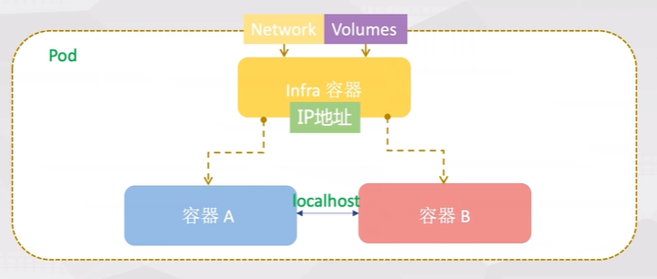
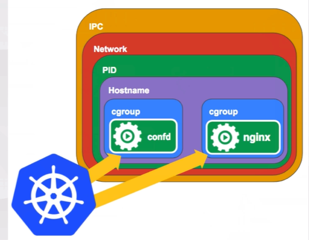
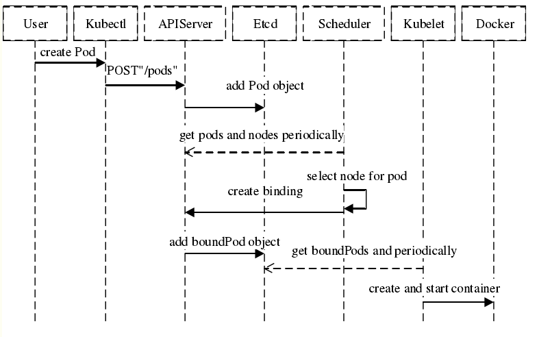
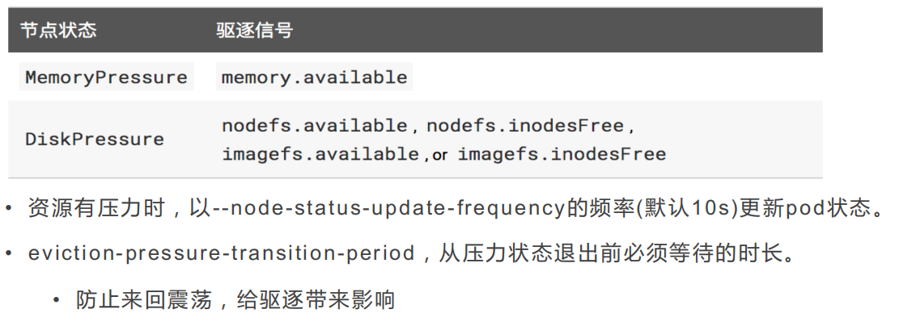
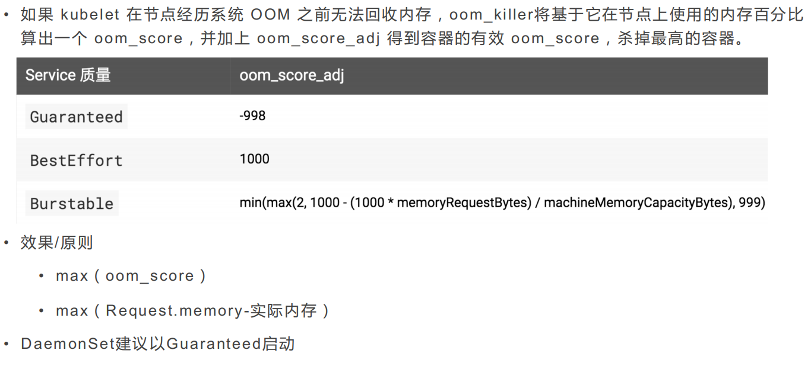

# K8S 进阶

 资源负载，进阶实战

## Pod

Pod是Kubernetes中最小的可部署和管理的计算单元。一个Pod包含一个或多个紧密耦合的容器，这些容器共享存储、网络和命名空间，以及如何运行的规范。

### Pod定义

- **最小调度单元**：Pod是Kubernetes中可以被创建、调度和管理的最小单元
- **共享上下文**：Pod中的容器共享IP地址和端口空间，可以通过localhost相互通信
- **共享存储**：Pod中的容器可以共享存储卷（Volume）
- **生命周期一致**：Pod中的所有容器同时创建、调度和终止





### Pause容器 

每个Pod里运行着一个特殊的被称之为Pause的容器，其他容器则为业务容器，这些**业务容器共享Pause容器的网络栈和Volume挂载卷**.

原则上，任何人只需要创建一个**父容器**就可以配置docker来管理**容器组之间的共享问题**。这个父容器需要能够准确的知道如何去创建共享运行环境的容器，还能**管理这些容器的生命周期**。为了实现这个父容器的构想，kubernetes中，**用pause容器来作为一个pod中所有容器的父容器**。这个pause容器有两个核心的功能:

- 第一，它提供整个pod的Linux命名空间的基础。
- 第二，启用PID命名空间，它在每个pod中都作为PID为1进程，并回收僵尸进程。

在ghost容器中同时可以看到pause和nginx容器的进程，并且pause容器的PID是1。而在kubernetes中容器的PID=1的进程即为容器本身的业务进程。

- 纽带，将所有容器连接起来
- 最先启动
- 暂停
- 为pod内的容器创建共享的网络/存储

**kubernetes中的pause容器主要为每个业务容器提供以下功能：**

- PID命名空间：Pod中的不同应用程序可以看到其他应用程序的进程ID。

- 网络命名空间：Pod中的多个容器能够访问同一个IP和端口范围。

- IPC命名空间：Pod中的多个容器能够使用SystemV IPC或POSIX消息队列进行通信。

- UTS命名空间：Pod中的多个容器共享一个主机名
- Volumes（共享存储卷）：Pod中的各个容器可以访问在Pod级别定义的Volumes

### Pod生命周期

Pod在其生命周期中会经历以下几个阶段：

- **Pending**：Pod已被Kubernetes系统接受，但有一个或多个容器镜像尚未创建
- **Running**：Pod已绑定到节点，所有容器都已创建，至少有一个容器正在运行或正在启动或重启
- **Succeeded**：Pod中的所有容器都已成功终止，且不会再重启
- **Failed**：Pod中的所有容器都已终止，且至少有一个容器因失败而终止
- **Unknown**：由于某些原因无法获取Pod的状态，通常是由于与Pod所在节点的通信出错

### Pod重启策略

Pod的重启策略（restartPolicy）定义了容器退出后kubelet的处理方式：

- **Always**（默认）：容器退出时总是重启
- **OnFailure**：容器异常退出（退出码非0）时重启
- **Never**：容器退出时从不重启

### Init容器

Init容器是在应用容器启动之前运行的专用容器，用于执行初始化任务：

- 按顺序执行，一个完成后才执行下一个
- 如果Init容器失败，Pod会重启，直到Init容器成功
- 可以访问应用容器无法访问的Secret
- 常用于等待依赖服务、初始化数据库、下载配置文件等场景

### Sidecar容器

Sidecar容器是与主容器一起运行的辅助容器，用于扩展主容器的功能：

- 与主容器共享网络和存储
- 常用于日志收集、监控、代理等功能
- 典型的Sidecar模式包括：日志代理（Fluentd）、服务网格代理（Envoy）、监控代理等

### Namespace

Namespace是Kubernetes中用于逻辑隔离资源对象的机制，类似于虚拟集群。

- **定义**：使用一个K8s集群划分多个虚拟集群，实现资源的逻辑分组和隔离
- **多租户、多产品线场景**：
  - 按照团队划分（基础服务，业务中台，用户中心）
  - 按照业务线划分（用户产品，BPIT）
  - 区分环境（dev，test，prod）
- **资源对象的隔离**：
  - Namespace间资源对象有条件不可见（默认隔离，但可以通过Service跨Namespace访问）
  - 同一资源名称可以在不同Namespace中重复使用
  - 每个Namespace都有独立的资源配额和访问控制
- **资源数量的隔离（ResourceQuota）**：
  - CPU、内存的使用配额
  - 存储资源配额
  - 对象数量配额（Pod、Service、ConfigMap等）
  - 更细粒度的资源控制

### 默认Namespace

Kubernetes集群默认包含以下Namespace：

- **default**：未指定Namespace的资源默认创建在此
- **kube-system**：Kubernetes系统组件使用的Namespace
- **kube-public**：所有用户可读的公共资源
- **kube-node-lease**：节点心跳信息，用于节点可用性检测


## Resources

### cgroups基础

一个进程可以使用它所运行的物理机器上的所有资源，从而使其他进程无法获得资源。为了限制这一点，Linux有一个称为**cgroups（Control Groups）**的特性。进程可以像在命名空间中一样在cgroup中运行，但是cgroup限制了进程可以使用的资源。这些资源包括CPU、RAM、块I/O、网络I/O等。CPU可以被限制到毫核（一个核的千分之一）或RAM字节级别。

### 资源请求和限制

Kubernetes通过Requests和Limits来管理容器的资源使用：

- **Requests（请求）**：容器启动时向节点申请的资源量，调度器使用此值决定将Pod调度到哪个节点
- **Limits（限制）**：容器可以使用的资源上限，超过限制会被限制或终止

### CPU资源

- **特性**：
  - 限制可超（可被throttle，CPU会被限流但不会杀死进程）
  - 可压缩资源（当资源不足时，可以降低使用率）
- **Requests**：期望能保证的CPU资源量，调度器保证节点有足够的CPU资源
- **Limits**：使用CPU资源的上限，超过限制时CPU会被限流
- **单位**：
  - CPU:0.5 = 500m（毫核，millicores）
  - 1 CPU = 1000m = 1核
  - 支持小数：0.1、0.5、1.5等

### 内存资源

- **特性**：
  - 限制不可超，直接kill进程（OOM kill）
  - 不可压缩资源（无法通过降低使用率来释放）
- **Requests**：期望能保证的内存资源量，调度器保证节点有足够的内存资源
- **Limits**：使用内存资源的上限，超过限制时容器会被OOM Killer终止
- **单位**：
  - E、P、T、G、M、K（1000进制）
  - Ei、Pi、Ti、Gi、Mi、Ki（1024进制）
  - 例如：1Gi = 1024Mi，1G = 1000M

### 其他资源

- **临时存储（ephemeral-storage）**：Pod的临时存储使用量
- **扩展资源**：GPU、FPGA等自定义资源


### ResourceQuota

ResourceQuota提供了更丰富和更高维度的资源使用控制：

- **限制Namespace中资源对象的数量**：如Pod、Service、ConfigMap、Secret、PVC等
- **限制Namespace中资源的使用量**：CPU、内存、存储等
- **可以按资源类型、优先级等进行细粒度控制**
- **作用范围**：在Namespace级别生效，可以限制该Namespace下所有资源的总使用量

### LimitRange

LimitRange用于限制Namespace中单个资源对象的资源使用量，为Pod和Container设置默认的资源请求和限制：

- **默认资源请求和限制**：为未指定Requests/Limits的容器设置默认值
- **最小/最大资源限制**：限制单个容器或Pod的资源使用范围
- **存储限制**：限制PVC的存储大小
- **比例限制**：限制Requests和Limits之间的比例关系

**ResourceQuota vs LimitRange**：
- ResourceQuota：限制整个Namespace的资源总量
- LimitRange：限制单个资源对象的资源使用量


## 资源隔离、调度、配额

- **Scheduling** refers to making sure that Pods are matched to Nodes so that the kubelet can run them
- **Eviction** is the process of proactively failing one or more Pods on resource-starved Nodes.


### Scheduler

#### **监视**

新创建的没有分配节点的Pods

#### **分配**

对于调度器发现的每个Pod，调度器将负责为该Pod寻找运行的最佳Node

#### 调度步骤：

1. **节点预选（Predicate/Filtering）**：排除完全不满足条件的节点
   - 资源检查：CPU、内存是否满足Pod的Requests
   - 端口检查：节点上是否有Pod需要的端口
   - 亲和性检查：节点标签、污点等是否匹配
   - 其他约束：节点状态、Pod反亲和性等

2. **节点优先级排序（Priority/Scoring）**：根据优先级选出最佳节点
   - 资源均衡：优先选择资源使用率较低的节点
   - 亲和性得分：根据节点亲和性规则计算得分
   - 数据本地性：优先选择数据所在的节点
   - 其他策略：最少请求优先级、平衡资源分配等

3. **节点择优（Select）**：根据优先级选定节点
   - 选择得分最高的节点
   - 如果多个节点得分相同，随机选择




1. **首先用户通过 Kubernetes 客户端 Kubectl 提交创建 Pod 的 Yaml 的文件，向Kubernetes 系统发起资源请求，该资源请求被提交到**

2. **Kubernetes 系统中，用户通过命令行工具 Kubectl 向 Kubernetes 集群即 APIServer 用 的方式发送“POST”请求，即创建 Pod 的请求。**

3. **APIServer 接收到请求后把创建 Pod 的信息存储到 Etcd 中，从集群运行那一刻起，资源调度系统 Scheduler 就会定时去监控 APIServer**

4. **通过 APIServer 得到创建 Pod 的信息，Scheduler 采用 watch 机制，一旦 Etcd 存储 Pod 信息成功便会立即通知APIServer，**

5. **APIServer会立即把Pod创建的消息通知Scheduler，Scheduler发现 Pod 的属性中 Dest Node 为空时（Dest Node=””）便会立即触发调度流程进行调度。**

6. 而这一个创建Pod对象，在调度的过程当中有3个阶段：节点预选、节点优选、节点选定，从而筛选出最佳的节点
   - **节点预选**：基于一系列的预选规则对每个节点进行检查，将那些不符合条件的节点过滤，从而完成节点的预选
   - **节点优选**：对预选出的节点进行优先级排序，以便选出最合适运行Pod对象的节点
   - **节点选定**：从优先级排序结果中挑选出优先级最高的节点运行Pod，当这类节点多于1个时，则进行随机选择

#### Kube-scheduler

- 是 Control Plane 的一部分
- Scheduler的默认实现
- 对于每个新创建的pod或其他未调度的pod, kube-scheduler为它们选择一个最优节点来运行。
  - 但是，pods中的每个容器对资源都有不同的需求，每个pod也有不同的需求。因此，需要根据具体的**调度要求对现有节点进行筛选**。
- 在集群中，满足Pod调度要求的节点称为**可行节点（feasible nodes）**。
- 如果没有合适的节点，pod将保持未调度状态，直到调度器能够放置它。
- 调度器为Pod找到可行节点，然后**运行一组函数**对可行节点进行打分，然后在**可行节点中选择得分最高**的节点运行Pod。然后调度器在一个名为**binding的进程中通知API服务器（Api server）**这个决策。
- 在进行调度决策时，需要考虑的因素包括个别和集体的资源需求、硬件/软件/策略约束、关联和反关联规范、数据位置、工作负载之间的干扰，等等。

#### Node selection in kube-scheduler 节点选择

为pod选择node需要两步操作：

1. **Filtering 过滤**
   - 找到可行地调度Pod的节点集。
   - 例如，PodFitsResources过滤器检查候选节点是否有足够的可用资源来满足Pod的特定资源请求。在此步骤之后，节点列表包含任何合适的节点;**通常，会有不止一个**。**如果列表为空，则Pod(还)不能调度。**
2. **Scoring 评分**
   - 对剩余节点进行排序，以选择最合适的Pod位置。调度器根据活动评分规则为过滤存活下来的每个节点分配一个分数。

最后，kube-scheduler将Pod**分配到级别（ranking）最高的节点**。如果**有多个相同分数的节点，kube-scheduler将随机选择其中一个**。


有**两种**支持的方式配置Filtering和Scoring行为:

- [Scheduling Policies](https://kubernetes.io/docs/reference/scheduling/policies) 调度策略：允许您配置用于筛选的谓词和评分的优先级。
- [Scheduling Profiles](https://kubernetes.io/docs/reference/scheduling/profiles) 调度配置：文件允许您配置实现不同调度阶段的插件，包括:QueueSort、Filter、Score、Bind、Reserve、Permit等。您还可以配置kube-scheduler以运行不同的配置文件。

### 节点亲和性和反亲和性

- **节点亲和性（Node Affinity）**：将Pod调度到满足特定条件的节点上
  - requiredDuringSchedulingIgnoredDuringExecution：硬性要求
  - preferredDuringSchedulingIgnoredDuringExecution：软性偏好

- **Pod亲和性和反亲和性（Pod Affinity/Anti-Affinity）**：基于Pod的标签来控制Pod的调度
  - Pod亲和性：将Pod调度到与指定Pod在同一节点或同一区域
  - Pod反亲和性：避免将Pod调度到与指定Pod在同一节点或同一区域
  - 常用于实现高可用、负载分散等场景

### 污点和容忍度

- **污点（Taint）**：节点上的标记，用于拒绝不匹配的Pod调度
  - NoSchedule：不调度新Pod（除非有匹配的容忍度）
  - PreferNoSchedule：尽量不调度新Pod
  - NoExecute：不调度新Pod，并驱逐已有不匹配的Pod

- **容忍度（Toleration）**：Pod上的标记，允许Pod调度到有污点的节点
  - 用于专用节点、GPU节点、维护节点等场景


### Kube-proxy

Kube-proxy是Kubernetes网络代理，在每个Node上运行，负责维护Service的转发规则。

- **功能**：反映每个Node上Kubernetes API中定义的服务，进行TCP、UDP和SCTP流转发
- **负载均衡**：通过一组后端进行TCP、UDP和SCTP的round robin调度转发
- **服务发现**：通过环境变量和DNS提供服务发现功能
- **代理模式**：
  - **userspace模式**（已废弃）：在用户空间实现代理，性能较低
  - **iptables模式**（默认）：使用iptables规则实现代理，性能较高
  - **ipvs模式**（推荐）：使用IPVS（IP Virtual Server）实现代理，性能最高，支持更多负载均衡算法


### HPA（Horizontal Pod Autoscaler）

HPA是Kubernetes中用于自动水平扩展Pod数量的控制器。

- **工作原理**：根据CPU、内存等指标自动调整Pod的副本数量
- **指标类型**：
  - 资源指标：CPU、内存使用率
  - 自定义指标：应用特定的指标（如QPS、请求延迟等）
  - 外部指标：来自集群外部的指标
- **扩缩容策略**：
  - 最小副本数（minReplicas）
  - 最大副本数（maxReplicas）
  - 目标指标值（targetMetricValue）
- **扩缩容行为**：
  - 扩容：当指标超过目标值时增加Pod数量
  - 缩容：当指标低于目标值时减少Pod数量
  - 冷却时间：避免频繁扩缩容

### 基于Prometheus的HPA

使用Prometheus作为指标源，通过Custom Metrics API实现基于自定义指标的HPA：

- 需要部署Prometheus Adapter
- 支持基于Prometheus查询的指标进行扩缩容
- 可以实现更灵活的扩缩容策略，如基于QPS、错误率等指标


## 驱逐


如果一个节点有10Gi内存，我们希望在内存不足1Gi时候进行驱逐，可以用下面两种方式进行定位驱逐阈值：

```bash
memory.available<10%
memory.available<1Gi
```

- **软驱逐（Soft Eviction）**：配合驱逐宽限期（eviction-soft-grace-period和eviction-max-pod-grace-period）一起使用。系统资源达到软驱逐阈值并在超过宽限期之后才会执行驱逐动作。

```bash
--eviction-soft:描述驱逐阈值，例如：memory.available<1.5G
--eviction-soft-grace-period:驱逐宽限期，memory.available=1m30s
--eviction-max-pod-grace-period:终止pod最大宽限时间，单位s
```

- **硬驱逐（Hard Eviction）**：系统资源达到硬驱逐阈值时立即执行驱逐动作。

```bash
这些驱逐阈值可以使用百分比，也可以使用绝对值，如：
--eviction-hard=memory.available<500Mi,nodefs.available<1Gi,imagefs.available<100Gi
--eviction-minimum-reclaim="memory.available=0Mi,nodefs.available=500Mi,imagefs.available=2Gi"
--system-reserved=memory=1.5Gi
```

- **驱逐监控间隔**：kubelet定期检查节点资源使用情况

- 

### 驱逐策略

以下是一些kubelet能用来做决策依据的信号，依据这些信号来做驱逐行为。

- memory : 内存；

- nodefs: 指node自身的存储，存储daemon的运行日志等，一般指root分区/；

- imagefs: 指docker daemon用于存储image和容器可写层(writable layer)的磁盘；



**驱逐策略配置说明**：

1. **配置方式**：驱逐策略通过kubelet的启动参数配置，需要在每个节点上设置（或通过DaemonSet统一配置）
2. **驱逐后的行为**：
   - Pod被驱逐后，会根据其所属的控制器（如Deployment、StatefulSet）自动重新创建
   - 新Pod会被调度到其他有足够资源的节点上
   - 如果所有节点都资源不足，Pod会保持Pending状态

### 磁盘不足

当节点磁盘空间不足时，kubelet会触发驱逐：

- **nodefs.available**：节点文件系统可用空间不足
- **imagefs.available**：容器镜像文件系统可用空间不足
- **驱逐行为**：
  - 停止使用磁盘最多的Pod
  - 清理未使用的容器镜像
  - 清理未使用的容器层

### 内存不足

当节点内存不足时，kubelet会触发驱逐：

- **memory.available**：节点可用内存不足
- **OOM Killer**：Linux内核的内存管理机制
  - 当系统内存严重不足时，OOM Killer会杀死占用内存最多的进程
  - kubelet通过设置oom_score_adj来控制Pod被OOM Killer杀死的优先级
- **驱逐优先级**：BestEffort > Burstable > Guaranteed

### 最小资源回收

eviction-minimum-reclaim用于设置每次驱逐时回收的最小资源量：

- 避免频繁的小规模驱逐
- 确保每次驱逐都能回收足够的资源
- 可以针对不同资源类型设置不同的最小回收量


### 节点资源紧缺情况下系统行为

1. **Scheduler行为**

   Master上的scheduler不再向该节点调度pod，节点状况与调度行为的对应关系如下：

```bash
MemoryPressure: 不再调度新的BestEffort pod到这个节点
DiskPressure: 不再向这一节点调度pod
```

2. **Node的OOM行为**

   kubelet根据pod的QoS为每个容器设置一个oom_score_adj，如果kubelet无法在系统OOM之前回收足够的内存，则oom_killer会根据内存使用比例来计算oom_score，最后结果和oom_score_adj相加，得分最高的pod将会首先被驱逐。


### Pod QoS Class

- **Guaranteed**：指定内存和CPU的请求和限制且相等，完全可靠，最后被驱逐
- **Burstable**：不符合Guaranteed，但有资源指定，弹性波动，较为可靠，中等优先级
- **BestEffort**：没有资源指定，不可靠，最先被驱逐

按照优先级驱逐顺序：BestEffort > Burstable > Guaranteed



## 健康检查

- 为了确保Pod处于健康正常的运行状态，Kubernetes提供了两种探针，用于检测容器的状态：
  - **Liveness Probe** ：检查容器是否处于运行状态。如果检测失败，kubelet将会杀掉容器，并根据重启策略进行下一步的操作。如果容器没有提供Liveness Probe，则默认状态为Success；
    - 是否还活着
    - 可以捕获死锁，应用程序正在运行，但无法取得进展。在这种状态下重新启动容器可以继续存活。
  - **Readiness Probe** ：检查容器是否已经处于可接受服务请求的状态。如果Readiness Probe失败，端点控制器将会从服务端点（与Pod匹配的）中移除容器的IP地址。Readiness的默认值为Failure，如果一个容器未提供Readiness，则默认是Success。
    - 来确定容器是否已经就绪可以接收流量过来了
    - 当一个应用服务有大文件加载时，这种情况下不允许接受用户访问，readiness probe就不会对这类型的程序启动服务。
kubelet在容器上周期性的执行探针以检测容器的健康状态，kubelet通过调用被容器实现的处理器来实现检测，在Kubernetes中有三类处理器：

- **ExecAction**：在容器中执行一个指定的命令。如果命令的退出状态为0，则判断认为是成功的
- **TCPSocketAction**：在容器IP地址的特定端口上执行一个TCP检查，如果端口处于打开状态，则视为成功
- **HTTPGetAction**：在容器IP地址的特定端口和路径上执行一个HTTP Get请求
  - 使用container的IP地址和指定的端口以及请求的路径作为url
  - 用户可以通过host参数设置请求的地址
  - 通过scheme参数设置协议类型（HTTP、HTTPS）
  - 如果其响应代码在200~400之间，设为成功

### Startup Probe

Startup Probe用于检测容器是否已经启动，特别适用于启动时间较长的应用：

- **用途**：在应用启动期间禁用Liveness和Readiness探针
- **场景**：避免启动时间长的应用在启动过程中被误杀
- **工作方式**：在Startup Probe成功之前，Liveness和Readiness探针不会执行

### 探针参数

所有探针都支持以下参数：

- **initialDelaySeconds**：容器启动后等待多长时间开始执行探针（默认0）
- **periodSeconds**：执行探针的频率（默认10秒）
- **timeoutSeconds**：探针超时时间（默认1秒）
- **successThreshold**：探针连续成功多少次才认为成功（默认1）
- **failureThreshold**：探针连续失败多少次才认为失败（默认3）

### 健康检测结果

健康检测的结果为下面三种情况：

- **Success**：表示容器通过检测
- **Failure**：表示容器没有通过检测
- **Unknown**：未知，不做处理

## Service

Service是Kubernetes中用于暴露Pod服务的抽象层，提供了稳定的网络访问入口。

### Service类型

- **ClusterIP**（默认）：在集群内部IP上暴露服务，只能在集群内部访问
- **NodePort**：通过每个Node上的静态端口（NodeIP:NodePort）暴露服务，可以从集群外部访问
- **LoadBalancer**：使用云提供商的负载均衡器向外部暴露服务
- **ExternalName**：通过返回CNAME记录和对应值，将服务映射到externalName字段的内容

### Service工作原理

- Service通过Label Selector选择后端Pod
- kube-proxy负责维护Service到Pod的转发规则
- 支持TCP、UDP和SCTP协议
- 提供负载均衡功能（默认轮询）

### Endpoints

- Service通过Endpoints对象维护后端Pod的IP地址列表
- 当Pod创建或删除时，Endpoints自动更新
- 可以手动创建Endpoints来指向集群外部服务
- Endpoints Controller负责维护Service和Pod之间的映射关系

### Headless Service

Headless Service（无头服务）是一种特殊的Service，不分配ClusterIP：

- **定义**：将Service的clusterIP设置为None
- **用途**：
  - 直接返回后端Pod的IP地址列表
  - 用于StatefulSet，为每个Pod提供稳定的DNS名称
  - 用于服务发现场景，客户端直接连接Pod
- **DNS解析**：返回所有后端Pod的IP地址，而不是Service的虚拟IP

### Service会话亲和性

Service支持会话亲和性（Session Affinity），确保来自同一客户端的请求路由到同一个后端Pod：

- **None**（默认）：不启用会话亲和性
- **ClientIP**：基于客户端IP的会话亲和性
- **适用场景**：有状态应用、需要保持会话的场景

## Ingress

Ingress是用于管理外部访问集群内服务的HTTP和HTTPS路由的API对象。

### Ingress功能

- 提供基于域名和路径的路由规则
- 支持SSL/TLS终止
- 提供负载均衡
- 支持基于名称的虚拟主机

### Ingress Controller

- Ingress Controller是实际运行的反向代理程序（如Nginx、Traefik、HAProxy等）
- 负责实现Ingress规则，将外部流量路由到集群内的Service
- 需要单独部署和配置
- 通常以DaemonSet或Deployment形式部署

### Ingress规则示例

```yaml
apiVersion: networking.k8s.io/v1
kind: Ingress
metadata:
  name: example-ingress
spec:
  rules:
  - host: foo.bar.com
    http:
      paths:
      - path: /foo
        pathType: Prefix
        backend:
          service:
            name: service1
            port:
              number: 80
      - path: /bar
        pathType: Prefix
        backend:
          service:
            name: service2
            port:
              number: 80
```

### Ingress TLS

Ingress支持TLS终止，可以在Ingress中配置TLS证书：

- 在Ingress中指定TLS Secret
- Ingress Controller负责SSL/TLS终止
- 支持SNI（Server Name Indication）多域名证书

## ConfigMap和Secret

### ConfigMap

ConfigMap用于存储非敏感的配置数据，以键值对的形式存储。

- **用途**：存储配置文件、环境变量、命令行参数等
- **创建方式**：从文件、目录或字面值创建
- **使用方式**：
  - 作为环境变量注入到容器
  - 作为配置文件挂载到容器
  - 在Pod的命令行参数中引用

### Secret

Secret用于存储敏感信息，如密码、OAuth令牌、SSH密钥等。

- **类型**：
  - Opaque：用户定义的任意数据
  - kubernetes.io/dockerconfigjson：Docker镜像仓库认证信息
  - kubernetes.io/tls：TLS证书和密钥
- **使用方式**：与ConfigMap类似，但数据会进行Base64编码
- **安全注意**：Secret数据是Base64编码，不是加密，需要配合RBAC和加密存储使用

## 工作负载控制器

### ReplicaSet

ReplicaSet是Deployment的底层实现，用于维护一组Pod的副本数量：

- **功能**：确保指定数量的Pod副本始终运行
- **选择器**：通过Label Selector选择管理的Pod
- **扩缩容**：可以手动或自动调整副本数量
- **与Deployment的关系**：Deployment管理ReplicaSet，ReplicaSet管理Pod

### Deployment

Deployment为Pod和ReplicaSet提供声明式更新，是管理无状态应用的主要方式。

- **功能**：
  - 管理Pod的副本数量
  - 滚动更新和回滚
  - 暂停和恢复更新
  - 历史版本管理
- **更新策略**：
  - **RollingUpdate（默认）**：逐步替换旧Pod
    - maxSurge：更新过程中可以超过期望副本数的最大Pod数量
    - maxUnavailable：更新过程中不可用的最大Pod数量
  - **Recreate**：先删除所有旧Pod，再创建新Pod（会导致服务中断）
- **回滚**：可以回滚到之前的任何版本
- **暂停和恢复**：可以暂停更新，进行多次修改后再恢复

### StatefulSet

StatefulSet用于管理有状态应用，提供稳定的网络标识和持久化存储。

- **特性**：
  - 稳定的Pod标识（有序的Pod名称和主机名）
  - 稳定的持久化存储（每个Pod有独立的PVC）
  - 有序的部署和扩展
  - 有序的删除和终止
- **适用场景**：数据库、有状态中间件等需要稳定标识和存储的应用

### DaemonSet

DaemonSet确保所有（或特定）节点上运行一个Pod的副本。

- **用途**：
  - 在每个节点上运行日志收集器（如Fluentd）
  - 在每个节点上运行监控代理（如Prometheus Node Exporter）
  - 在每个节点上运行网络插件
- **特性**：当节点加入集群时自动创建Pod，节点移除时自动删除Pod

### Job和CronJob

- **Job**：创建一个或多个Pod，并确保指定数量的Pod成功终止
  - 用于一次性任务
  - 支持并行执行
  - 支持重试机制

- **CronJob**：基于Cron时间表运行Job
  - 用于定时任务
  - 支持时区设置
  - 可以设置并发策略和历史记录限制

## 存储

### Volume

Volume是Pod中可被多个容器访问的共享目录，用于在容器之间共享数据或持久化数据。

- **emptyDir**：临时存储，Pod删除时数据丢失
  - 用途：容器间共享临时数据、缓存等
  - 存储位置：节点本地存储或内存（tmpfs）
- **hostPath**：挂载节点文件系统
  - 用途：访问节点文件系统、日志收集等
  - 注意：Pod删除后数据保留在节点上，但绑定到特定节点
- **configMap/secret**：挂载配置和密钥
  - 用途：将ConfigMap和Secret作为文件挂载到容器
  - 支持只读挂载和子路径挂载
- **persistentVolumeClaim**：使用持久化存储
  - 用途：需要持久化的数据存储
  - 通过PVC动态或静态绑定PV
- **其他Volume类型**：
  - **nfs**：网络文件系统
  - **cephfs**：Ceph文件系统
  - **glusterfs**：Gluster文件系统
  - **awsElasticBlockStore**：AWS EBS卷
  - **azureDisk**：Azure磁盘
  - **gcePersistentDisk**：GCE持久化磁盘

### PersistentVolume (PV)

PV是集群级别的存储资源，由管理员预先配置。

- **访问模式**：
  - ReadWriteOnce (RWO)：单节点读写
  - ReadOnlyMany (ROX)：多节点只读
  - ReadWriteMany (RWX)：多节点读写
- **回收策略**：
  - Retain：手动回收
  - Recycle：删除数据（已废弃）
  - Delete：自动删除

### PersistentVolumeClaim (PVC)

PVC是用户对存储的请求，类似于Pod对Node资源的请求。

- 用户通过PVC申请存储资源
- PVC绑定到匹配的PV
- Pod通过PVC使用持久化存储

### StorageClass

StorageClass提供动态存储供应能力，允许按需创建PV。

- **定义存储类**：管理员可以定义不同的存储类（如fast-ssd、slow-hdd等）
- **动态供应**：支持按需动态创建PV，无需管理员手动创建
- **存储后端**：支持不同的存储后端
  - 云存储：AWS EBS、GCE PD、Azure Disk等
  - 网络存储：NFS、Ceph、GlusterFS等
  - 本地存储：local volume
- **默认StorageClass**：可以设置默认StorageClass，未指定StorageClass的PVC会使用默认值
- **回收策略**：可以在StorageClass中设置PV的回收策略
- **绑定模式**：
  - **Immediate**：立即绑定
  - **WaitForFirstConsumer**：延迟绑定，直到Pod使用PVC时才创建PV

## RBAC（基于角色的访问控制）

RBAC用于控制用户和服务账户对Kubernetes API资源的访问权限。

### 核心概念

- **Role/ClusterRole**：定义权限集合
  - Role：命名空间级别
  - ClusterRole：集群级别
- **RoleBinding/ClusterRoleBinding**：将角色绑定到用户、组或ServiceAccount
  - RoleBinding：命名空间级别
  - ClusterRoleBinding：集群级别

### ServiceAccount

ServiceAccount为Pod中的进程提供身份标识，用于访问Kubernetes API。

- **身份标识**：为Pod中的进程提供身份标识
- **默认ServiceAccount**：每个命名空间有默认的default ServiceAccount
- **自定义ServiceAccount**：可以创建自定义ServiceAccount并绑定权限
- **Token挂载**：ServiceAccount的Token会自动挂载到Pod的`/var/run/secrets/kubernetes.io/serviceaccount`目录
- **使用场景**：
  - 不同应用需要不同的API访问权限
  - 限制Pod的权限范围
  - 实现最小权限原则

## Network Policy

Network Policy用于控制Pod之间的网络通信，实现网络层面的安全隔离。

- **功能**：
  - 定义Pod之间的网络隔离规则
  - 基于标签选择器控制流量
  - 支持入站（Ingress）和出站（Egress）规则
  - 支持基于命名空间、Pod标签、IP CIDR的规则
- **默认行为**：
  - 未定义Network Policy的Pod：允许所有流量
  - 定义了Network Policy的Pod：默认拒绝所有流量（白名单模式）
- **实现**：需要网络插件支持（如Calico、Cilium、Weave Net等）
- **规则示例**：
  - 允许来自特定命名空间的流量
  - 允许访问特定端口的流量
  - 拒绝访问特定IP的流量

## 最佳实践

### Pod设计

- 一个Pod一个容器（除非容器需要紧密耦合）
- 使用健康检查（Liveness和Readiness Probe）
- 设置合理的资源请求和限制
- 使用Init容器进行初始化工作

### 资源管理

- 始终设置资源请求（Requests）
- 根据实际需求设置资源限制（Limits）
- 使用ResourceQuota限制命名空间资源
- 使用LimitRange设置默认资源限制

### 安全

- 使用最小权限原则配置RBAC
- 使用Secret管理敏感信息
- 启用Pod Security Policy（或Pod Security Standards）
- 定期更新镜像和Kubernetes版本

### 监控和日志

- 配置健康检查探针
- 使用Prometheus等工具监控集群和Pod
- 集中化日志收集（如ELK、Loki）
- 设置告警规则

