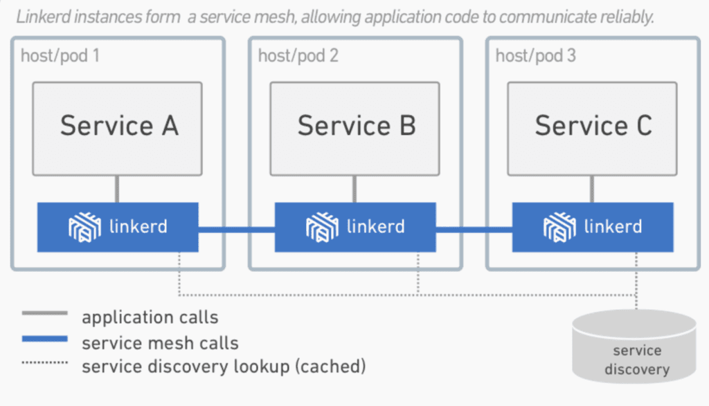

# Service Mash

## 定义

> A service mesh, like the open source project [Istio,](https://www.redhat.com/en/topics/microservices/what-is-istio) is a way to control how different parts of an application share data with one another. Unlike other systems for managing this communication, a service mesh is a dedicated infrastructure layer built right into an app. This visible infrastructure layer can document how well (or not) different parts of an app interact, so it becomes easier to optimize communication and avoid downtime as an app grows.
>
> RadHat

> 服务网格是用于处理服务到服务通信的专用基础结构层。它负责通过包含现代云本地应用程序的复杂服务拓扑来可靠地交付请求。在实践中，服务网格通常实现为一组轻量级网络代理，这些代理与应用程序代码一起部署，应用程序不需要知道。(不过这个想法也有不同的版本，我们将会看到。)
>
> 服务网格作为一个独立层的概念与云本机应用程序的兴起紧密相关。在云原生模型中，单个应用程序可能包含数百个服务;每个服务可能有数千个实例;每个实例都可能处于不断变化的状态，因为它们是由类似Kubernetes的协调器动态调度的。在这个世界上，服务通信不仅极其复杂，而且是运行时行为的普遍和基本部分。管理它对于确保端到端性能和可靠性至关重要。
>
> https://buoyant.io/2017/04/25/whats-a-service-mesh-and-why-do-i-need-one/

### IS THE SERVICE MESH A NETWORKING MODEL?

服务网格是一种网络模型，位于TCP/IP之上的抽象层。它假设底层的L3/L4网络已经存在，并且能够点对点传递字节。(它还假设这个网络和环境的其他方面一样，是不可靠的;因此，服务网格也必须能够处理网络故障。)

在某些方面，服务网络类似于TCP/IP。正如TCP堆栈抽象了在网络端点之间可靠地交付字节的机制一样，服务网格抽象了在服务之间可靠地交付请求的机制。与TCP一样，服务网格并不关心实际的有效负载或它是如何编码的。应用程序有一个高级目标(“将某个东西从a发送到B”)，而服务网格的工作，就像TCP的工作一样，就是在处理过程中的任何故障的同时完成这个目标。

与TCP不同，服务网格的重要目标不仅仅是“让它工作”:它提供了一个统一的、应用程序范围的点，以便在应用程序运行时引入**可见性和控制**。服务网格的明确目标是将**服务通信从不可见的隐含基础设施的领域转移到“生态系统的一流成员”的角色——在这里可以对其进行监视、管理和控制**。

## When Might a Service Mesh Be a Bad Idea?

There are five main reasons why you may ***not\*** want to consider using a service mesh to manage the potentially complex networking challenges a microservices architecture presents.

### 1. Service Meshes are Opinionated

服务网格是一个“平台”解决方案，因此往往非常固执己见。这意味着你可能会发现自己不得不“按照他们的方式”工作，而不是按照对你的业务或技术最有意义的方式工作。根据你自己的情况，这种前期投资可能会被证明过于昂贵。

类似地，如果控制应用程序和服务之间的通信方式对您的组织具有战略重要性，那么使用现有的服务网格就没有什么意义了。采用服务网格可以让您从涨潮中受益，但不允许您控制自己的命运。

### 2. Service Meshes are Complex

部署服务网格会增加相当大的复杂性。部署需要接收Sidecars，服务网格需要集成到环境中，然后不断地重新配置，加密可能需要重新设计。因此，在Kubernetes这样的平台上运行服务网格不仅需要您成为您所选择的服务网格的专家，还需要成为该平台的专家。

### 3. Service Meshes can be Slow

随着网络的增长和路由表的膨胀，通过一系列代理的路由流量会变得非常缓慢。

### 4. Service Meshes Prefer Self-Contained Blueprints

采用服务网格来跟踪跨服务的请求并不总是像最初那样有价值。例如，如果您的微服务环境组合了来自不同团队的应用程序和服务，那么当它们跨越不同工程团队和业务单位的边界时，解释跟踪就会非常具有挑战性，更不用说企业或云提供商了。

### 5. Service Meshes are for Developers

服务网格主要关注开发人员对服务调用的战术关注。它们不能帮助控制复杂的突发行为，这些行为是由应用程序和服务有机地发展而来的，而这些应用程序和服务彼此以非预期的方式进行大规模交互。

See our post [“Should I use a service mesh?”](https://glasnostic.com/blog/should-i-use-a-service-mesh) for more details.

# Istio

> Istio is an open source service mesh initially developed by Google, IBM and Lyft. The project was announced in May 2017, with its 1.0 version released in July 2018. Istio is built on top of the [Envoy proxy which acts as its data plane](https://glasnostic.com/blog/microservices-architecture-patterns-service-mesh-glossary#Envoy). Although it is quite clearly the most popular service mesh available today, it is for all practical purposes only usable with [Kubernetes](https://kubernetes.io/).

# Linkerd

> Linkerd (rhymes with “chickadee”) is the original service mesh created by [Buoyant](https://buoyant.io/), which coined the term in 2016. It is the official service mesh project supported by the [Cloud-Native Computing Foundation,](https://www.cncf.io/) Like Twitter’s [Finagle](https://twitter.github.io/finagle/), on which it was based, Linkerd was originally written in Scala and designed to be deployed on a per-host basis. Criticisms of its comparatively large memory footprint subsequently led to the development of [Conduit](https://blog.buoyant.io/2017/12/05/introducing-conduit/), a lightweight service mesh specifically for Kubernetes, written in Rust and Go. The Conduit project has since been folded into Linkerd, which [relaunched as Linkerd 2.0](https://blog.linkerd.io/2018/07/06/conduit-0-5-and-the-future/) in July of 2018. While Linkerd 2.x is currently specific to Kubernetes, Linkerd 1.x can be deployed on a per-node basis, thus making it a more flexible choice where a variety of environments need to be supported. Unless mentioned otherwise, the comparisons below refer to Linkerd 2.x.

# Istio Linkered

## 架构

Istio和Linkerd都支持通过流行的[sidecar模式](https://glasnostic.com/blog/microservices-architecture-patterns-servicmes-glossary # sidecar)进行部署，该模式为每个微服务分配一个单独的代理。微服务不是直接调用其他服务，而是连接到它们的本地代理。然后，该代理将调用路由到适当的服务实例的代理，该代理将调用传递到其本地微服务。这个服务代理的网格形成了[数据平面](https://glasnostic.com/blog/microservices-architecing-patterns-servicmes-glossary # data - plane)。在一个服务网格中，数据平面由一个[控制平面](https://glasnostic.com/blog/microservices-architecture-patterns-servicmes-glossary # control - plane)配置和监控，它通常是单独部署的。

![[Pasted image 20230302000614.png]]

![[Pasted image 20230302000441.png]]
![[Pasted image 20230301235656.png]]
例如Istio部署。Envoy代理被部署为边车。在这个部署模型中，代理被注入到每个容器工作负载中。因此，可以为每个工作负载分别配置代理。Istio控制平面由用于配置、度量、控制和保护各种服务到服务连接的组件组成。

## Control Plane

Control Plane是一组api和工具，用于控制跨网格的代理行为。控制平面是用户指定身份验证策略、收集指标和配置整个数据平面的地方。

Istio的控制平面由三个部件组成。首先，Pilot负责配置数据平面。接下来，Mixer收集流量指标并响应来自数据平面的各种查询，比如授权、访问控制和配额检查。根据启用了哪些适配器，它还可以与日志记录和监视系统进行接口。最后，Citadel允许开发者构建基于服务身份而不是网络控制的零信任环境。它负责为每个服务分配证书，还可以在需要时接受外部证书权威密钥。

Linkerd的控制平面由一个控制器组件、一个提供管理仪表板的web组件和一个度量组件组成，度量组件由Prometheus和Grafana的修改版本组成。

## Data Plane

在典型的服务网格中，服务部署被修改为包含专用的sidecar代理。服务不是直接通过网络调用服务，而是调用它们的本地sidecar代理，这反过来封装了服务到服务交换的复杂性。服务网格中相互连接的代理集表示其数据平面。

默认情况下，Istio使用Envoy作为它的数据平面，尽管它被设计成与其他代理(如Nginx)一起工作。Linkerd提供了它自己的代理。

## Platform Support

虽然Istio声称支持多种环境和框架，但实际上，它只在Kubernetes上得到很好的支持，这使它成为更窄的服务网格选项之一。

同样,Linkerd 2。x目前也需要Kubernetes。然而,Linkerd 1.x 仍在广泛部署并处于积极开发中，它被设计用于在许多环境和框架中运行，包括AWS ECS、DC/OS和Docker。对环境的广泛支持的主要原因是Linkerd 1.x 可以部署在每个主机上，这允许它与不适合sidecar部署的环境集成。

每台主机上部署的Linkerd服务网格。在这个部署变体中，运行在同一主机上的多个微服务连接到一个共享的Linkerd (1.x)实例。

## Supported Protocols

Both Istio and Linkerd 2.x support HTTP 1.1, HTTP2, gRPC, and TCP communication between services via their sidecar proxies. Linkerd 1.x does not support TCP connections.

## Implementation Languages

Both Istio (the control plane) and Linkerd 2.x are written in Go. The proxy used for Istio’s data plane, Envoy, is written in C++ while the proxy implementing the Linkerd 2.x data plane is written in Rust. Linkerd 1.x is written in Scala.

## Security, Encryption and Authorization

Istio’s control plane components provide the following security functionality:

- **Citadel:** Key and certificate management.
- **Pilot:** Distribution of authentication policies and secure naming information.
- **Mixer:** Management of authorization and auditing.
- **Sidecars:** Implementation of secure communication between proxies with support for TLS encryption.

As of this writing, automatic TLS encryption in Linkerd is labeled [“experimental”](https://linkerd.io/2/features/automatic-tls/) and host-to-host authentication is not supported.

## Sidecar Injection

The process of adding sidecars to deployment artifacts and registering them with the service mesh control plane is called “sidecar injection.” Both Istio and Linkerd support manual and automatic sidecar injection.

## High Availability

Istio supports high availability on Kubernetes provided multiple replicas are configured and the `podAntiAffinity` flag is used.

High availability features in Linkerd are currently labeled [“experimental.”](https://linkerd.io/2/features/ha/)

## Monitoring and Tracing Support

Istio supports Prometheus natively and integrates with [Jaeger](https://istio.io/docs/tasks/telemetry/distributed-tracing/) for distributed tracing. 

Linkerd supports Prometheus and Grafana for monitoring out of the box but does not currently support distributed tracing. 

## Performance

The performance overhead of Linkerd 2.x is generally lower than that of Istio.

In [a performance benchmark between both services meshes](https://medium.com/@ihcsim/linkerd-2-0-and-istio-performance-benchmark-df290101c2bb), it was shown that for the test load consisting of HTTP echos, the queries per seconds dropped from a baseline of 30-35 thousand queries per second (kqps) to 10-12 kqps for Linkerd and 3.2-3.9 kqps for Istio