# ISTIO

**它是一个完全开源的服务网格**，作为透明的一层接入到现有的分布式应用程序里。**它也是一个平台**，拥有可以集成任何日志、遥测和策略系统的 API 接口。Istio 多样化的特性使您能够成功且高效地运行分布式微服务架构，并提供保护、连接和监控微服务的统一方法。

## 架构与原理

### 流量管理组件

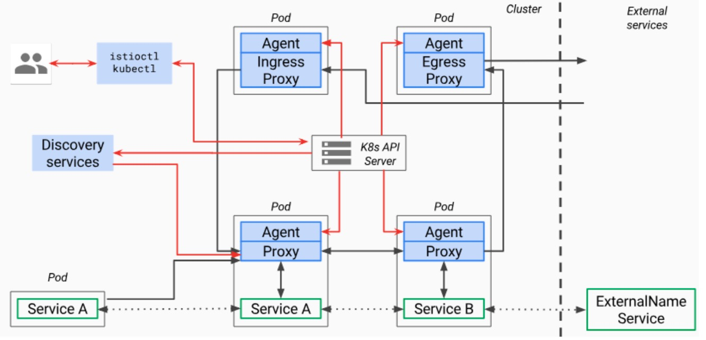

基于IPTABLES

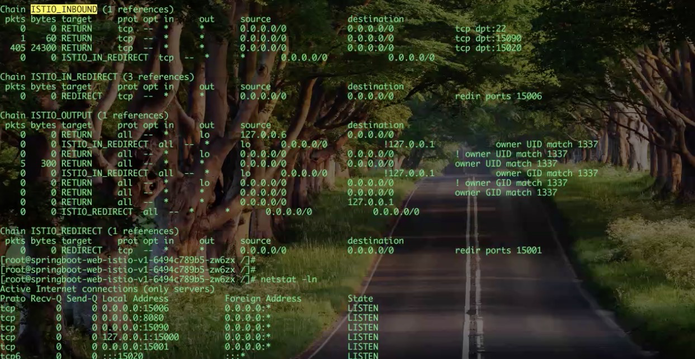

IN 15006 OUT 15001 

管理端口 15090 提供接口，从controlplane拉取最新配置

### pliot架构

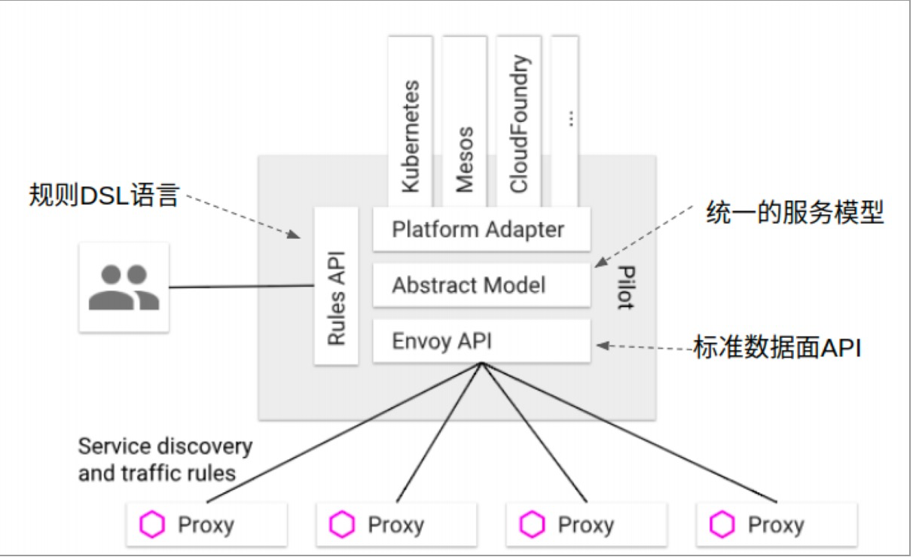

### XDS数据接口

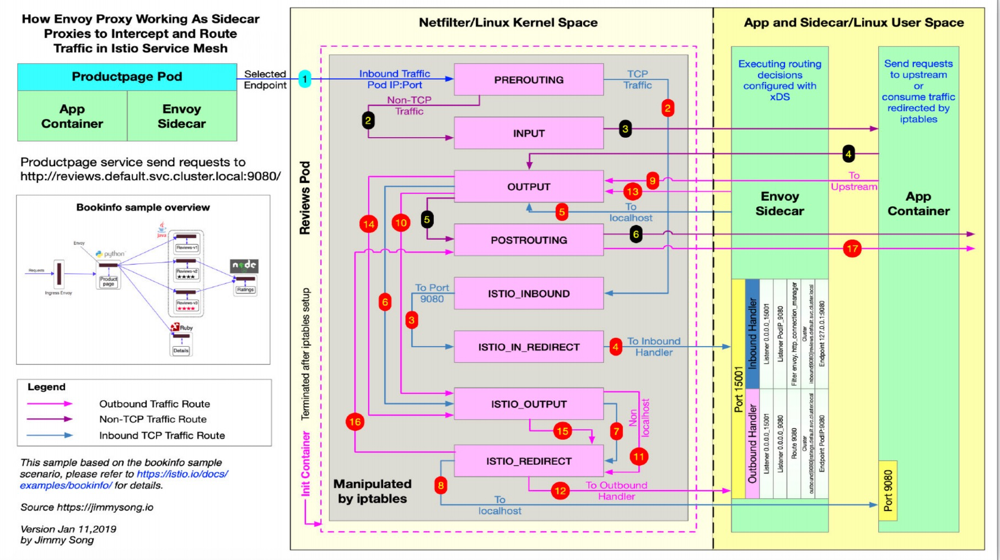

### SideCar 注入原理

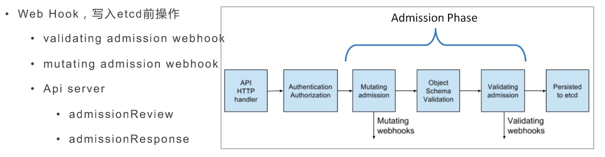

### WebHook 工作流程图

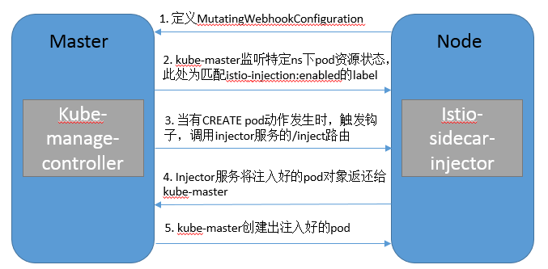

[浅谈领域特定语言(DSL)](https://www.jianshu.com/p/a3f3700d33c0)

### Envoy

Envoy主要面向SOA（面向服务的架构）的网络代理，所以非常适用于微服务，其主要是用来调解Service Mesh中所有服务的入站和出站流量。

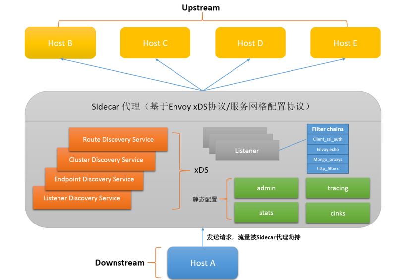

xDS模块的功能是通过Envoy API V1（基于HTTP）或V2（基于gRPC）实现一个服务端将配置信息暴露给上游主机，等待上游主机的拉取。

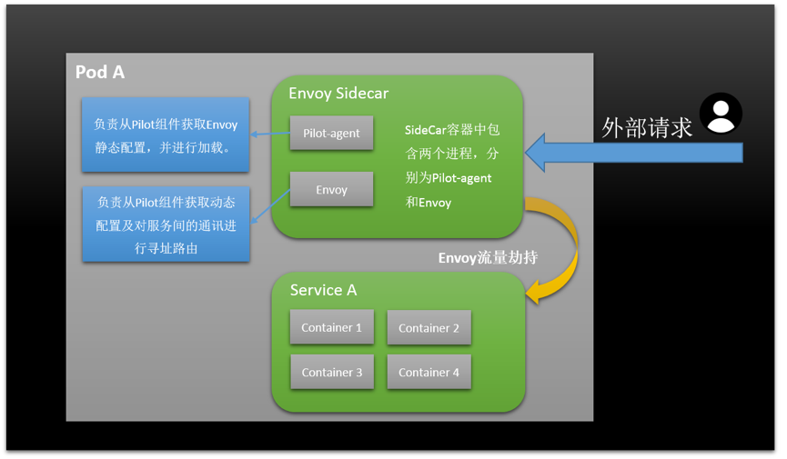

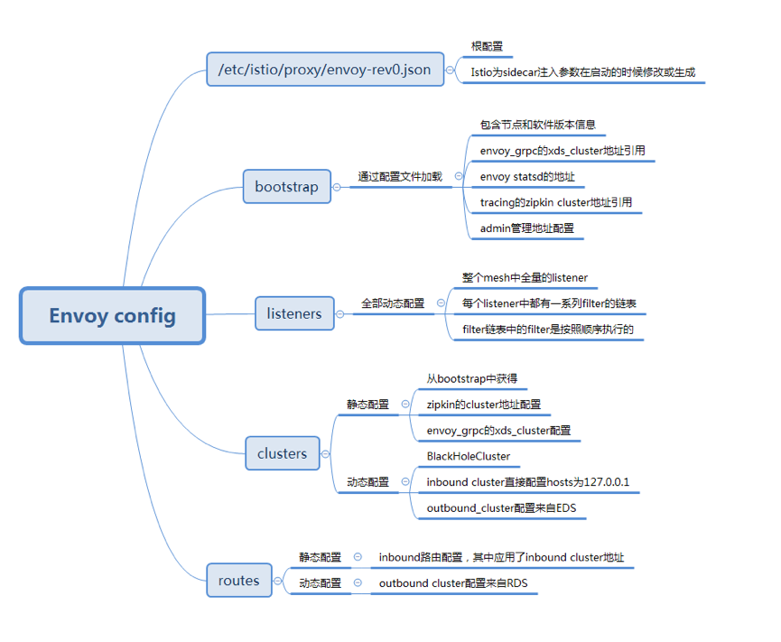

#### XDS数据接口

RDS

CDS

EDS

LDS

ADS:广播通知

### Sidecar原理

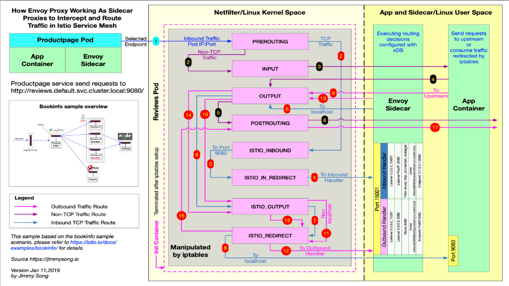

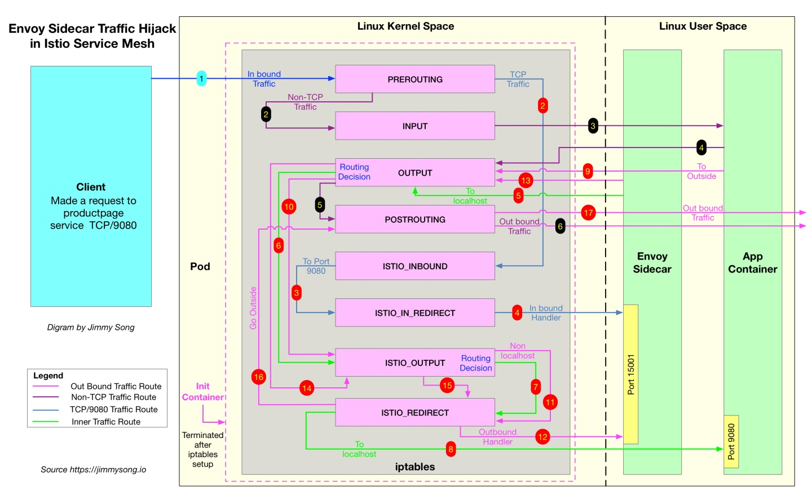

### 动态准入 Webhook 概述

来自 [Kubernetes 准入控制机制](https://kubernetes.io/docs/reference/access-authn-authz/extensible-admission-controllers/)：

准入 Webhook 是 HTTP 方式的回调，接收准入请求并对其进行相关操作。可定义两种类型的准入 Webhook，Validating 准入 Webhook 和 Mutating 准入 Webhook。使用 Validating Webhook，可以通过自定义的准入策略来拒绝请求；使用 Mutating Webhook，可以通过自定义默认值来修改请求。

Istio 使用 `ValidatingAdmissionWebhooks` 验证 Istio 配置，使用 `MutatingAdmissionWebhooks` 自动将 Sidecar 代理注入至用户 Pod。

Webhook 设置过程需要了解 Kubernetes 动态准入 Webhook 相关的知识。有关 Validating 和 Mutating Webhook 配置的详细文档，请参考 [Kubernetes API](https://kubernetes.io/docs/reference/generated/kubernetes-api/v1.11/)。

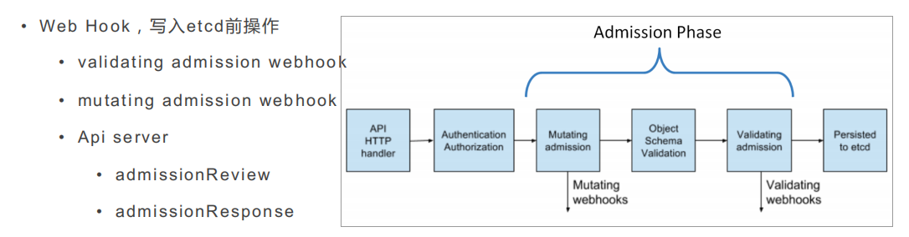

### Sidecar 自动注入

Sidecar 自动注入机制将 sidecar 代理添加到用户创建的 pod。

它使用 `MutatingWebhook` 机制在 pod 创建的时候将 sidecar 的容器和卷添加到每个 pod 的模版里。

用户可以通过 webhooks `namespaceSelector` 机制来限定需要启动自动注入的范围，也可以通过注解的方式针对每个 pod 来单独启用和禁用自动注入功能。

Sidecar 是否会被自动注入取决于下面 3 条配置和 2 条安全规则：

配置：

- webhooks `namespaceSelector`
- 默认策略
- pod 级别的覆盖注解

安全规则:

- sidecar 默认不能被注入到 `kube-system` 和 `kube-public` 这两个 namespace
- sidecar 不能被注入到使用 `host network` 网络的 pod 里

下面的表格展示了基于上述三个配置条件的最终注入状态。上述的安全规则不会被覆盖。

| `namespaceSelector` 匹配 | 默认策略 | Pod 覆盖 `sidecar.istio.io/inject` 注解 | Sidecar 是否注入？ |
| ------------------------ | -------- | --------------------------------------- | ------------------ |
| yes                      | enabled  | true (default)                          | yes                |
| yes                      | enabled  | false                                   | no                 |
| yes                      | disabled | true                                    | yes                |
| yes                      | disabled | false (default)                         | no                 |
| no                       | enabled  | true (default)                          | no                 |
| no                       | enabled  | false                                   | no                 |
| no                       | disabled | true                                    | no                 |
| no                       | disabled | false (default)                         | no                 |

## 解决问题

- 较高的层面来说，Istio 有助于降低这些部署的复杂性，并减轻开发团队的压力
- 作为透明的一层接入到现有的分布式应用程序里,无侵入，
- 为微服务的提供保护、连接和监控提供统一方法
- 解决了开发人员和运维人员所面临的从单体应用向分布式微服务架构转变的挑战
- 将基础设施下沉，使上层业务只专注于业务本身，在云原生领域具有广阔的应用前景。

## 不足

- EnvoyFilter的工作原理和隔离性不足