# Linux性能

推荐《性能之巅》这本书

## CPU

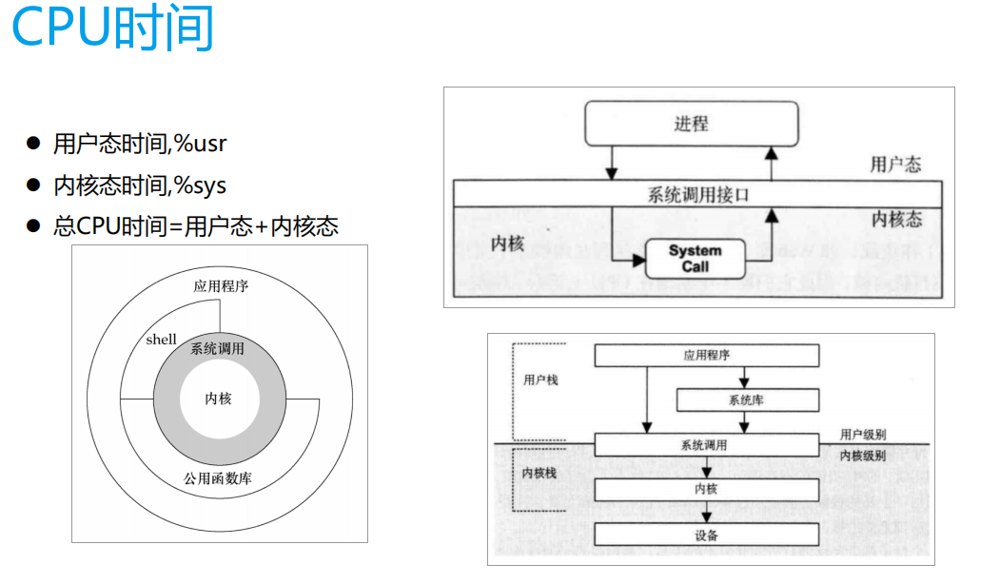

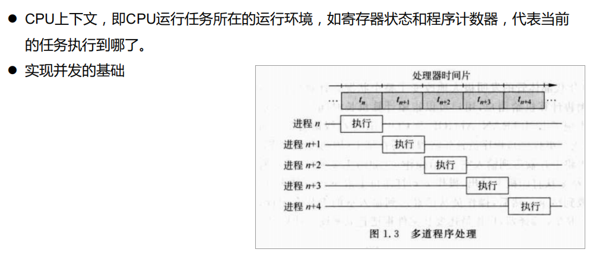

CPU利用率：CPU的使用情况。
用户时间(User time) ：表示CPU执行用户进程的时间，包括nices时间。通常期望用户空间CPU越高越好。
系统时间(System time) ：表示CPU在内核运行时间，包括IRQ和softirq时间。系统CPU占用率高，表明系统某部分存在瓶颈。通常值越低越好。
等待时间(Waiting time) ：CPU在等待I/O操作完成所花费的时间。系统不应该花费大量时间来等待I/O操作，否则就说明I/O存在瓶颈。
空闲时间(Idle time) ：系统处于空闲期，等待进程运行。
Nice时间(Nice time) ：系统调整进程优先级所花费的时间。
硬中断处理时间(Hard Irq time) ：系统处理硬中断所花费的时间。
软中断处理时间(SoftIrq time) ：系统处理软中断中断所花费的时间。
丢失时间(Steal time) ：被强制等待（involuntary wait）虚拟CPU的时间，此时hypervisor在为另一个虚拟处理器服务。


### top命令看到的CPU占用率信息及各项值含义。

Cpu(s): 0.2%us, 0.2%sy, 0.0%ni, 99.2%id, 0.5%wa, 0.0%hi, 0.0%si, 0.0%st
us: User time,用户态使用的cpu时间比。CPU一共花了多少比例的时间运行在用户态空间或者说是用户进程(running user space processes)。典型的用户态空间程序有：Shell、数据库、web服务器。
sy: System time,系统态使用的cpu时间比。System的含义与User相似。System表示：CPU花了多少比例的时间在内核空间运行。分配内存、IO操作、创建子进程……都是内核操作。这也表明，当IO操作频繁时，System参数会很高。
ni: Nice time,用做nice加权的进程分配的用户态cpu时间比。用户空间进程的CPU的调度优先级，范围为[-20,19]。每个linux进程都有个优先级，优先级高的进程有优先执行的权利，这个叫做pri。进程除了优先级外，还有个优先级的修正值。即比如你原先的优先级是20，然后修正值为-2，那么你最后的进程优先级为18。这个修正值就叫做进程的nice值。
id: Idle time,空闲的cpu时间比。一般而言，idel + user + nice 约等于100%。
wa: Waiting time,cpu等待磁盘写入完成时间。在计算机中，读写磁盘的操作远比CPU运行的速度要慢，CPU负载处理数据，而数据一般在磁盘上需要读到内存中才能处理。当CPU发起读写操作后，需要等着磁盘驱动器将数据读入内存，从而导致CPU 在等待的这一段时间内无事可做。CPU处于这种等待状态的时间由Wait参数来衡量。所以如果一台机器看到wa特别高，那么一般说明是磁盘IO出现问题。
hi: Hard Irq time,硬中断消耗时间
si: SoftIrq time,软中断消耗时间
如果程序都没什么问题，那么是没有hi和si的，但是实际上有个硬中断和软中断的概念。比如硬中断，cpu在执行程序的时候，突然外设硬件（比如硬盘出现问题了）机器需要立刻通知cpu进行现场保存工作。这个时候会cpu会出现上下文切换。就是cpu会有一部分时间会被硬中断占用了，这个时间就是hi。相类似，si是软中断的cpu占用时间，软中断是由软件的指令方式触发的。
st: Steal time,虚拟机偷取时间。对虚拟机来说的，一台物理是可以虚拟化出几台虚拟机的。在其中一台虚拟机上用top查看发现st不为0，就说明本来有这么多个cpu时间是安排给这个虚拟机的，但是由于某种虚拟技术，把这个cpu时间分配给了其他的虚拟机了。这就叫做偷取


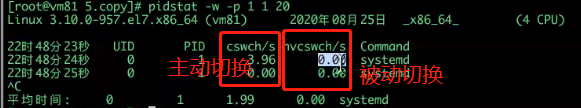


## Process Thread LWP

***1. Linux中没有真正的线程，但windows中确实有线程\***
***2. Linux中没有的线程是由进程来模拟实现的（又称作：轻量级进程）\***
***3. 所以在Linux中（在CPU角度看）进程被称作轻量级进程（LWP）\***
***由于Linux下没有真正的线程，只有所谓的用户级线程，线程在CPU地址空间内运行\***

关于进程（PCB）、轻量级进程（LWP）、线程（TCB）、用户线程、内核线程的定义，在现代操作系统中，进程支持多线程 。 ***进程是分配资源（资源管理）的最小单元；而线程是调度资源（程序执行）的最小单元\***。 一个进程的组成实体可以分为两大部分：线程集合和资源集合。进程中的线程是动态的对象；代表了进程指令的执行。


进程是Linux的基础，因为OS所做的每一项工作都是根据进程来完成的。只要想一想，您就会发现这是一个过程。这是因为要完成的任何工作都需要系统资源（由内核提供），并且该过程被内核视为可以向其提供系统资源的实体。

进程具有优先级，具体取决于哪个内核上下文切换它们。如果可以执行优先级更高的进程，则可以抢占该进程。


例如，如果某个进程正在等待系统资源，例如保存在磁盘上的文本文件中的某些文本，则内核可以调度更高优先级的进程，并在数据可用时返回到等待进程。这样可以使整个操作系统的运行状况保持平稳，并使用户感觉到任务正在并行运行。

进程可以使用进程间通信方法与其他进程进行对话，并可以使用共享内存之类的技术共享数据。

在Linux中，fork（）用于创建新进程。这些新进程称为子进程，每个子进程最初共享所有段，例如文本，堆栈，堆等，直到子进程尝试对堆栈或堆进行任何更改。如有任何更改，将为子级准备单独的堆栈段和堆段副本，以便更改保持特定于子级。文本段是只读的，因此父级和子级都共享相同的文本段。[C fork函数](https://www.thegeekstuff.com/2012/05/c-fork-function/)文章详细介绍了fork（）。

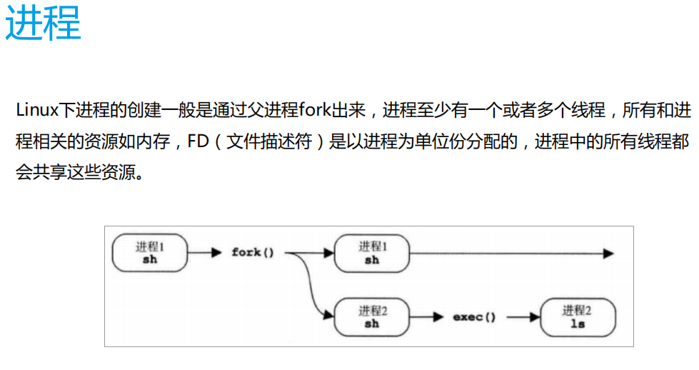

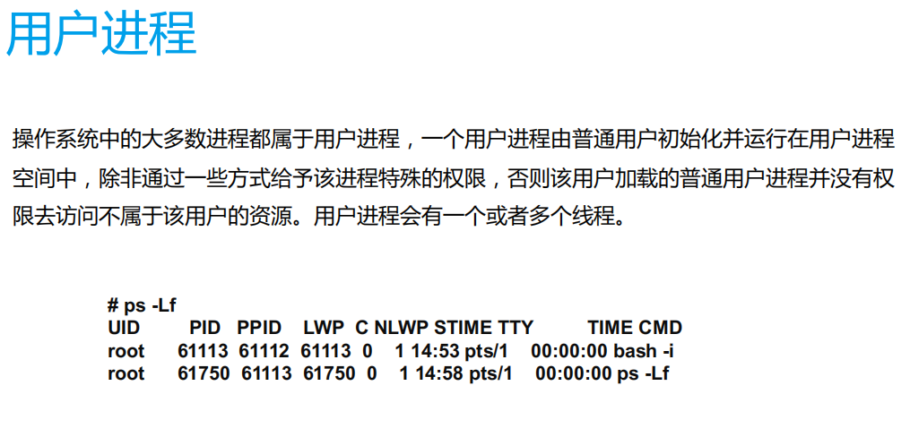

## 进程与线程的联系与区别

```
1. 线程是在进程内部运行的执行分支
2. 线程是为了资源共享（共享地址空间），进程是为了资源独占（私有地址空间）
3. Linux下没有真正的线程，它是利用进程来代替实现的
4. 进程是分配资源（资源管理）的最小单元；而线程是调度资源（程序执行）的最小单元
5. 线程与线程之间是独立的
```

### Linux线程与轻量级进程

Linux中的线程不过是流程执行的流程。包含多个执行流的进程称为多线程进程。

对于非多线程进程，只有执行流是主要的执行流，因此也称为单线程进程。对于Linux内核，没有线程的概念。内核将每个线程视为一个单独的进程，但是这些进程与其他常规进程有所不同。我将在以下各段中解释差异。

线程通常与轻量级进程或LWP混合使用。原因可以追溯到Linux仅在用户级别支持线程的时候。这意味着内核甚至将多线程应用程序视为单个进程。这给管理这些用户级线程的库带来了巨大的挑战，因为它必须处理这样的情况：如果有任何其他线程发出了阻塞调用，则线程执行不会受到阻碍。

后来更改了实现，并将进程附加到每个线程，以便内核可以处理它们。但是，如前所述，Linux内核并不将其视为线程，每个线程都被视为内核中的一个进程。这些过程称为轻量过程。

轻量级进程（LWP）与普通进程之间的主要区别在于，LWP共享相同的地址空间和其他资源，例如打开文件等。由于共享了某些资源，因此与其他普通进程相比，这些进程被认为是轻量级的因此，名称轻量级过程。

因此，实际上，我们可以说线程和轻量进程是相同的。只是线程是在用户级别使用的术语，而轻量级进程是在内核级别使用的术语。

从实现的角度来看，线程是使用Linux中符合POSIX的pthread库公开的功能创建的。在内部，clone（）函数用于创建正常以及轻量化的过程。这意味着要创建一个普通的进程fork（），它会使用适当的参数进一步调用clone（），而在创建线程或LWP时，pthread库中的函数会使用相关的标记调用clone（）。因此，主要区别是通过使用可以传递给clone（）函数的不同标志生成的。

在各自的手册页上了解有关fork（）和clone（）的更多信息。

[如何在Linux中创建线程](https://www.thegeekstuff.com/2012/04/create-threads-in-linux/)说明了有关线程的更多信息。
https://unix.stackexchange.com/questions/472300/is-a-light-weight-process-attached-to-a-kernel-thread-in-linux

![[Pasted image 20230302001729.png]]
![[Pasted image 20230302001738.png]]
![[Pasted image 20230302001750.png]]

## PID TGID TID LWP

初步理解各种ID。基本上按照重要程度从高到低，在分割线下方的IDs不太重要。

- pid: 进程ID。
- lwp: 线程ID。在用户态的命令(比如ps)中常用的显示方式。
- tid: 线程ID，等于lwp。tid在系统提供的接口函数中更常用，比如syscall(SYS_gettid)和syscall(__NR_gettid)。
- tgid: 线程组ID，也就是线程组leader的进程ID，等于ppid。
- ------分割线------
- ppid：父进程ID
- pgid: 进程组ID，也就是进程组leader的进程ID。
- pthread id: pthread库提供的ID，生效范围不在系统级别，可以忽略。
- sid: session ID for the session leader。
- tpgid: tty process group ID for the process group leader。

 从上面的列表看出，各种ID最后都归结到pid和lwp(tid)上。所以理解各种ID，最终归结为理解pid和lwp(tid)的联系和区别。


上图很好地描述了用户视角(user view)和内核视角(kernel view)看到线程的差别：

- 从用户视角出发，在pid 42中产生的tid 44线程，属于tgid(线程组leader的进程ID) 42。甚至用ps和top的默认参数，你都无法看到tid 44线程。
- 从内核视角出发，tid 42和tid 44是独立的调度单元，可以把他们视为"pid 42"和"pid 44"。

需要指出的是，有时候在Linux中进程和线程的区分也是不是十分严格的。即使线程和进程混用，pid和tid混用，根据上下文，还是可以清楚地区分对方想要表达的意思。上图中，从内核视角出发看到了pid 44，是从调度单元的角度出发，但是在top或ps命令中，你是绝对找不到一个pid为44的进程的，只能看到一个lwp(tid)为44的线程。

### LWP

```
就算你生成了n个线程，但是在 linux看来跟进程是一样的。只不过是占用内存大小变小，称为轻量级进程。LIGHT WEIGHT PROCESS
linux 原生内核不支持线程，好多爱好开发者提供了好多实现方式，linux内核实现一套   红帽  一套   其他一套  三种实现需要线程库的支持。
 
 线程死锁
线程不一定是好事，多个线程不能同时抢占一个文件。内核会给资源枷锁。
线程资源浪费：
    死锁：1拿2的资源 2拿1的资源，都在等着释放。
           1 等着2拿的资源，cpu过一下看一回，一直cpu看，浪费时间。
```

在计算机操作系统中,轻量级进程（LWP）是一种实现多任务的方法。与普通进程相比，LWP与其他进程共享所有（或大部分）它的逻辑地址空间和系统资源；与[线程](http://baike.baidu.com/view/1053.htm)相比，LWP有它自己的进程标识符，优先级，状态，以及栈和局部存储区，并和其他进程有着父子关系；这是和类Unix操作系统的系统调用vfork()生成的进程一样的。另外，线程既可由应用程序管理，又可由内核管理，而LWP只能由内核管理并像普通进程一样被调度。Linux内核是支持LWP的典型例子。

　　在大多数系统中，LWP与普通进程的区别也在于它只有一个最小的执行上下文和调度程序所需的统计信息，而这也是它之所以被称为轻量级的原因。一般来说，一个进程代表程序的一个实例，而LWP代表程序的执行线程（其实，在内核不支持线程的时候，LWP可以很方便地提供线程的实现）。因为一个执行线程不像进程那样需要那么多状态信息，所以LWP也不带有这样的信息。

　　LWP的一个重要作用是提供了一个用户级线程实现的中间系统。LWP可以通过系统调用获得内核提供的服务，因此，当一个用户级线程运行时，只需要将它连接到一个LWP上便可以具有内核支持线程的所有属性。

　　而因为LWP之间共享它们的大部分资源，所以它在某些应用程序就不适用了；这个时候就要使用多个普通的进程了。例如，为了避免内存泄漏（a process can be replaced by another one）和实现特权分隔（processes can run under other credentials and have other permissions）。

　　使用多个进程也使得应用程序在出现进程池内的进程崩溃或被攻击的情况下变得更加健壮。

## 守护进程

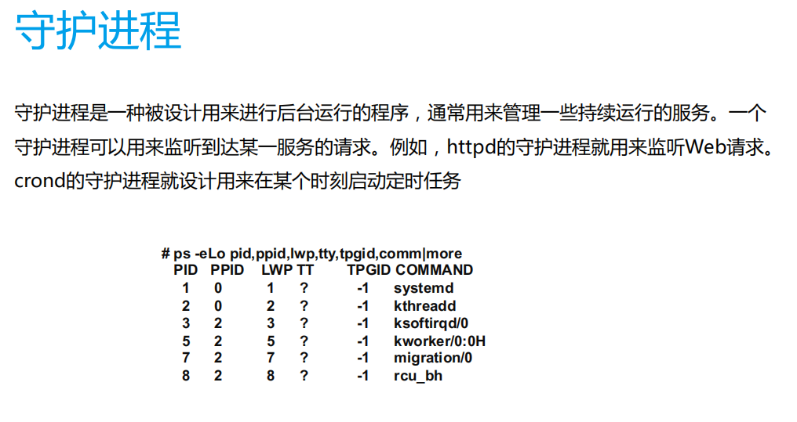

### 内核进程

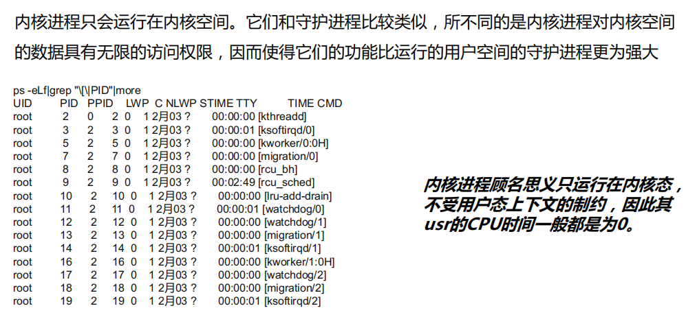

## 进程状态

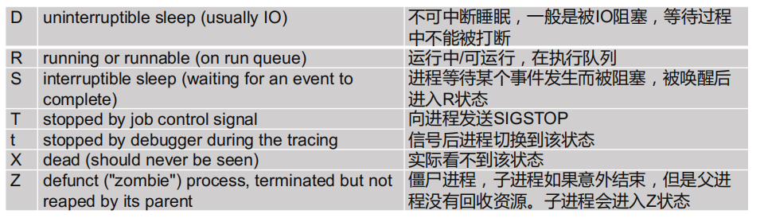

普通Linux进程的生命周期看起来很像现实生活。流程诞生了，一段时间与父母共享资源，准备好进行更改时获得了自己的资源副本，根据它们的优先级经历了各种状态，然后最终消亡。在本节中，将讨论Linux进程的各种状态：

- RUNNING –此状态指定该进程正在执行中或正在等待执行。
- 可中断–此状态指定该进程正处于睡眠模式时正等待被中断，并且正在等待可以唤醒该进程的某些操作。该动作可以是硬件中断，信号等。
- 不可中断–就像可中断状态一样，唯一的区别是无法通过传递信号来唤醒处于此状态的进程。
- STOPPED –此状态指定进程已停止。如果将诸如SIGSTOP，SIGTTIN等的信号传递到进程，则可能会发生这种情况。
- TRACED-此状态指定正在调试进程。每当调试器停止该过程（以帮助用户调试代码）时，该过程就会进入此状态。
- ZOMBIE-此状态指定进程已终止，但仍在内核进程表中徘徊，因为该进程的父级仍未获取此进程的终止状态。父级使用wait（）系列函数来获取终止状态。
- DEAD-此状态指定进程已终止，并且条目已从进程表中删除。如ZOMBIE状态中所述，当父级成功获取终止状态时，将达到此状态。


**Linux进程状态：R (TASK_RUNNING)，可执行状态。**

只有在该状态的进程才可能在CPU上运行。而同一时刻可能有多个进程处于可执行状态，这些进程的task_struct结构（进程控制块）被放入对应CPU的可执行队列中（一个进程最多只能出现在一个CPU的可执行队列中）。进程调度器的任务就是从各个CPU的可执行队列中分别选择一个进程在该CPU上运行。

很多操作系统教科书将正在CPU上执行的进程定义为RUNNING状态、而将可执行但是尚未被调度执行的进程定义为READY状态，这两种状态在linux下统一为 TASK_RUNNING状态。

**Linux进程状态：S (TASK_INTERRUPTIBLE)，可中断的睡眠状态。**

处于这个状态的进程因为等待某某事件的发生（比如等待socket连接、等待信号量），而被挂起。这些进程的task_struct结构被放入对应事件的等待队列中。当这些事件发生时（由外部中断触发、或由其他进程触发），对应的等待队列中的一个或多个进程将被唤醒。

通过ps命令我们会看到，一般情况下，进程列表中的绝大多数进程都处于TASK_INTERRUPTIBLE状态（除非机器的负载很高）。毕竟CPU就这么一两个，进程动辄几十上百个，如果不是绝大多数进程都在睡眠，CPU又怎么响应得过来。

**Linux进程状态：D (TASK_UNINTERRUPTIBLE)，不可中断的睡眠状态。**

与TASK_INTERRUPTIBLE状态类似，进程处于睡眠状态，但是此刻进程是不可中断的。不可中断，指的并不是CPU不响应外部硬件的中断，而是指进程不响应异步信号。
绝大多数情况下，进程处在睡眠状态时，总是应该能够响应异步信号的。否则你将惊奇的发现，kill -9竟然杀不死一个正在睡眠的进程了！于是我们也很好理解，为什么ps命令看到的进程几乎不会出现TASK_UNINTERRUPTIBLE状态，而总是TASK_INTERRUPTIBLE状态。

而TASK_UNINTERRUPTIBLE状态存在的意义就在于，内核的某些处理流程是不能被打断的。如果响应异步信号，程序的执行流程中就会被插入一段用于处理异步信号的流程（这个插入的流程可能只存在于内核态，也可能延伸到用户态），于是原有的流程就被中断了。（参见《linux内核异步中断浅析》）
在进程对某些硬件进行操作时（比如进程调用read系统调用对某个设备文件进行读操作，而read系统调用最终执行到对应设备驱动的代码，并与对应的物理设备进行交互），可能需要使用TASK_UNINTERRUPTIBLE状态对进程进行保护，以避免进程与设备交互的过程被打断，造成设备陷入不可控的状态。这种情况下的TASK_UNINTERRUPTIBLE状态总是非常短暂的，通过ps命令基本上不可能捕捉到。

linux系统中也存在容易捕捉的TASK_UNINTERRUPTIBLE状态。执行vfork系统调用后，父进程将进入TASK_UNINTERRUPTIBLE状态，直到子进程调用exit或exec（参见《神奇的vfork》）


## Load average

- 如果平均值为0.0，则您的系统处于空闲状态。
- 如果1分钟的平均值高于5分钟或15分钟的平均值，则负载正在增加。
- 如果1分钟的平均值低于5或15分钟的平均值，则负载正在减少。
- 如果它们高于您的CPU数量，那么您可能会遇到性能问题（取决于情况）。


也许一直以来的真正问题是，“平均负载”一词与“ I / O”一样模棱两可。哪种类型的I / O？磁盘I / O？文件系统I / O？网络I / O？...同样，平均负载是多少？平均CPU负载？系统平均负载？这样澄清一下，我就可以这样理解：

- 在Linux上，平均负载是（或试图成为）整个系统的“ **系统平均负载** ”，用于衡量正在工作并等待工作的线程数（CPU，磁盘，不间断锁）。换句话说，它测量未完全空闲的线程数。优势：包括对不同资源的需求。
- 在其他OS上，平均负载为“ **CPU平均负载** ”，表示CPU运行数量+ CPU可运行线程数。优点：可以更容易理解和推理（仅适用于CPU）。

### 什么是“好”或“坏”的平均负载？

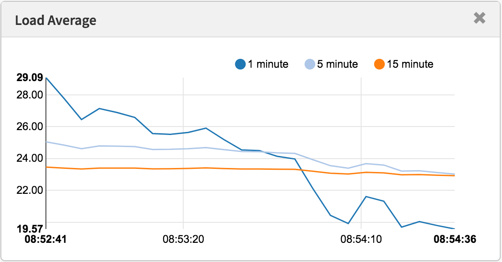
*使用现代工具测得的平均负载*

有些人发现了适用于他们的系统和工作负载的价值：他们知道，当负载超过X时，应用程序延迟很高，客户开始抱怨。但这并没有真正的规则。

使用CPU平均负载，可以将该值除以CPU计数，然后说如果该比率超过1.0，则说明您正在饱和运行，这可能会导致性能问题。这有点模棱两可，因为它是一个长期平均值（至少一分钟），可以隐藏变化。一个比率为1.5的系统可能运行良好，而在1.5分钟内突然爆裂的另一个系统可能表现不佳。

我曾经管理过一个两CPU电子邮件服务器，该服务器在一天中的平均CPU负载为11到16（比率为5.5到8）。延迟是可以接受的，没有人抱怨。这是一个极端的例子：大多数系统的负载/ CPU比率仅为2。

至于Linux的系统平均负载：由于它们涵盖了不同的资源类型，因此它们甚至更加模棱两可，因此，您不能仅仅除以CPU数量。对于*相对*比较*而言，*它更有用：如果您知道系统在20的负载下运行良好，而现在是40，那么该是时候探究其他指标以查看发生了什么。


### 更好的指标

当Linux平均负载增加时，您就会知道对资源（CPU，磁盘和某些锁）的需求更高，但是您不确定哪一个。您可以使用其他指标进行澄清。例如，对于CPU：

- **每CPU利用率**：例如，使用`mpstat -P ALL 1`
- **每个进程的CPU利用率**：例如`top`，`pidstat 1`等。
- **每线程运行队列（调度程序）延迟**：例如，在/ proc / PID / schedstats，delaystats，`perf sched中`
- **CPU运行队列延迟**：例如，在/ proc / schedstat中，在`perf sched中`，我的[runqlat ](http://www.brendangregg.com/blog/2016-10-08/linux-bcc-runqlat.html)[bcc](https://github.com/iovisor/bcc)工具。
- **CPU运行队列长度**：例如，使用`vmstat 1`和'r'列或我的runqlen bcc工具。

前两个是利用率指标，后三个是饱和度指标。利用率指标可用于工作负载表征，而饱和度指标可用于识别性能问题。最佳的CPU饱和度度量标准是运行队列（或调度程序）延迟的度量：任务/线程处于可运行状态但必须等待其运行的时间。这些允许您计算性能问题的严重程度，例如，线程在调度程序延迟中花费的时间百分比。相反，通过测量运行队列长度可以表明存在问题，但是估计幅度更困难

### 结论

1993年，一位Linux工程师发现了一个不直观的情况，即平均负载，并且通过三行修补程序将它们从“ CPU平均负载”永久地更改为“系统平均负载”。他的更改包括处于不间断状态的任务，因此平均负载反映了对磁盘资源的需求，而不仅仅是CPU。这些系统平均负载对工作和等待工作的线程数进行计数，并总结为指数阻尼移动和平均值的三元组，这些平均值在方程式中使用1、5和15分钟作为常数。这个三元组数字使您可以查看负载是在增加还是在减少，并且它们的最大值可能是与它们自己的相对比较。

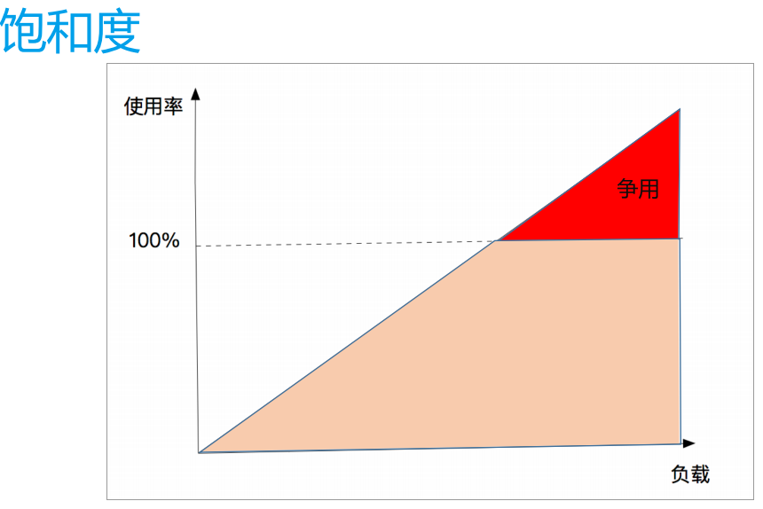

# 工具

## TOP

## PS

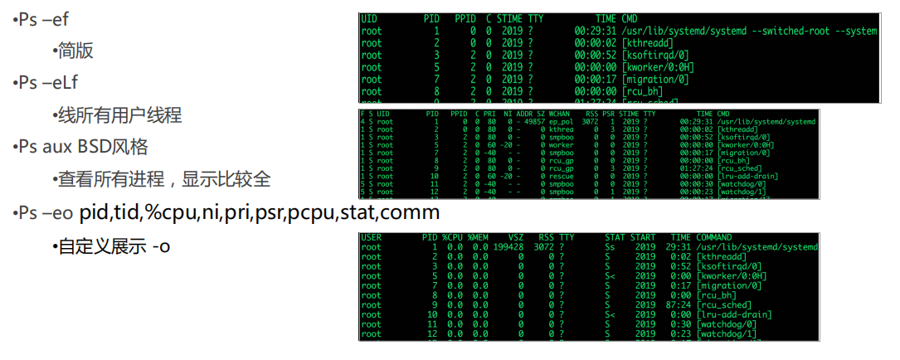

## pidstat

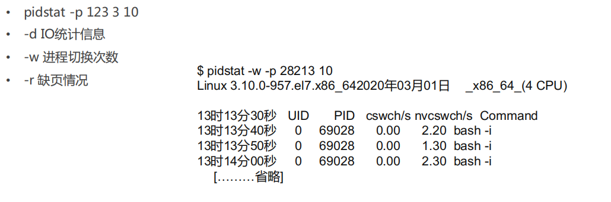

## iostat

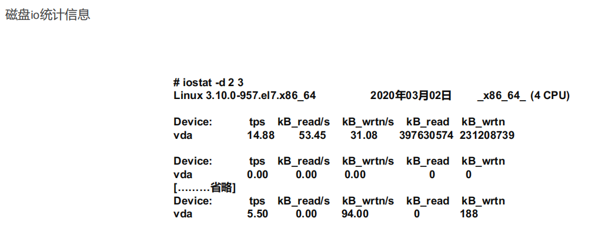

## sar

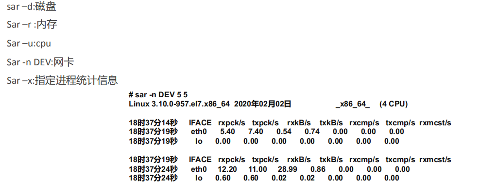

## mpstat

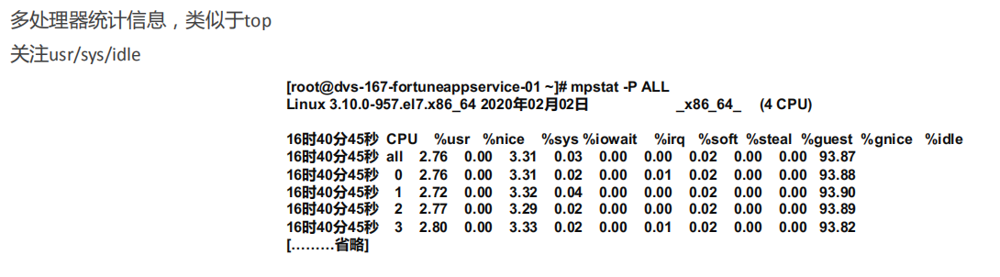

## netstat

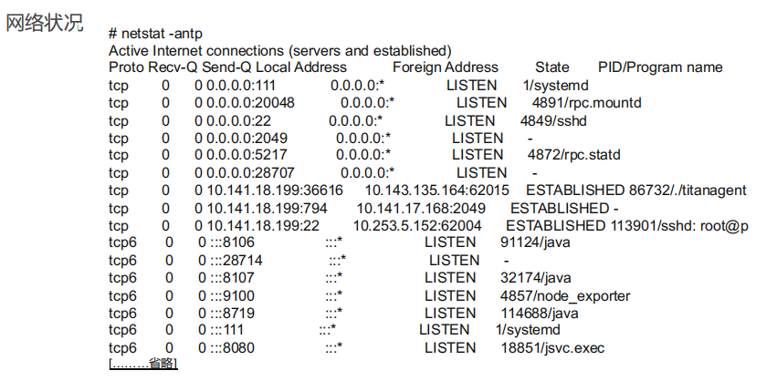

## hping3

## traceroute

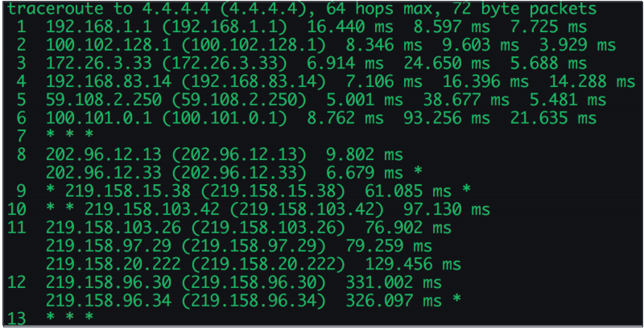

默认使用UDP协议，使用大于32768的端口,路由器有些会拒绝，所以会有“* * *"

控制发送频次, `traceroute -Z 1000` ,1 s。避免”防刷“策略

使用 icmp 协议 `traceroute -I`： https://baike.baidu.com/item/ICMP/572452?fr=aladdin 


## 60s诊断

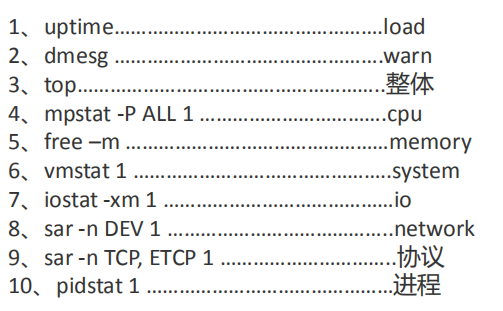

http://techblog.netflix.com/2015/11/linux-performance-analysis-in-60s.html

# CASE

## 高CPU带来高负载？

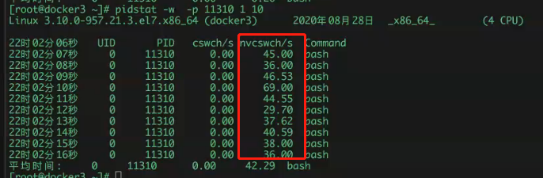

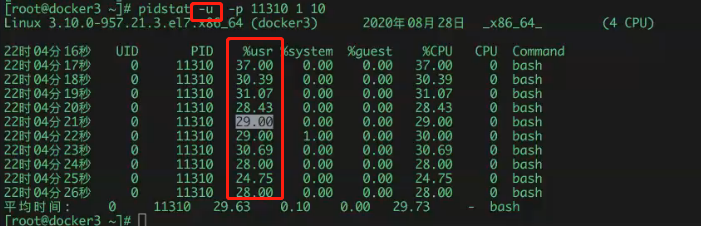

## 低CPU负载一定低？

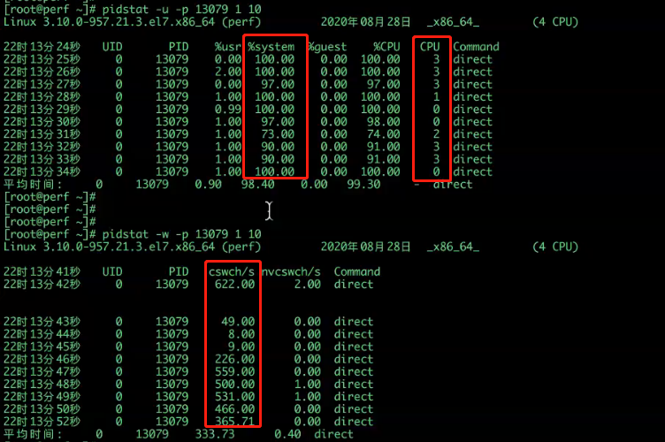

## 理想

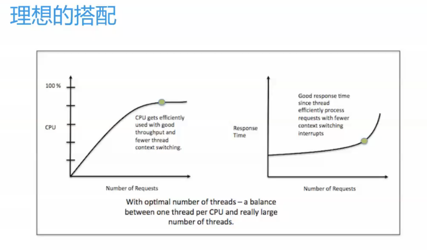

