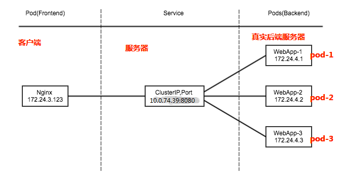

# K8S，必知必会


## 1. 变迁


- Automatic Binpacking 自动装箱

- Service Discovery & LB 服务发现与负载

- storage orchestration 存储协调

  - Rook

    - Rook是一款面向Kubernetes的开源云本地存储协调器，为多种存储解决方案提供平台、框架和支持，从而与云本地环境进行本地集成。

      Rook将存储软件转变为自管理、自伸缩和自修复的存储服务。它通过自动化部署、引导、配置、供应、伸缩、升级、迁移、灾难恢复、监视和资源管理来实现这一点。Rook使用底层云本地容器管理、调度和编排平台提供的功能来执行其职责。

- Java1.3  Self healing 自我修复的

  - ```
    Kubernetes的自修复特性，确保集群始终以最佳状态运行。Kubernetes可以自我检测两种类型的对象——podstatus和containerstatus。Kubernetes的编排功能，可以根据所需的配置监视和替换不健康的容器。同样，Kubernetes可以修复pod.
    ```

    - **pod的阶段、探测和重启策略**
      - 在Kubernetes中的pod阶段提供了对pod位置的洞察。我们可以有
        - Pending Pods——创建但不运行
        - Running Pods——运行所有的容器
        - Succeeded Pods——成功完成容器生命周期
        - Failed Pods——至少一个容器失效，所有容器终止
        - Unknown Pods
      - Kubernetes对pod执行了liveliness和readiness探测，以检查它们是否按照期望的状态工作。
        - liveliness探测器将检查容器的运行状态。如果一个容器探测失败，Kubernetes将终止它，并根据重启策略创建一个新的容器。
        - readiness探测器将检查容器的服务请求服务功能。如果容器探测失败，Kubernetes将删除相关pod的IP地址。
        - 探测包括
          - ExecAction——在容器中执行命令。
          - TCPSocketAction——实现TCP检查，指向一个容器的IP地址。
          - HTTPGetAction——实现一个HTTPGet检查，指向一个容器的IP地址。
        - 每个探测给出三个结果之一：
          - Success：容器通过了诊断。
          - Failure：容器诊断失败。
          - Unknown：诊断失败，所以不应该采取行动。

  - ```
    Kubernetes可以自愈应用程序和容器，但是当节点有问题时，如何自愈呢？为了让Kubernetes继续自我修复，它需要一组专用的基础设施，可以随时访问自修复节点。基础设施必须由自动化驱动，并由预测分析提供支持，以便预先修复问题。底线是，在任何给定的时间点，基础设施节点应该维护不间断服务所需的数量。
    ```

- Secret & Configuration Management  密钥与配置管理

- Batch Execution 批处理

  - There are three main types of task suitable to run as a Job:
    - Non-parallel Jobs
    - Parallel Jobs with a *fixed completion count*
    - Parallel Jobs with a *work queue*

- Horizontal Scaling 水平扩展

- Automatic Rollbacks & Rollouts  自动回滚&发布


## 2. 架构


- **Master**
  - Api-Server
    - 集群的管理总线和数据中心（etcd）
  - Scheduler
    - 任务调度
  - Control Manager
    - 资源管理
    - Deployment
    - rc
    - rs
    - ns
    - endpoint
  - KV 存储
    - 数据存储
- **Node**
  - Kubelet
    - etcd
  - Kube-poxy
    - 资源管理
    - ns
    - endpoint
  - Container runtime
    - Docker,containerd,CRI-O
    - 符合k8s CRI (Container Runtime Interface)
- k8s 不直接管理容器，管理pod.
- scheduler -> api server -> 存储信息，指令，数据 在etc -> kubelet 扫描 etcd 获取相关指令，扫描相关请求 -> 发现请求 -> 执行在node请求


- CRI（Container Runtime Interface）：容器运行时接口，提供计算资源
- CNI（Container Network Interface）：容器网络接口，提供网络资源
- CSI（Container Storage Interface）：容器存储接口，提供存储资源


## 3. 核心概念
### 3.1 Pod

- 一系列服务（容器）

- 一个Pod的共享上下文是Linux namespace、cgroups和其它潜在隔离内容的集合。 在Pod中，容器共享一个IP地址和端口空间，它们可以通过localhost发现彼此。

  - Pod 的上下文可以理解成 **多个** linux namespace 的联合：
    - PID namespace（同一个Pod中应用可以看到其它进程）
    - 网络 namespace（同一个Pod的中的应用对相同的IP地址和端口有权限）
    - IPC namespace（同一个Pod中的应用可以通过VPC或者POSIX进行通信）
    - UTS namespace（同一个Pod中的应用共享一个主机名称）

- 网络

  - 每一个Pod都会被指派一个唯一的Ip地址，在Pod中的每一个容器共享网络命名空间，包括Ip地址和网络端口。在同一个Pod中的容器可以同localhost进行互相通信。当Pod中的容器需要与Pod外的实体进行通信时，则需要通过端口等共享的网络资源。
    - 在同一个Pod中的容器，可以使用System V 或POSIX信号进行标准的进程间通信和共享内存。
    - 在不同Pod中的容器，拥有不同的IP地址，因此不能够直接在进程间进行通信。容器间通常使用Pod IP地址进行通信。

- 存储

  - Pod能够被指定共享存储卷的集合，在Pod中所有的容器能够访问共享存储卷，允许这些容器共享数据。存储卷也允许在一个Pod持久化数据，以防止其中的容器需要被重启。

- Pod是一个临时的实体，它有着自己的生命周期。在Pod被创建时，会被指派一个唯一的ID，并被调度到Node中，直到Pod被终止或删除。如果Pod所在的Node宕机，给定的Pod（即通过UID定义）不会被重新调度。相反，它将被完全相同的Pod所替代。

  - 例如存储卷，是说和Pod存在的时间一样长。如果Pod被删除，即使完全相同的副本被创建，则相关存储卷等也会被删除，并会Pod创建一个新的存储卷等。Pod本身就没有打算作为持久化的实体，在调度失败、Node失败和获取其它退出（缺少资源或者Node在维护）情况下，Pod都会被删除。

- 一般来说，用户不应该直接创建Pod，即是创建单个的Pod也应该通过控制器创建。在集群范围内，控制器为Pod提供自愈能力，以及副本和部署管理。

  - 如果Pod所在的Node失败，或者如果调度操作本身失败，则Pod将会被删除；

  

###  3.2 Pod控制器

通过控制器能够创建和管理多个Pod（通过pod模版），并在集群范围内处理副本、部署和提供自愈能力。

#### 3.2.1 [Deployment](https://kubernetes.io/docs/concepts/workloads/controllers/deployment/)

- A *Deployment* provides declarative updates for [Pods](https://kubernetes.io/docs/concepts/workloads/pods/) [ReplicaSets](https://kubernetes.io/docs/concepts/workloads/controllers/replicaset/).
- you describe a *desired state* in a Deployment, and the Deployment [Controller](https://kubernetes.io/docs/concepts/architecture/controller/) changes the actual state to the desired state at a controlled rate. You can define Deployments to create new ReplicaSets, or to remove existing Deployments and adopt all their resources with new Deployments.
- **Note:** Do not manage ReplicaSets owned by a Deployment.

##### Use Case

The following are typical use cases for Deployments:

- [Create a Deployment to rollout a ReplicaSet](https://kubernetes.io/docs/concepts/workloads/controllers/deployment/#creating-a-deployment). The ReplicaSet creates Pods in the background. Check the status of the rollout to see if it succeeds or not.

- [Declare the new state of the Pods](https://kubernetes.io/docs/concepts/workloads/controllers/deployment/#updating-a-deployment) by updating the PodTemplateSpec of the Deployment. A new ReplicaSet is created and the Deployment manages moving the Pods from the old ReplicaSet to the new one at a controlled rate. Each new ReplicaSet updates the revision of the Deployment.

- [Rollback to an earlier Deployment revision](https://kubernetes.io/docs/concepts/workloads/controllers/deployment/#rolling-back-a-deployment) if the current state of the Deployment is not stable. Each rollback updates the revision of the Deployment.

- [Scale up the Deployment to facilitate more load](https://kubernetes.io/docs/concepts/workloads/controllers/deployment/#scaling-a-deployment).

- [Pause the Deployment](https://kubernetes.io/docs/concepts/workloads/controllers/deployment/#pausing-and-resuming-a-deployment) to apply multiple fixes to its PodTemplateSpec and then resume it to start a new rollout.

- [Use the status of the Deployment](https://kubernetes.io/docs/concepts/workloads/controllers/deployment/#deployment-status) as an indicator that a rollout has stuck.

- [Clean up older ReplicaSets](https://kubernetes.io/docs/concepts/workloads/controllers/deployment/#clean-up-policy) that you don't need anymore.

  

- 新建RS，新建POD

- “无状态‘更新：

  - 无实时 数据需要存储
  - 将服务抽离集群后，再放置回去，集群服务可用。

- ReplicaSet 更高级的封装

  - 滚动更新
  - 水平扩展/收缩

- 只认标签，不认owner

  - 裸pod最好不要设置label

- 弹性扩容

  - HPA
  - CPU&内存
  - 自定义

  

#### 3.2.2 [StatefulSet](https://kubernetes.io/docs/concepts/workloads/controllers/statefulset/)

- 有“状态”更新：
  - 有 实时 数据需要存储
  - 将服务抽离集群后，再放置回去，集群服务不可用。
- 新建RS，新建POD（hostname不变）
- 靠POD中的hostname来关联实时状态数据
- 持久化数据依靠 PVC 文件系统
- 维护有状态的pod，网络，标识，存储
- 有序的启动、销毁
- 具有稳定的网络标识

#### 3.2.3 [DaemonSet](https://kubernetes.io/docs/concepts/workloads/controllers/daemonset/)

- 确保所有（或部分）节点运行指定的pod副本
- 一般用于守护进程，如日志收集、监控、存储

*DaemonSet* 确保全部（或者一些）Node 上运行一个 Pod 的副本。当有 Node 加入集群时，也会为他们新增一个 Pod 。当有 Node 从集群移除时，这些 Pod 也会被回收。删除 DaemonSet 将会删除它创建的所有 Pod。

使用 DaemonSet 的一些典型用法：

- 运行集群存储 daemon，例如在每个 Node 上运行 `glusterd`、`ceph`。
- 在每个 Node 上运行日志收集 daemon，例如`fluentd`、`logstash`。
- 在每个 Node 上运行监控 daemon，例如 Prometheus Node Exporter、`collectd`、Datadog 代理、New Relic 代理，或 Ganglia `gmond`。


一个简单的用法是，在所有的 Node 上都存在一个 DaemonSet，将被作为每种类型的 daemon 使用。 一个稍微复杂的用法可能是，对单独的每种类型的 daemon 使用多个 DaemonSet，但具有不同的标志，和/或对不同硬件类型具有不同的内存、CPU要求。

#### 3.2.4 ReplicaSet （副本控制器）

- 标签 
  - 多选
  - 单选
- 控制副本数量与预设的一致
- 自带pod的创建模板，根据目标pod配置去创建、更新、销毁pod
- 通过selector选中管理pod
- 建议使用Deployments

#### 3.2.5 ReplicaController

- 标签:单选
- 新版k8s推荐使用 ReplicaSet


### 3.3 Pod模板

是一个被包含在其它对象(例如：Deployment、StatefuleSet、DaemonSet等)中的Pod规格

#### 重启策略

- 通过*restartPolicy*字段设置重启策略：
  - Always：只要退出就会重启。
  - OnFailure：只有在失败退出（exit code不等于0）时，才会重启。
  - Never：只要退出，就不再重启
- 注意，这里的重启是指在Pod的宿主Node上进行本地重启，而不是调度到其它Node上。

#### **镜像拉取策略**

- 通过*imagePullPolicy字体设置镜像的拉取策略*：
  - Always：不管本地是否存在镜像都会进行一次拉取。
  - Never：不管本地是否存在镜像都不会进行拉取。
  - IfNotPresent：仅在本地镜像不存在时，才会进行镜像拉取。
- 注意：
  - 镜像拉取策略的默认值为IfNotPresent，但:latest标签的镜像默认为Always。
  - 拉取镜像时docker会进行校验，如果镜像中的MD5码没有变，则不会拉取镜像数据。
  - 生产环境中应该尽量避免使用:latest标签，而开发环境中可以借助:latest标签自动拉取最新的镜像。


#### 私钥镜像仓库

- 在使用私有镜像拉取镜像时，需要为私有镜像仓库创建一个docker registry secret，并在创建容器中进行引用。

- 通过kubectl create secret docker-registry命令创建docker registry secret：

  - ```
    $ kubectl create secret docker-registry regsecret --docker-server=<your-registry-server> \
    --docker-username=<your-name> --docker-password=<your-pword> --docker-email=<your-email>
    ```


#### **资源限制**

- 容器的资源限制通过resources.limits进行设置
  - spec.containers[].resources.limits.cpu：容器的CPU资源上限，可以短暂超过，容器也不会被停止；
  - spec.containers[].resources.limits.memory：容器的内存资源上限，不可以超过；如果超过，容器可能会被停止或调度到其它资源充足的Node上。
- 资源请求通过resources.requests进行设置
  - spec.containers[].resources.requests.cpu：容器的CPU资源请求，可以超过；
  - spec.containers[].resources.requests.memory：容器的内存资源请求，可以超过；但如果超过，容器可能会在Node内存不足时清理。
  - Kubernetes在进行Pod调度时，Pod的资源请求是最重要的一个指标。Kubernetes Schedule会检查Node是否存在足够的资源，判断是否能够满足Pod的资源请求，从而决定是否可以运行Pod。


### **3.4 健康检查**

- 

### 3.5 **初始化容器**

在一个POD中，可以运行多个容器，同时它也可以拥有有一个或多个初始化容器，**初始化容器**在**应用程序容器**启动之前运行。

- 初始化容器与普通容器完全一样，只是：
  - 它们总是完全执行
  - 每一个初始化容器都必须在下一个初始化开始之前成功完成

- 如果Pod中的初始化容器失败，Kubernetes将会重复重启Pod，直到初始化容器成功执行。
  - 然而，如果Pod的重启策略为*Never，*则Pod不会重启。
- 初始化容器支持应用程序容器的所有字段和特性，包括资源限制、存储卷和安全设置等
- 初始化容器不支持健康检测探针，因为，它们必须在POD准备好之前完成运行。
- 如果为Pod指定了多个初始化容器，则这些初始化容器将会按顺序依次运行。
  - 每一个都必须在下一个运行之前成功运行。当所有的初始化容器都运行完成时，Kubernetes完成Pod的初始化，并像通常的方式一样运行应用程序容器。

### 3.5 **容器调度**


### 3.6 **环境变量**

在Kubernetes中，通过*env*或*envFrom*字段进行设置。使用*env*或*envFrom*字段设置的环境变量将会覆盖容器镜像中指定的环境变量。


### **3.7** **启动命令**

在配置文件通过设置*command*字段来定义命令，通过设置args字段来定义参数。

- 在Pod被创建后，定义的命令和参数将不能被修改。
- 在配置文件中定义的命令和参数会覆盖在容器镜像中定义的命令和参数。


### 3.8 **Pod的生命周期**

Pod的生命周期包括：从Pod被创建、并调度到Node中、以及Pod成功或失败的终止。

Pod的阶段是一个简单的、高层次的Pod所处在生命周期的概述。

在Pod的生命周期中，有如下的几个状态：

- **Pending** : Pod已经被Kubernetes系统接受，但是还有一个或者多个容器镜像未被创建。这包括Pod正在被调度和从网络上下载镜像的时间。
- **Running** : Pod已经被绑定到了一个Node，所有的容器也已经被创建。至少有一个容器已经在运行，或者在启动或者重新启动的过程中。
- **Succeeded ** : 在Pod中的所有的容器都已经被成功的终止，并且不会再重启。
- **Failed** : 在Pod中所有容器都已经被终止，并且至少有一个容器是非正常终止的。即，容器以非零状态退出或者被系统强行终止的。
- **Unknown**: 由于某些原因，Pod不能被获取，典型的情况是在与Pod的主机进行通信中发生了失败。

### 3.9 Service




- An abstract way to expose an application running on a set of [Pods](https://kubernetes.io/docs/concepts/workloads/pods/) as a **network service**.
- With Kubernetes you don't need to modify your application to use an unfamiliar service discovery mechanism. Kubernetes gives Pods their **own IP addresses** and **a single DNS name for a set of Pods**, and can **load-balance across them**.
- In Kubernetes, a Service is an abstraction which defines a logical set of Pods and a policy by which to access them (sometimes this pattern is called a **micro-service**). The set of Pods targeted by a Service is usually determined by a [**selector（选择器）**](https://kubernetes.io/docs/concepts/overview/working-with-objects/labels/) (see [below](https://kubernetes.io/docs/concepts/services-networking/service/#services-without-selectors) for why you might want a Service *without* a selector).
- The Service abstraction enables this **decoupling(去耦合)**.
    - 例子： consider a stateless image-processing backend which is running with 3 replicas. Those replicas are fungible—frontends do not care which backend they use. While the actual Pods that compose **the backend set may change**, t**he frontend clients should not need to be aware of that,** nor should they need to keep track of the set of backends themselves.
- **Cloud-native service discovery**
    - If you're able to use Kubernetes APIs for **service discovery** in your application, you can **query the [API server](https://kubernetes.io/docs/reference/generated/kube-apiserver/) for Endpoints**, that get updated whenever the set of Pods in a Service changes.
    - **non-native applications**, Kubernetes offers ways to place **a network port** or **load balancer** in between your application and the backend Pods.
- **A Service in Kubernetes is a REST object**, similar to a Pod. 
    - Like all of the REST objects, you can `POST` **a Service definition to the API server to create a new instance**. The name of a Service object must be **a valid [DNS label name](https://kubernetes.io/docs/concepts/overview/working-with-objects/names#dns-label-names).**
- 在Kubernetes中，每个节点都安装了kube-proxy，kube-proxy通过kubernetes中固有的watch请求方法持续监听apiserver。一旦有service资源发生变动(增删改查)kube-proxy可以及时转化为能够调度到后端Pod节点上的规则，这个规则可以是iptables也可以是ipvs，取决于service实现方式
- Kubernetes 三大IP
    - Node Network 节点网络 节点网络地址是配置在节点网络之上Pod Network 
    - Pod网络 Pod网络地址是配置在Pod网络之上节点网络和Pod网络都是配置在某个设备之上，可以是硬件也可以是虚拟网络
    - Cluster Network(svc network) virtual IP svc ip没有配置在某个网络接口上，它只是存在service的规则当中

#### 3.9.1 VIP 和 Service 代理

在 Kubernetes 集群中，每个 Node 运行一个 `kube-proxy` 进程。`kube-proxy` 负责为 `Service` 实现了一种 VIP（虚拟 IP）的形式，而不是 [`ExternalName`](https://kubernetes.io/zh/docs/concepts/services-networking/service/#externalname) 的形式。


**为什么不使用 DNS 轮询？**


从Kubernetes v1.0开始，您已经可以使用 [用户空间代理模式](https://kubernetes.io/zh/docs/concepts/services-networking/service/#proxy-mode-userspace)。 Kubernetes v1.1添加了 iptables 模式代理，在 Kubernetes v1.2 中，kube-proxy 的 **iptables 模式**成为默认设置。 Kubernetes v1.8添加了 **ipvs 代理模式**


#### 3.9.2 **Userspace Proxy Mode** （用户空间代理）


- kube-proxy 会监视 Kubernetes master 对 `Service` 对象和 `Endpoints` 对象的添加和移除。

- 对每个 `Service`，它会在本地 Node 上打开一个端口（随机选择）。

- 任何连接到“代理端口”的请求，都会被代理到 `Service` 的backend `Pods` 中的某个上面（如 `Endpoints` 所报告的一样）。

- 使用哪个 backend `Pod`，是 kube-proxy 基于 `SessionAffinity` 来确定的。

- 最后，它配置 iptables 规则，捕获到达该 `Service` 的 `clusterIP`（是虚拟 IP）和 `Port` 的请求，并重定向到代理端口，代理端口再代理请求到 backend `Pod`。

- 默认情况下，用户空间模式下的kube-proxy通过**循环算法**选择后端。

- 默认的策略是，通过 **round-robin （轮询）算法**来选择 backend `Pod`。

- 其它描述：

    - 1、NODE节点的客户端要访问service的代理IP+端口。
        2、IP与端口是由kube-proxy维护的，它创建了IPtables一个规则。
        3、请求经过IPtables后，再转发给kube-proxy端口。
        4、kube-proxy关联后端的backend pod，将请求根据标签代理到指定的Backenpod。

        注：Backend Pod：访问节点IP的指定端口，转发到后端的pod。kubectl get ep 可查看Backend Pod IP。
        注：效率比较低，需要经过一次转发。
        注：kube-proxy是使用的用户空间处理。

#### 3.9.3 Ip-tables 代理模式

这种模式，kube-proxy 会监视 Kubernetes 控制节点对 `Service` 对象和 `Endpoints` 对象的添加和移除。 对每个 `Service`，它会配置 iptables 规则，从而捕获到达该 `Service` 的 `clusterIP` 和端口的请求，进而将请求重定向到 `Service` 的一组 backend 中的某个上面。 对于每个 `Endpoints` 对象，它也会配置 iptables 规则，这个规则会选择一个 backend 组合。

默认的策略是，kube-proxy 在 iptables 模式下随机选择一个 backend。

- 使用 iptables 处理流量具有较低的系统开销，因为流量由 Linux netfilter 处理，而**无需在用户空间和内核空间之间切换**。 这种方法也可能更可靠。

- 如果 kube-proxy 在 iptables 模式下运行，并且所选的第一个 Pod 没有响应，则连接失败。 这与用户空间模式不同：在这种情况下，kube-proxy 将检测到与第一个 Pod 的连接已失败，并会自动使用其他后端 Pod 重试。

- 您可以使用 Pod [readiness 探测器](https://kubernetes.io/docs/concepts/workloads/pods/pod-lifecycle/#container-probes) 验证后端 Pod 可以正常工作，以便 iptables 模式下的 kube-proxy 仅看到测试正常的后端。 这样做意味着您避免将流量通过 kube-proxy 发送到已知已失败的Pod。


在Iptables模式模式下，kube-proxy监视API Server中service和endpoint的变化情况。对于每个service，它都生成相应的iptables规则，这些规则捕获到service的clusterIP和port的流量，并将这些流量随机重定向到service后端Pod。对于每个endpoint对象，它生成选择后端Pod的iptables规则。如果选择的第一个Pod没有响应，kube-proxy将检测到到第一个Pod的连接失败，并将自动重试另一个后端Pod。

**缺点：**

iptables 因为它纯粹是为防火墙而设计的，并且基于内核规则列表，集群数量越多性能越差。

#### 3.9.4 IPVS 代理模式

在 `ipvs` 模式下，kube-proxy监视Kubernetes服务和端点，调用 `netlink` 接口相应地创建 IPVS 规则， 并定期将 IPVS 规则与 Kubernetes 服务和端点同步。 该控制循环可确保　IPVS　状态与所需状态匹配。 访问服务时，IPVS　将流量定向到后端Pod之一。

IPVS代理模式基于类似于 iptables 模式的 netfilter 挂钩函数，但是使用哈希表作为基础数据结构，并且在内核空间中工作。 这意味着，与 iptables 模式下的 kube-proxy 相比，IPVS 模式下的 kube-proxy 重定向通信的延迟要短，并且在同步代理规则时具有更好的性能。与其他代理模式相比，IPVS 模式还支持更高的网络流量吞吐量。

IPVS提供了更多选项来平衡后端Pod的流量。 这些是：

- `rr`: round-robin
- `lc`: least connection (smallest number of open connections)
- `dh`: destination hashing
- `sh`: source hashing
- `sed`: shortest expected delay
- `nq`: never queue

**说明：**

要在 IPVS 模式下运行 kube-proxy，必须在启动 kube-proxy 之前使 IPVS Linux 在节点上可用。

当 kube-proxy 以 IPVS 代理模式启动时，它将验证 IPVS 内核模块是否可用。 如果未检测到 IPVS 内核模块，则 kube-proxy 将退回到以 iptables 代理模式运行。


在这些代理模型中，绑定到服务IP的流量：在客户端不了解Kubernetes或服务或Pod的任何信息的情况下，将Port代理到适当的后端。 如果要确保每次都将来自特定客户端的连接传递到同一Pod，则可以通过将 `service.spec.sessionAffinity` 设置为 "ClientIP" (默认值是 "None")，来基于客户端的IP地址选择会话关联。

您还可以通过适当设置 `service.spec.sessionAffinityConfig.clientIP.timeoutSeconds` 来设置最大会话停留时间。 （默认值为 10800 秒，即 3 小时）。


#### 3.9.5 服务发现

Kubernetes 支持2种基本的服务发现模式 —— 环境变量和 DNS。

##### 环境变量


##### DNS

一个可选（尽管强烈推荐）[集群插件](http://releases.k8s.io/v1.15.11/cluster/addons/README.md) 是 DNS 服务器。 DNS 服务器监视着创建新 `Service` 的 Kubernetes API，从而为每一个 `Service` 创建一组 DNS 记录。 如果整个集群的 DNS 一直被启用，那么所有的 `Pod` 应该能够自动对 `Service` 进行名称解析。

例如，有一个名称为 `"my-service"` 的 `Service`，它在 Kubernetes 集群中名为 `"my-ns"` 的 `Namespace` 中，为 `"my-service.my-ns"` 创建了一条 DNS 记录。 在名称为 `"my-ns"` 的 `Namespace` 中的 `Pod` 应该能够简单地通过名称查询找到 `"my-service"`。 在另一个 `Namespace` 中的 `Pod` 必须限定名称为 `"my-service.my-ns"`。 这些名称查询的结果是 Cluster IP。

Kubernetes 也支持对端口名称的 DNS SRV（Service）记录。 如果名称为 `"my-service.my-ns"` 的 `Service` 有一个名为 `"http"` 的 `TCP` 端口，可以对 `"_http._tcp.my-service.my-ns"` 执行 DNS SRV 查询，得到 `"http"` 的端口号。

Kubernetes DNS 服务器是唯一的一种能够访问 `ExternalName` 类型的 Service 的方式。 更多信息可以查看[DNS Pod 和 Service](https://v1-15.docs.kubernetes.io/docs/concepts/services-networking/dns-pod-service/)。


#### 3.9.6 Headless Service

有时不需要或不想要负载均衡，以及单独的 Service IP。 遇到这种情况，可以通过指定 Cluster IP（`spec.clusterIP`）的值为 `"None"` 来创建 `Headless` Service。

这个选项允许开发人员自由寻找他们自己的方式，从而降低与 Kubernetes 系统的耦合性。 应用仍然可以使用一种自注册的模式和适配器，对其它需要发现机制的系统能够很容易地基于这个 API 来构建。

对这类 `Service` 并不会分配 Cluster IP，kube-proxy 不会处理它们，而且平台也不会为它们进行负载均衡和路由。 DNS 如何实现自动配置，依赖于 `Service` 是否定义了 selector。

##### 配置 Selector

对定义了 selector 的 Headless Service，Endpoint 控制器在 API 中创建了 `Endpoints` 记录，并且修改 DNS 配置返回 A 记录（地址），通过这个地址直接到达 `Service` 的后端 `Pod` 上。

##### 不配置 Selector

对没有定义 selector 的 Headless Service，Endpoint 控制器不会创建 `Endpoints` 记录。 然而 DNS 系统会查找和配置，无论是：

- ReplicaSet （副本控制器）
    - 标签 
        - 多选
        - 单选
    - 控制副本数量与预设的一致
    -  ReplicaController
        - 标签:单选
        - 新版k8s推荐使用 ReplicaSet
- Deployment
    - 滚动更新
    - 新建RS，新建POD
    - “无状态‘更新：
        - 无实时 数据需要存储
        - 将服务抽离集群后，再放置回去，集群服务可用。
- StatefulSet
    - 有“状态”更新：
        - 有 实时 数据需要存储
        - 将服务抽离集群后，再放置回去，集群服务不可用。
    - 新建RS，新建POD（hostname不变）
    - 靠POD中的hostname来关联实时状态数据
    - 持久化数据依靠 PVC 文件系统
# Control Plane 组件

### kube-apiserver


### etcd


### kube-scheduler


### kube-controller-manager


### cloud-controller-manager


# Node 组件

### kubelet


### kube-proxy

- 每个节点都运行一个kube-proxy
- 监控pod，将pod的ip地址汇报给etcd里面的endpoints

### Container runtime


# Addons 插件

### DNS


### Web UI (Dashboard)


### Container Resource Monitoring


### Cluster-level Logging


# 服务注册与发现
- ExternalName 类型 Service 的 CNAME 记录
  - 记录：与 Service 共享一个名称的任何 `Endpoints`，以及所有其它类型

#### 3.9.7 发布服务 —— 服务类型

对一些应用（如 Frontend）的某些部分，可能希望通过外部（Kubernetes 集群外部）IP 地址暴露 Service。

Kubernetes `ServiceTypes` 允许指定一个需要的类型的 Service，默认是 `ClusterIP` 类型。

`Type` 的取值以及行为如下：

- `ClusterIP`：通过集群的内部 IP 暴露服务，选择该值，服务只能够在集群内部可以访问，这也是默认的 `ServiceType`。
- `NodePort`：通过每个 Node 上的 IP 和静态端口（`NodePort`）暴露服务。`NodePort` 服务会路由到 `ClusterIP` 服务，这个 `ClusterIP` 服务会自动创建。通过请求 `<NodeIP>:<NodePort>`，可以从集群的外部访问一个 `NodePort` 服务。
- `LoadBalancer`：使用云提供商的负载局衡器，可以向外部暴露服务。外部的负载均衡器可以路由到 `NodePort` 服务和 `ClusterIP` 服务。
- `ExternalName`：通过返回 `CNAME` 和它的值，可以将服务映射到 `externalName` 字段的内容（例如， `foo.bar.example.com`）。 没有任何类型代理被创建，这只有 Kubernetes 1.7 或更高版本的 `kube-dns` 才支持。


##### NodePort 类型

如果设置 `type` 的值为 `"NodePort"`，Kubernetes master 将从给定的配置范围内（默认：30000-32767）分配端口，每个 Node 将从该端口（每个 Node 上的同一端口）代理到 `Service`。该端口将通过 `Service` 的 `spec.ports[*].nodePort` 字段被指定。

如果需要指定的端口号，可以配置 `nodePort` 的值，系统将分配这个端口，否则调用 API 将会失败（比如，**需要关心端口冲突的可能性**）。

这可以让开发人员自由地安装他们自己的负载均衡器，并配置 Kubernetes 不能完全支持的环境参数，或者直接暴露一个或多个 Node 的 IP 地址。

需要注意的是，Service 将能够通过 `<NodeIP>:spec.ports[*].nodePort` 和 `spec.clusterIp:spec.ports[*].port` 而对外可见。


## 服务暴露与发现

- pod
    - 对外部提供访问
        - 绑定物理机的端口与POD端口进行映射
    - 对内部提供访问
        - localhost
    - 负载均衡
        - 为什么不能用nginx做负载均衡
            - pod 新建，IP会发生变化
    
- kube-proxy （服务发现）

    - 每个节点都运行一个kube-proxy
    - 监控pod，将pod的ip地址汇报给etcd里面的endpoints

- service V_IP
    - 一组相同的副本会创建一个service
    - POD IP
    - NODE IP
    - Cluster IP k8s 抽象出来的service对象，service对象是一个V_IP的资源对象（一个运行在物理机上的进程）
    - 通过 service 转发数据包给POD
    - ingress-nginx 多个service之间的负载均衡
    - 转发流程
        1. 物理机 ip:port 收到请求，转发给 service ip 
        2. 把请求给service后，通过（iptables，ipvs）做数据包的分发给POD
    - POD SERVICE 
        - 都是进程，都不能对外提供服务
        - 可以互相通信，局域网通信
        - 通过标签选择器进行关联
        - 关联完毕，后将POD IP 进行关联保存至 endpoints
        - pod 发生变化时， kube-proxy 会更新etc中的 endpoints
        - 不能跨组，只是一组相同的标签 
        - 不通的业务，有不同的service
        

### Hostport nodeport

- pod —> service
  - ip
  - svc name（dns）
- pod -> 集群外
  - ip
  - endpoint
- 集群外 -> 集群内
  - pod
    - hostport（hostnetwork,本机网络）
  - service
    - hostport
    - nodeport
  - Ingress
    - LB
    - nodeport
    - hostport


### Ingress

Ingress exposes HTTP and HTTPS routes from outside the cluster to [services](https://v1-15.docs.kubernetes.io/docs/concepts/services-networking/service/) within the cluster. Traffic routing is controlled by rules defined on the Ingress resource.

```none
 	internet
        |
   [ Ingress ]
   --|-----|--
   [ Services ]
```

An Ingress can be configured to give Services externally-reachable URLs, load balance traffic, terminate SSL / TLS, and offer name based virtual hosting. An [Ingress controller](https://v1-15.docs.kubernetes.io/docs/concepts/services-networking/ingress-controllers) is responsible for fulfilling the Ingress, usually with a load balancer, though it may also configure your edge router or additional frontends to help handle the traffic.

An Ingress does not expose arbitrary ports or protocols. Exposing services other than HTTP and HTTPS to the internet typically uses a service of type [Service.Type=NodePort](https://v1-15.docs.kubernetes.io/docs/concepts/services-networking/service/#nodeport) or [Service.Type=LoadBalancer](https://v1-15.docs.kubernetes.io/docs/concepts/services-networking/service/#loadbalancer).


# ip
Kubernetes集群里有三种IP地址，分别如下：

## Node IP

- Node节点的IP地址，即物理网卡的IP地址。

- 可以是物理机的IP（也可能是虚拟机IP）。每个Service都会在Node节点上开通一个端口，外部可以通过NodeIP:NodePort即可访问Service里的Pod,和我们访问服务器部署的项目一样，IP:端口/项目名
- InternalIP就是NodeIP

## Pod IP

- Pod的IP地址，即docker容器的IP地址，此为虚拟IP地址。
- Pod IP是每个Pod的IP地址，他是Docker Engine根据docker网桥的IP地址段进行分配的，通常是一个虚拟的二层网络
- 同Service下的pod可以直接根据PodIP相互通信
- 不同Service下的pod在集群间pod通信要借助于 cluster ip
- pod和集群外通信，要借助于node ip

## Cluster IP

- Service的IP地址，此为虚拟IP地址。

- Service的IP地址，此为虚拟IP地址。外部网络无法ping通，只有kubernetes集群内部访问使用。

- 它是由kube-proxy使用Iptables规则重新定向到其本地端口，再均衡到后端Pod的。这个地址从我们启动API的service-cluster-ip-range参数(旧版本为portal_net参数)指定的地址池中分配，比如–service-cluster-ip-range=10.0.0.0/16。假设这个Service的端口是1234。集群内的所有kube-proxy都会注意到这个Service。当proxy发现一个新的service后，它会在本地节点打开一个任意端口，建相应的iptables规则，重定向服务的IP和port到这个新建的端口，开始接受到达这个服务的连接。

  

- 根据Kubernetes的网络模型，使用Service Cluster IP和Port访问Service的客户端可以坐落在任意代理节点上，只能Cluster内部访问。外部要访问Service，我们就需要给Service外部访问IP

- Cluster IP是一个虚拟的IP，但更像是一个伪造的IP网络，原因有以下几点

  1. Cluster IP仅仅作用于Kubernetes Service这个对象，并由Kubernetes管理和分配P地址
  2. Cluster IP无法被ping，他没有一个“实体网络对象”来响应
  3. Cluster IP只能结合Service Port组成一个具体的通信端口，单独的Cluster IP不具备通信的基础，并且他们属于Kubernetes集群这样一个封闭的空间。
  4. 在不同Service下的pod节点在集群间相互访问可以通过Cluster IP


## External IP

外部访问Service的方式有两种：

1）通过设置nodePort映射到物理机，同时设置Service的类型为**NodePort**。

2）通过设置LoadBalancer映射到云服务上提供的LoadBalancer地址。这种用法仅用于公有云服务提供商的云平台设置Service的场景。对该Service的请求将会通过LoadBalancer转发到后端Pod上，负载分发的实现方式则依赖于云服务商提供的LoadBalancer的实现机制。

### **ExternalIP方式提供外部Service服务（包含Cluster IP和External IP）**

kubectl expose deployment nginx --type=LoadBalancer --port=80 --target-port=80

type的类型选择为LoadBalancer， --port指定的是80端口，意思是这个service对外界暴露出来的服务端口是80，--target-port=80，这个端口是pod内部的nginx docker容器提供服务的工作端口，默认为80。

kubectl get svc获取External IP和端口，通过External:port外部访问Service。

### **NodePort方式提供外部Service服务**

kubectl expose deployment nginx --type=NodePort --port=80 --target-port=80

kubectl get svc获取nodePort端口， 随便使用任意一个node的external IP地址+nodePort端口外部访问Service
        


# ip寻址
- veth0 pod内部之间 通过localhost
- cbr0（网桥）  pod 和 pod ，
    - flannel 同一网段，通过网桥互通
    - 不同网段 向上抛，通过路由寻址
- eth0（物理网卡）
- router 路由


# Kubelet

The kubelet is the primary "node agent" that runs on each node. It can register the node with the apiserver using one of: the hostname; a flag to override the hostname; or specific logic for a cloud provider.


The kubelet works in terms of a PodSpec. A PodSpec is a YAML or JSON object that describes a pod. The kubelet takes a set of PodSpecs that are provided through various mechanisms (primarily through the apiserver) and ensures that the containers described in those PodSpecs are running and healthy. The kubelet doesn't manage containers which were not created by Kubernetes.

Other than from a PodSpec from the apiserver, there are three ways that a container manifest can be provided to the Kubelet.

File: Path passed as a flag on the command line. Files under this path will be monitored periodically for updates. The monitoring period is 20s by default and is configurable via a flag.

HTTP endpoint: HTTP endpoint passed as a parameter on the command line. This endpoint is checked every 20 seconds (also configurable with a flag).

HTTP server: The kubelet can also listen for HTTP and respond to a simple API (underspec'd currently) to submit a new manifest.