# **分布式事务架构设计原理**

分布式事务，因什么背景而产生？必须要分布式事务才能解决吗？ （基础问题）

如果没有本地事务，是否存在分布式事务？ （基础问题）

## **分布式背景环境**

**聚合模式**

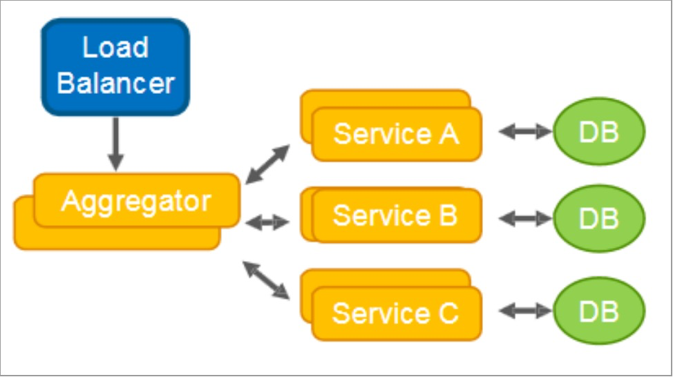

**链式模式**

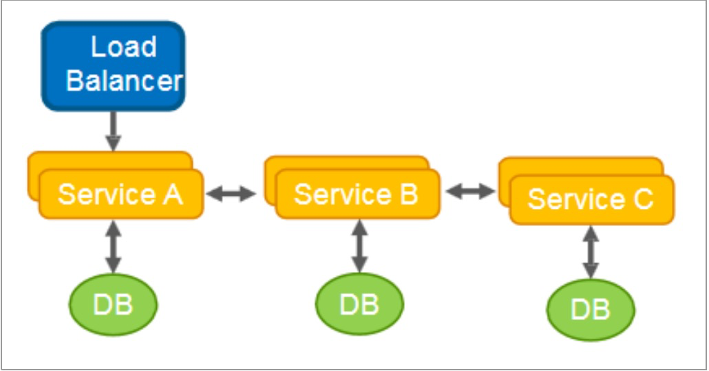

**数据共享模式**

**代理模式**

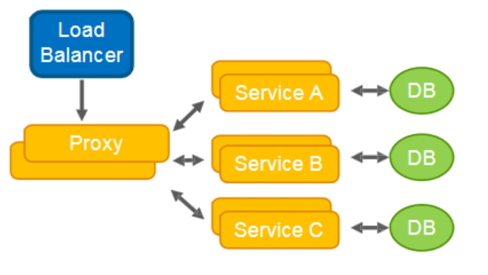

**分支模式**

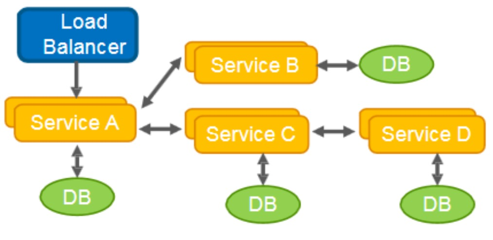

**异步消息模式**

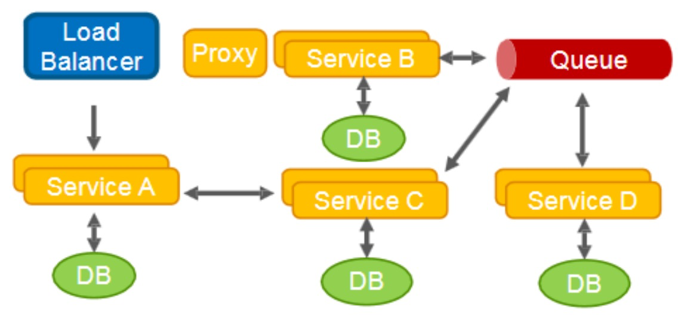

- 微服务架构下为什么需要分布式事务，单体下是否需要分布式事务呢？
  - 单体多数据源

- 所有场景，是否都可以使用最终一致性（时间窗口），能否一定保证分布式？
  - 缺点：
    - 实时性不高（多了一层网络开发，消息积压导致数据实时一致性）
    - 不具备半事务消息（AB不是一个严格一致的状态，在窗口期内A已终态，而B非终态，该窗口期数据不一致是否容忍，而其他业务服务可以看到该窗口期服务的中间态的数据，该隔离性是否在预期之内）
    - A调用MQ转B，A事务成功，B一直失败，MQ属于单项通知角色，则B不能通过A回滚，因此B做补偿策略
	- 

- 定时任务进行数据补偿？
  - 原因：网络超时，波动，B服务挂了
  - 通过定时任务的业务逻辑检查，AB服务之间的业务数据是否满足业务一致性规则，不符合则根据规则做补偿。
- 不能使用场景：
  - 业务调用链路不够复杂，如果调用链路经过几十个微服务，中间某服务异常，则需要反向回滚补偿，梳理庞大的业务服务之间的**补偿逻辑，成本太高，定时任务太负载，得不偿失**。

# **Seata(Simple Extensible Autonomous Transaction Architecture)**

**微服务架构下，易用、高效的分布式事务解决方案**

## Seata特征

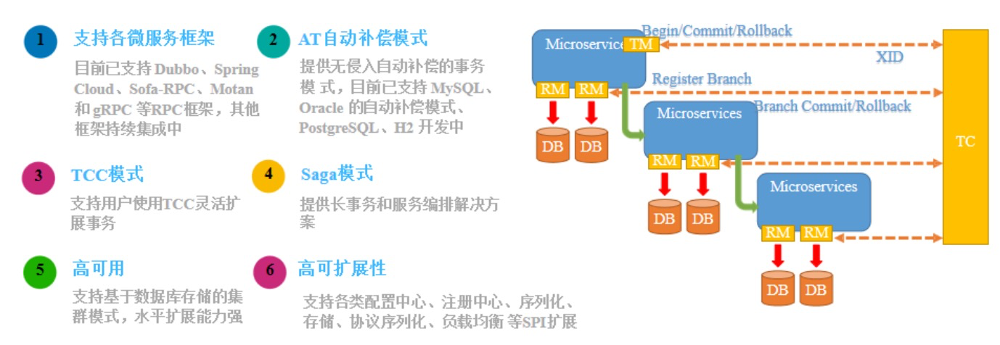

## Seata整体架构

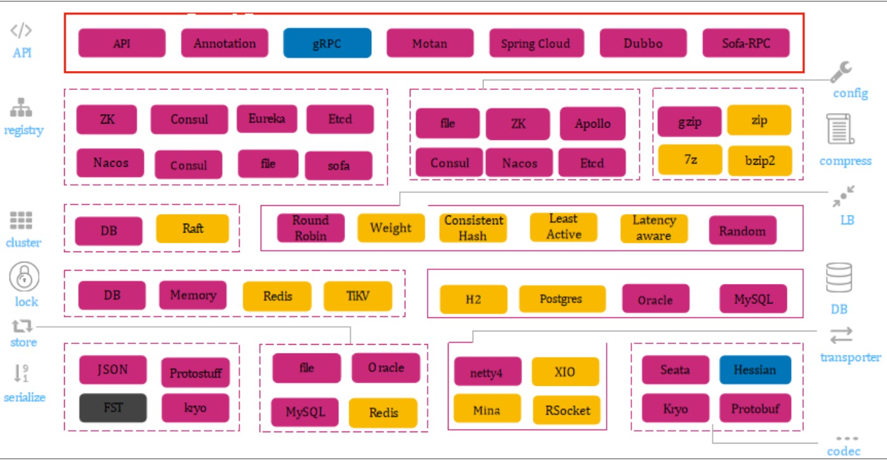

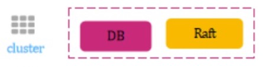

保证“数据”的可用性

**侵入与非侵入划分**

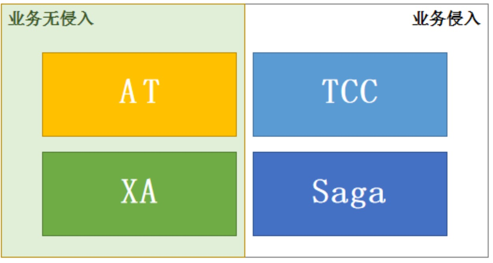

**Seata无法保证哪些场景的数据一致性！**

- 数据源、业务侧全部节点（当前全部和无新节点）不可恢复性故障。

- SeataServer（TM）存储故障

- 业务中事务的二阶段SeataServer与业务侧永不可达

**Seata能保障哪些极端情况下的数据一致性！**（框架高可靠设计保障）

- 服务调用timeout

- 被调用服务宕机，网络问题等服务不可达或可恢复性重试情况

- 当业务服务出现不可恢复性部分宕机或者可恢复性全部节点宕机情况

- SeataServer不可恢复性部分或全部计算节点宕机

- A调用B（B上线发布、重启、故障、timeout），保证A进入的流量的一致性

- 不同服务多数据源异构

# XA模型

## 前提

- 支持XA 事务的数据库。
- Java 应用，通过 JDBC 访问数据库。

- 执行阶段：
- - 可回滚：业务 SQL 操作放在 XA 分支中进行，由资源对 XA 协议的支持来保证 *可回滚*
  - 持久化：XA 分支完成后，执行 XA prepare，同样，由资源对 XA 协议的支持来保证 *持久化*（即，之后任何意外都不会造成无法回滚的情况）
- 完成阶段：
- - 分支提交：执行 XA 分支的 commit
  - 分支回滚：执行 XA 分支的 rollback

## XA事务模型弊端 **xRource commit ..... for update**

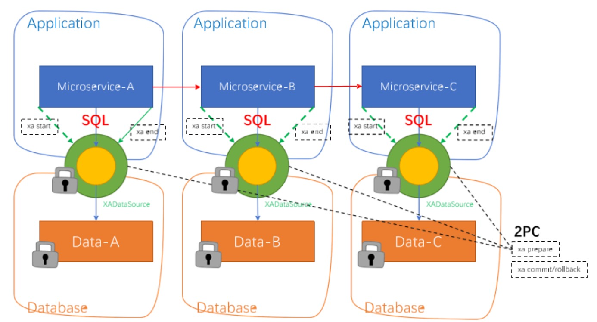

# AT模型

## **前提**

- 基于支持本地 ACID 事务的关系型数据库。

- Java 应用，通过 JDBC 访问数据库。

- 数据库：必须支持 本地事务

- 数据表：必须 定义主键

- 难以实现更高的隔离级别

## **整体机制**

两阶段提交协议的演变：

- 一阶段：业务数据和回滚日志记录在同一个本地事务中提交，释放本地锁和连接资源。

- 二阶段：
  - 提交异步化，非常快速地完成。
  - 回滚通过一阶段的回滚日志进行反向补偿。

## AT架构

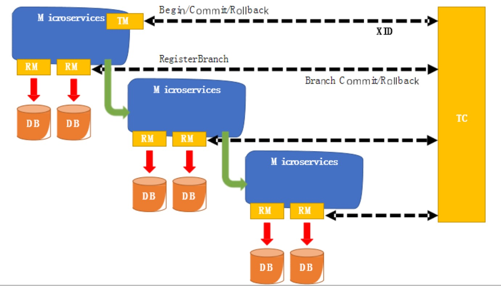

- 上游服务重启后，是否能感知到其它事务？
  - 直连不可以
  - mq可以

## AT核心设计思路

connectionProxy -> connection datasourceProxy ->datasource statement proxy XA 

分布式事务标准  **2019年Server**

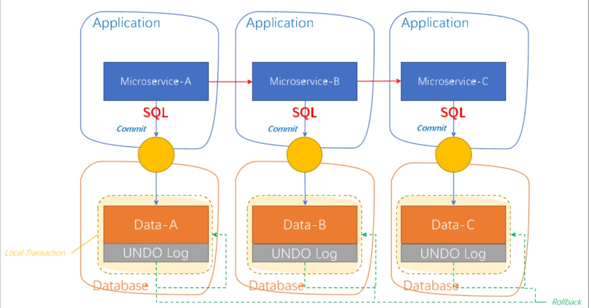

## AT事务设计模型

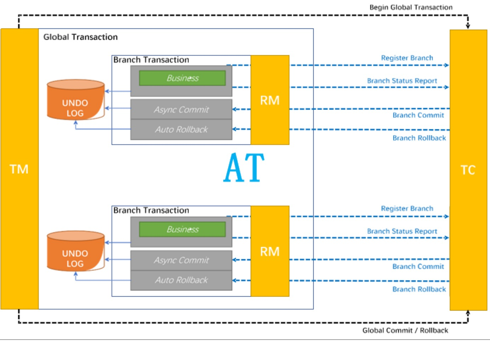

## AT事务阶段模型

### **执行阶段**

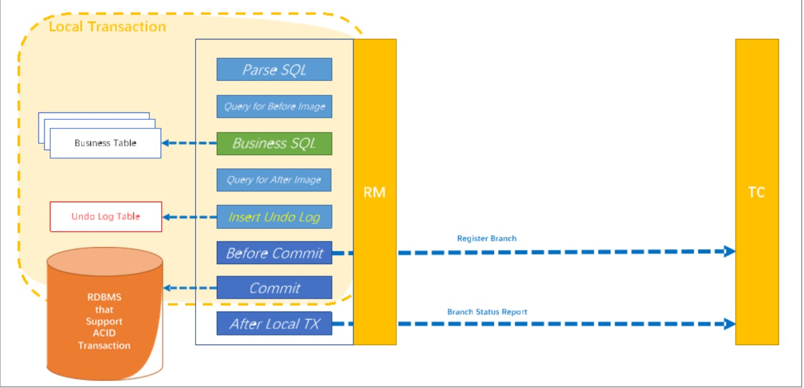

### **回滚阶段**

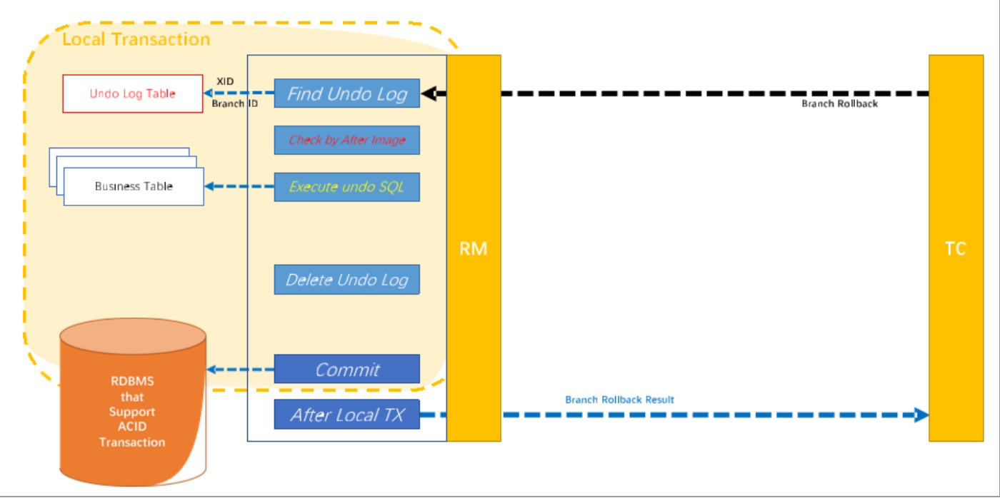

### **提交阶段**

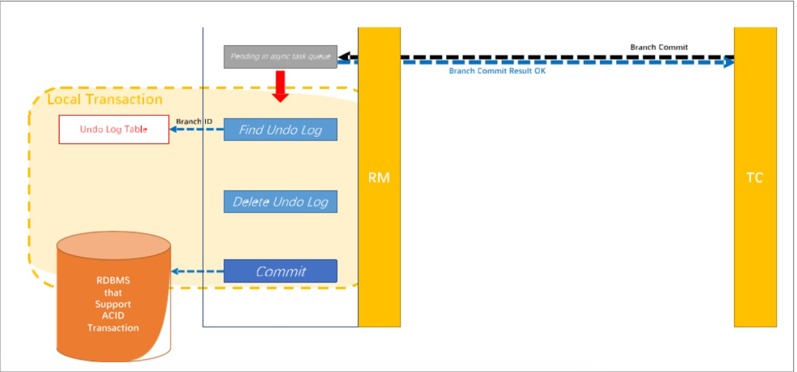

## **核心价值**

- 低成本：
  - 编程模型 不变，轻依赖 不需要为分布式事务场景做特定设计。

- 高性能：
  - 一阶段提交，不阻塞；连接释放，保证整个系统的吞吐。

- 高可用：
  - 极端的异常情况下，可以暂时 跳过异常事务，保证系统可用。

- 兼容性：
  - 兼顾各种架构设计场景。

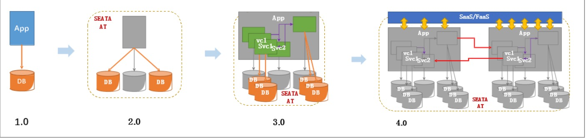

## **写隔离**

- 一阶段本地事务提交前，需要确保先拿到 **全局锁** 。

- 拿不到 **全局锁** ，不能提交本地事务。

- 拿 **全局锁** 的尝试被限制在一定范围内，超出范围将放弃，并回滚本地事务，释放本地锁。

以一个示例来说明：

两个全局事务 tx1 和 tx2，分别对 a 表的 m 字段进行更新操作，m 的初始值 1000。

tx1 先开始，开启本地事务，拿到本地锁，更新操作 m = 1000 - 100 = 900。本地事务提交前，先拿到

该记录的 **全局锁** ，本地提交释放本地锁。 tx2 后开始，开启本地事务，拿到本地锁，更新操作 m =

900 - 100 = 800。本地事务提交前，尝试拿该记录的 **全局锁** ，tx1 全局提交前，该记录的全局锁被 tx1

持有，tx2 需要重试等待 **全局锁** 。

客户端 connection - > 数据库 （Session 获取local lock） ,客户端只是想数据发送协议指令而已

connection 发送N个 SQL语句 ， save point rollback ( save point ) ，答案不确定，因为环境因素太

多。

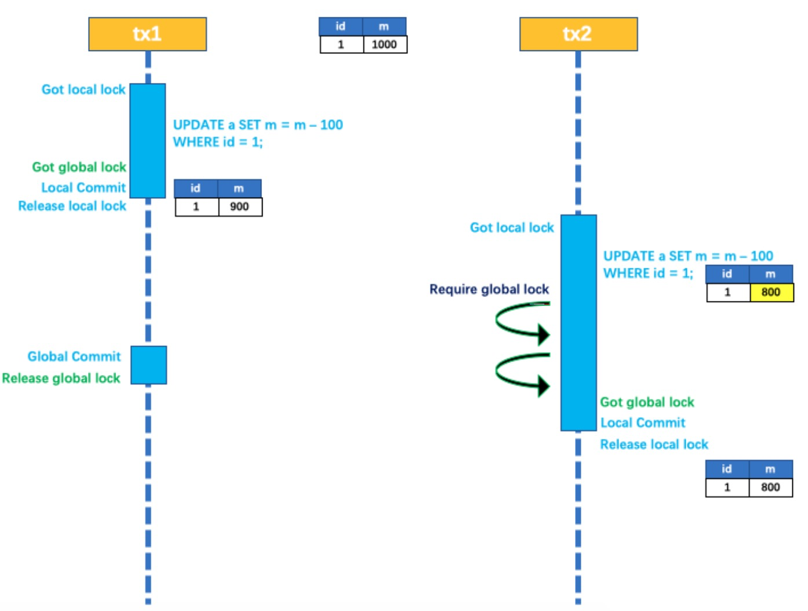

tx1 二阶段全局提交，释放 **全局锁** 。tx2 拿到 **全局锁** 提交本地事务。

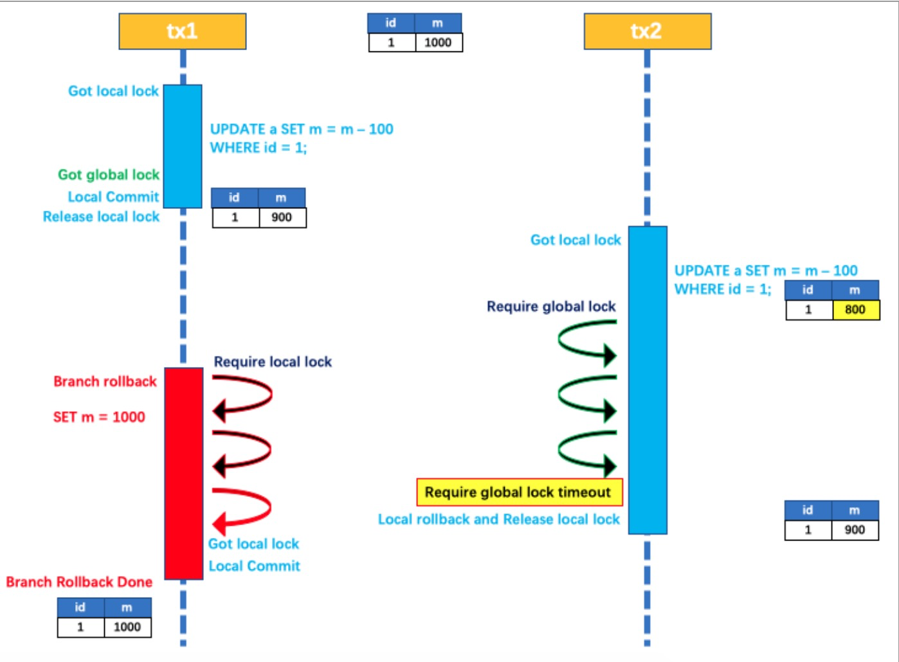

如果 tx1 的二阶段全局回滚，则 tx1 需要重新获取该数据的本地锁，进行反向补偿的更新操作，实现分

支的回滚。

此时，如果 tx2 仍在等待该数据的 **全局锁**，同时持有本地锁，则 tx1 的分支回滚会失败。分支的回滚会

一直重试，直到 tx2 的 **全局锁** 等锁超时，放弃 **全局锁** 并回滚本地事务释放本地锁，tx1 的分支回滚最

终成功。因为整个过程 **全局锁** 在 tx1 结束前一直是被 tx1 持有的，所以不会发生 **脏写** 的问题。

## **读隔离**

在数据库本地事务隔离级别 **读已提交（****Read Committed****）** 或以上的基础上，Seata（AT 模式）的默

认全局隔离级别是 **读未提交（****Read Uncommitted****）** 。

如果应用在特定场景下，必需要求全局的 **读已提交** ，目前 Seata 的方式是通过 SELECT FOR UPDATE

语句的代理。

微服务分布式锁（多个节点对同一个边界资源进行操作）

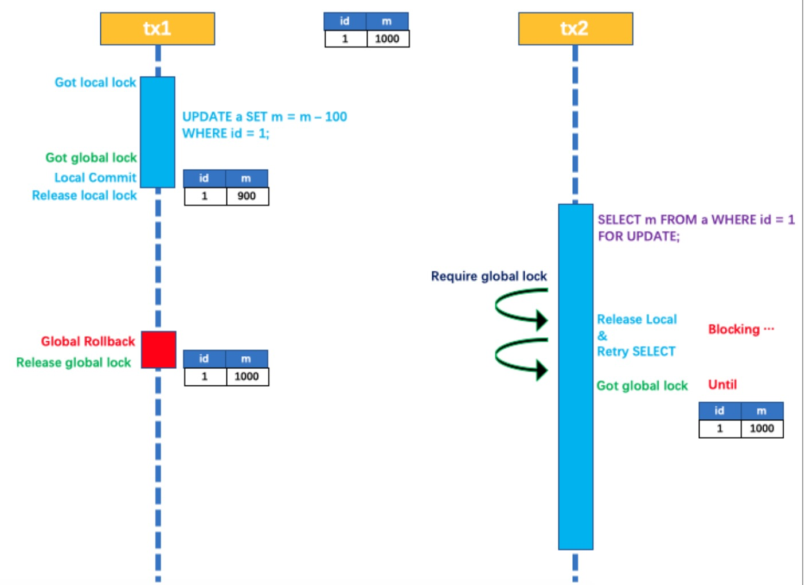

SELECT FOR UPDATE 语句的执行会申请 **全局锁** ，如果 **全局锁** 被其他事务持有，则释放本地锁（回滚

SELECT FOR UPDATE 语句的本地执行）并重试。这个过程中，查询是被 block 住的，直到 **全局锁** 拿

到，即读取的相关数据是 **已提交** 的，才返回。

出于总体性能上的考虑，Seata 目前的方案并没有对所有 SELECT 语句都进行代理，仅针对 FOR

UPDATE 的 SELECT 语句。

