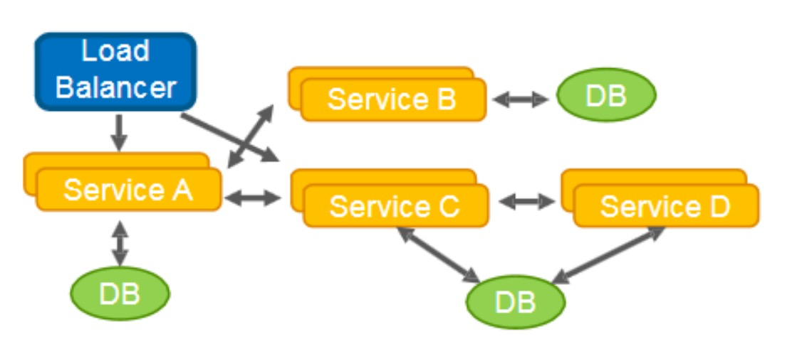
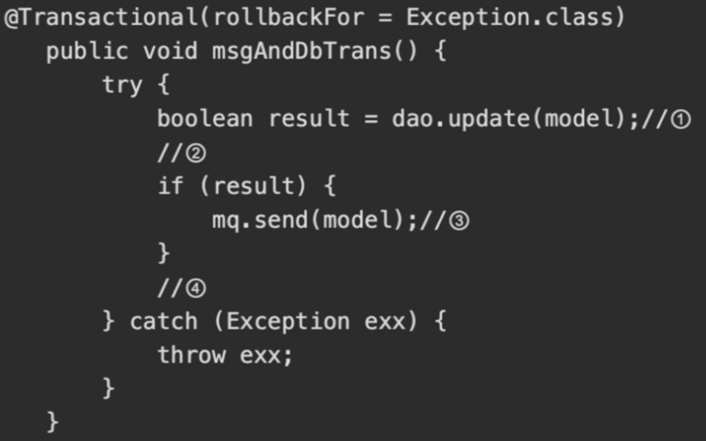
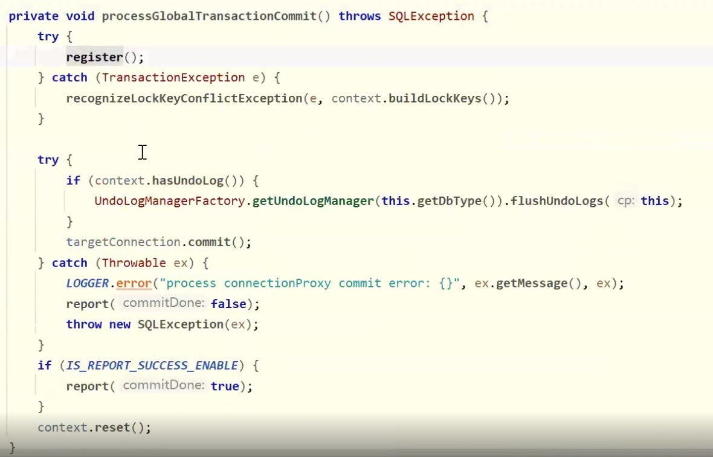
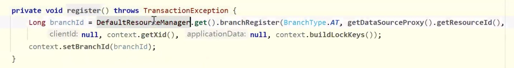

# **分布式事务架构设计原理**

分布式事务，因什么背景而产生？必须要分布式事务才能解决吗？ （基础问题）

如果没有本地事务，是否存在分布式事务？ （基础问题）


## **分布式背景环境**

### 分布式环境下的微服务模型

**聚合模式**


**链式模式**


**数据共享模式**



**代理模式**


**分支模式**


**异步消息模式**


- 微服务架构下为什么需要分布式事务，单体下是否需要分布式事务呢？
  - 单体多数据源

- 所有场景，是否都可以使用最终一致性（时间窗口），能否一定保证分布式？
  - 缺点：
    - 实时性不高（多了一层网络开发，消息积压导致数据实时一致性）
    - 不具备半事务消息（AB不是一个严格一致的状态，在窗口期内A已终态，而B非终态，该窗口期数据不一致是否容忍，而其他业务服务可以看到该窗口期服务的中间态的数据，该隔离性是否在预期之内）
    - A调用MQ转B，A事务成功，B一直失败，MQ属于单项通知角色，则B不能通过A回滚，因此B做补偿策略
	- 

- 定时任务进行数据补偿？
  - 原因：网络超时，波动，B服务挂了
  - 通过定时任务的业务逻辑检查，AB服务之间的业务数据是否满足业务一致性规则，不符合则根据规则做补偿。
- 不能使用场景：
  - 业务调用链路不够复杂，如果调用链路经过几十个微服务，中间某服务异常，则需要反向回滚补偿，梳理庞大的业务服务之间的**补偿逻辑，成本太高，定时任务太负载，得不偿失**。


# **Seata(Simple Extensible Autonomous Transaction Architecture)**

**微服务架构下，易用、高效的分布式事务解决方案**

## Seata特征


## Seata整体架构


保证“数据”的可用性


**侵入与非侵入划分**


**Seata无法保证哪些场景的数据一致性！**

- 数据源、业务侧全部节点（当前全部和无新节点）不可恢复性故障。

- SeataServer（TM）存储故障

- 业务中事务的二阶段SeataServer与业务侧永不可达


**Seata能保障哪些极端情况下的数据一致性！**（框架高可靠设计保障）

- 服务调用timeout

- 被调用服务宕机，网络问题等服务不可达或可恢复性重试情况

- 当业务服务出现不可恢复性部分宕机或者可恢复性全部节点宕机情况

- SeataServer不可恢复性部分或全部计算节点宕机

- A调用B（B上线发布、重启、故障、timeout），保证A进入的流量的一致性

- 不同服务多数据源异构

# XA模型

## 前提

- 支持XA 事务的数据库。
- Java 应用，通过 JDBC 访问数据库。


- 执行阶段：
- - 可回滚：业务 SQL 操作放在 XA 分支中进行，由资源对 XA 协议的支持来保证 *可回滚*
  - 持久化：XA 分支完成后，执行 XA prepare，同样，由资源对 XA 协议的支持来保证 *持久化*（即，之后任何意外都不会造成无法回滚的情况）
- 完成阶段：
- - 分支提交：执行 XA 分支的 commit
  - 分支回滚：执行 XA 分支的 rollback

## XA事务模型弊端 **xRource commit ..... for update**


## MYSQl XA

MySQL XA 是基于Open Group 的<<Distributed Transaction Processing:The XA Specification>> 标准实现的，支持分布式事务，允许多个数据库实例参与一个全局的事务。MySQl XA 从MySQL 5.0 开始引入，仅innodb存储引擎支持MySQL XA事务。


### **MySQL XA 事务SQL语法**

```
XA {START|BEGIN} xid [JOIN|RESUME]   //开启XA事务，如果使用的是XA START而不是XA BEGIN，那么不支持[JOIN|RESUME]，xid是一个唯一值，表示事务分支标识符
XA END xid [SUSPEND [FOR MIGRATE]]   //结束一个XA事务，不支持[SUSPEND [FOR MIGRATE]]
XA PREPARE xid 准备提交
XA COMMIT xid [ONE PHASE] //提交，如果使用了ONE PHASE，则表示使用一阶段提交。两阶段提交协议中，如果只有一个RM参与，那么可以优化为一阶段提交
XA ROLLBACK xid  //回滚
XA RECOVER [CONVERT XID]  //列出所有处于PREPARE阶段的XA事务
```

针对一个给定的客户端连接而言，XA事务和非XA事务(即本地事务)是互斥的。例如，已经执行了”XA START”命令来开启一个XA事务，则本地事务不会被启动，直到XA事务已经被提交或被 回滚为止。相反的，如果已经使用START TRANSACTION启动一个本地事务，则XA语句不能被使用，直到该事务被提交或被 回滚为止。


### 回滚

MySQL根据单机还是分布式集群分为内部XA和外部XA。通过版本管理。

**内部XA**：也就是单机的情况下，binlog充当TM(事务协调者)的角色。一个事务过来，写入redo log日志和undo log日志。事务提交时，同时写入redo log和binlog，保证redo log和binlog一致。如果事务撤销，则根据undo log进行撤销。

**外部XA**（多数据源）：分布式集群的情况下，一般用数据库代理层来充当TM的角色，实现对事务的支持。

#### redo log

redo log是重做日志，通常是物理日志，记录的是物理数据页的修改，它用来恢复提交后的物理数据页


如上图所示，redo log分为两部分：

- 内存中的redo log Buffer是日志缓冲区，这部分数据是容易丢失的
- 磁盘上的redo log file是日志文件，这部分数据已经持久化到磁盘，不容易丢失

SQL操作数据库之前，会先记录重做日志，为了保证效率会先写到日志缓冲区中（redo log Buffer），再通过缓冲区写到磁盘文件中进行持久化，既然有缓冲区说明数据不是实时写到redo log file中的，那么假如redo log写到缓冲区后，此时服务器断电了，那redo log岂不是会丢失？

在MySQL中可以自已控制log buffer刷新到log file中的频率，通过innodb_flush_log_at_trx_commit参数可以设置事务提交时log buffer如何保存到log file中，innodb_flush_log_at_trx_commit参数有3个值(0、1、2)，表示三种不同的方式

- 为1表示事务每次提交都会将log buffer写入到os buffer，并调用操作系统的fsync()方法将日志写入log file，这种方式的好处是就算MySQL崩溃也不会丢数据，redo log file保存了所有已提交事务的日志，MySQL重新启动后会通过redo log file进行恢复。但这种方式每次提交事务都会写入磁盘，IO性能较差
- 为0表示事务提交时不会将log buffer写入到os buffer中，而是每秒写入os buffer然后调用fsync()方法将日志写入log file，这种方式在MySQL系统崩溃时会丢失大约1秒钟的数据
- 为2表示事务每次提交仅将log buffer写入到os buffer中，然后每秒调用fsync()方法将日志写入log file，这种方式在MySQL崩溃时也会丢失大约1秒钟的数据

#### undo log

undo log是回滚日志，用来回滚行记录到某个版本，undo log一般是逻辑日志，根据行的数据变化进行记录

undo log跟redo log一样也是在SQL操作数据之前记录的，也就是SQL操作先记录日志，再进行操作数据


如上图所示，SQL操作之前会先记录redo log、undo log到日志缓冲区，日志缓冲区的数据会记录到os buffer中，再通过调用fsync()方法将日志记录到log file中

**undo log记录的是逻辑日志，可以简单的理解为：当insert一条记录时，undo log会记录一条对应的delete语句；当update一条语句时，undo log记录的是一条与之操作相反的语句**

当事务需要回滚时，可以从undo log中找到相应的内容进行回滚操作，回滚后数据恢复到操作之前的状态

**undo日志还有一个用途就是用来控制数据的多版本**（MVCC），在[《InnoDB存储引擎中的锁》](https://blog.csdn.net/pzjtian/article/details/107372792)一文中讲到MVCC是通过读取undo日志中数据的快照来进行多版本控制的

undo log是采用段(segment)的方式来记录的，每个undo操作在记录的时候占用一个undo log segment。

另外，undo log也会产生redo log，因为undo log也要实现持久性保护


# AT模型

## **前提**

- 基于支持本地 ACID 事务的关系型数据库。

- Java 应用，通过 JDBC 访问数据库。

- 数据库：必须支持 本地事务

- 数据表：必须 定义主键

- 难以实现更高的隔离级别

## **整体机制**

两阶段提交协议的演变：

- 一阶段：业务数据和回滚日志记录在同一个本地事务中提交，释放本地锁和连接资源。

- 二阶段：
  - 提交异步化，非常快速地完成。
  - 回滚通过一阶段的回滚日志进行反向补偿。

## AT架构


- 上游服务重启后，是否能感知到其它事务？
  - 直连不可以
  - mq可以

## AT核心设计思路

**connectionProxy -> connection datasourceProxy -> datasource statement proxy XA**

**JDBC规范不能改变，拦路处理** 

分布式事务标准  **2019年Server**


## AT事务设计模型


## AT事务阶段模型

### **执行阶段**


- 前镜像：有没有脏数据
- 后镜像：用作回滚
- UNDO LOG:保存前镜像、后镜像

### **回滚阶段**


### **提交阶段**


## **核心价值**

- 低成本：
  - 编程模型 不变，轻依赖 不需要为分布式事务场景做特定设计。

- 高性能：
  - 一阶段提交，不阻塞；连接释放，保证整个系统的吞吐。

- 高可用：
  - 极端的异常情况下，可以暂时 跳过异常事务，保证系统可用。

- 兼容性：
  - 兼顾各种架构设计场景。


## **写隔离**

- 一阶段**本地事务**提交前，需要确保先拿到 **全局锁** 。

- 拿不到 **全局锁** ，不能提交本地事务。

- 拿 **全局锁** 的尝试被限制在一定范围内，超出范围将放弃，并回滚本地事务，释放本地锁。

以一个示例来说明：

两个全局事务 tx1 和 tx2，分别对 a 表的 m 字段进行更新操作，m 的初始值 1000。

tx1 先开始，开启本地事务，拿到本地锁，更新操作 m = 1000 - 100 = 900。本地事务提交前，先拿到

该记录的 **全局锁** ，本地提交释放本地锁。 tx2 后开始，开启本地事务，拿到本地锁，更新操作 m =

900 - 100 = 800。本地事务提交前，尝试拿该记录的 **全局锁** ，tx1 全局提交前，该记录的全局锁被 tx1

持有，tx2 需要重试等待 **全局锁** 。

客户端 connection - > 数据库 （Session 获取local lock） ,客户端只是想数据发送协议指令而已

connection 发送N个 SQL语句 ， save point rollback ( save point ) ，答案不确定，因为环境因素太

多。


tx1 二阶段全局提交，释放 **全局锁** 。tx2 拿到 **全局锁** 提交本地事务。


如果 tx1 的二阶段全局回滚，则 tx1 需要重新获取该数据的本地锁，进行反向补偿的更新操作，实现分

支的回滚。

此时，如果 tx2 仍在等待该数据的 **全局锁**，同时持有本地锁，则 tx1 的分支回滚会失败。分支的回滚会

一直重试，直到 tx2 的 **全局锁** 等锁超时，放弃 **全局锁** 并回滚本地事务释放本地锁，tx1 的分支回滚最

终成功。因为整个过程 **全局锁** 在 tx1 结束前一直是被 tx1 持有的，所以不会发生 **脏写** 的问题。


## **读隔离**

在数据库本地事务隔离级别 **读已提交（****Read Committed****）** 或以上的基础上，Seata（AT 模式）的默

认全局隔离级别是 **读未提交（****Read Uncommitted****）** 。

如果应用在特定场景下，必需要求全局的 **读已提交** ，目前 Seata 的方式是通过 SELECT FOR UPDATE

语句的代理。


微服务分布式锁（多个节点对同一个边界资源进行操作）


SELECT FOR UPDATE 语句的执行会申请 **全局锁** ，如果 **全局锁** 被其他事务持有，则释放本地锁（回滚

SELECT FOR UPDATE 语句的本地执行）并重试。这个过程中，查询是被 block 住的，直到 **全局锁** 拿

到，即读取的相关数据是 **已提交** 的，才返回。

出于总体性能上的考虑，Seata 目前的方案并没有对所有 SELECT 语句都进行代理，仅针对 FOR

UPDATE 的 SELECT 语句。


## **工作机制**

以一个示例来说明整个 AT 分支的工作过程。

业务表： product

| **Field** | **Type**     | **Key** |
| --------- | ------------ | ------- |
| id        | bigint(20)   | PRI     |
| name      | varchar(100) |         |
| since     | varchar(100) |         |

AT 分支事务的业务逻辑：

```
update product set name = 'GTS' where name = 'TXC';
```


### **一阶段**

**过程**：

1. 解析 SQL：得到 SQL 的类型（UPDATE），表（product），条件（where name = 'TXC'）等相关

的信息。

2. **查询前镜像（确定是否有脏数据）**：根据解析得到的条件信息，**生成查询语句**，定位数据。

```sql
select id, name, since from product where name = 'TXC';
```

**得到前镜像**：

| id   | name | since |
| ---- | ---- | ----- |
| 1    | TXC  | 2014  |

1. 执行业务 SQL：更新这条记录的 name 为 'GTS'。

2. 查询后镜像（**必须定义主键**）：根据前镜像的结果，通过 **主键** 定位数据。

```sql
select id, name, since from product where id = 1;
```

**得到后镜像**：

| id   | name | since |
| ---- | ---- | ----- |
| 1    | GTS  | 2014  |

1. 插入回滚日志：把前后镜像数据以及业务 SQL 相关的信息组成一条回滚日志记录，插入到UNDO_LOG 表中。

**UNDO LOG:**

```json
{
	"branchId": 641789253,
	"undoItems": [{
		"afterImage": {
			"rows": [{
				"fields": [{
					"name": "id",
					"type": 4,
					"value": 1
				}, {
					"name": "name",
					"type": 12,
					"value": "GTS"
				}, {
					"name": "since",
					"type": 12,
					"value": "2014"
				}]
			}],
			"tableName": "product"
		},
		"beforeImage": {
			"rows": [{
				"fields": [{
					"name": "id",
					"type": 4,
					"value": 1
				}, {
					"name": "name",
					"type": 12,
					"value": "TXC"
				}, {
					"name": "since",
					"type": 12,
					"value": "2014"
				}]
			}],
			"tableName": "product"
		},
		"sqlType": "UPDATE"
	}],
	"xid": "xid:xxx"
}
```

1. 提交前，向 TC 注册分支：申请 product 表中，主键值等于 1 的记录的 **全局锁** 。

2. 本地事务提交：业务数据的更新和前面步骤中生成的 UNDO LOG 一并提交。

3. 将本地事务提交的结果上报给 TC。

### **二阶段-回滚**

1. 收到 TC 的分支回滚请求，开启一个本地事务，执行如下操作。

2. 通过 XID 和 Branch ID 查找到相应的 UNDO LOG 记录。

3. **数据校验**：拿 UNDO LOG 中的后镜与当前数据进行比较，**如果有不同，说明数据被当前全局事务**

**之外的动作做了修改**。这种情况，需要根据配置策略来做处理，详细的说明在另外的文档中介绍。

4. 根据 UNDO LOG 中的前镜像和业务 SQL 的相关信息生成并执行回滚的语句：

```sql
update product set name = 'TXC' where id = 1;
```

1. 提交本地事务。并把本地事务的执行结果（即分支事务回滚的结果）上报给 TC。

### **二阶段-提交**

1. 收到 TC 的分支提交请求，把请求放入**一个异步任务的队列**中，马上返回提交成功的结果给 TC。 

2. 异步任务阶段的分支提交请求将**异步和批量地删除相应 UNDO LOG 记录**。

### **回滚日志表**

UNDO_LOG Table：不同数据库在类型上会略有差别。

以 MySQL 为例：

| Field          | Type         |
| -------------- | ------------ |
| branch_id      | bigint PK    |
| xid            | varchar(100) |
| context        | varchar(128) |
| rollback_info  | longblob     |
| log_status     | tinyint      |
| log_created    | datetime     |
| log_modifified | datetime     |
|                |              |

```sql
-- 注意此处0.7.0+ 增加字段 context
CREATE TABLE `undo_log` (
  `id` bigint(20) NOT NULL AUTO_INCREMENT,
  `branch_id` bigint(20) NOT NULL,
  `xid` varchar(100) NOT NULL,
  `context` varchar(128) NOT NULL,
  `rollback_info` longblob NOT NULL,
  `log_status` int(11) NOT NULL,
  `log_created` datetime NOT NULL,
  `log_modified` datetime NOT NULL,
  PRIMARY KEY (`id`),
  UNIQUE KEY `ux_undo_log` (`xid`,`branch_id`)
) ENGINE=InnoDB AUTO_INCREMENT=1 DEFAULT CHARSET=utf8;
```

## **用例**

用户购买商品的业务逻辑。整个业务逻辑由3个微服务提供支持：

- 仓储服务：对给定的商品扣除仓储数量。

- 订单服务：根据采购需求创建订单。

- 帐户服务：从用户帐户中扣除余额。


### **期望**

**SeataServer 与 业务服务可用** 前提下

- 卖家现有商品库存+买家购买数量=卖家初始库存

- 买家现有账户金额+卖家卖出商品入账金额=买家初始金额

- 买家商品数量和花费金额保持一致

- 卖家商品库存和收到钱款保持一致


### **架构图**


- TM在Business


**仓储服务**

```java
public interface StorageService {
    /**
     * 扣除存储数量
     */
    void deduct(String commodityCode, int count);
}
```

**订单服务**

```java
public interface OrderService {
    /**
     * 创建订单
     */
    Order create(String userId, String commodityCode, int orderCount);
}
```

**帐户服务**

```java
public interface AccountService {
    /**
     * 从用户账户中借出
     */
    void debit(String userId, int money);
}
```

**主要业务逻辑**

```java
public class BusinessServiceImpl implements BusinessService {
    private StorageService storageService;
    private OrderService orderService;
    /**
     * 采购
     */
  	@GlobalTransactional
    public void purchase(String userId, String commodityCode, int
orderCount) {
        storageService.deduct(commodityCode, orderCount);
        orderService.create(userId, commodityCode, orderCount);
   }
}
public class OrderServiceImpl implements OrderService {
    private OrderDAO orderDAO;
    private AccountService accountService;
    public Order create(String userId, String commodityCode, int
orderCount) {
        int orderMoney = calculate(commodityCode, orderCount);
        accountService.debit(userId, orderMoney);
        Order order = new Order();
        order.userId = userId;
        order.commodityCode = commodityCode;
        order.count = orderCount;
        order.money = orderMoney;
        // INSERT INTO orders ...
        return orderDAO.insert(order);
   }
}
```

## **SEATA** **的分布式交易解决方案**


- TC （Seata server）做高可用。TM，RM都属于SDK。
- XID 怎么传递？再调用传递中，通过拦截器、过滤器获取XID，嫁接在RPC流程之上。
- TC集群名


我们只需要使用一个 @GlobalTransactional 注解在Business（TM）,在调用链入口上:

```java
@GlobalTransactional
public void purchase(String userId, String commodityCode, int orderCount) 
{
   ......
}
```


## **Seata AT** **实现原理讲解**

**AccountServiceImpl**

```java
AccountService {
    /**
     * The constant DB_KEY.
     */
    public static final String DB_KEY = "account";
    @Override
    public void reduce(String userId, int money) throws SQLException {
        String sql = "update account_tbl set money = money - " + money + " 
where user_id = '" + userId + "'";
        DataSourceUtil.executeUpdate(DB_KEY, sql);
   }
    @Override
    public int doNegativeCheck(String field, String id) throws SQLException
{
        String checkSql = "select " + field + " from account_tbl where 
user_id='" + id + "'";
        String result = DataSourceUtil.getSingleResult(DB_KEY, checkSql);
        return Integer.parseInt(result);
   }
  
  // 做恢复测试用的
    @Override
    public void reset(String key, String value) throws SQLException {
        String deleteSql = "delete from account_tbl where user_id = '" +
key + "'";
        String insertSql = "insert into account_tbl(user_id, money) values 
('" + key + "', " + value + ")";
        DataSourceUtil.executeUpdate(DB_KEY, deleteSql);
        DataSourceUtil.executeUpdate(DB_KEY, insertSql);
   }
}
```

**OrderServiceImpl**

```java
public class OrderServiceImpl implements OrderService {
    /**
     * The constant DB_KEY.
     */
    public static final String DB_KEY = "order";
    private AccountService accountService;
    @Override
    public void setAccountService(AccountService accountService) {
        this.accountService = accountService;
   }
    @Override
    public void create(String userId, String commodityCode, Integer count) 
throws SQLException {
        int money = count * 200;
        String sql = "insert into order_tbl (user_id, commodity_code, 
count, money) values ('" + userId + "','"
            + commodityCode + "'," + count + "," + money + ")";
        //插入订单
        DataSourceUtil.executeUpdate(DB_KEY, sql);
        //减少账户资金
        accountService.reduce(userId, money);
   }
                        // 做恢复测试用的
    @Override
    public void reset(String key, String value) throws SQLException {
        String deleteSql = "delete from order_tbl";
        DataSourceUtil.executeUpdate(DB_KEY, deleteSql);
   }
}
```

**StorageServiceImpl**

```java
public class StorageServiceImpl extends AbstractDataCheck implements
StorageService {
    /**
     * The constant DB_KEY.
     */
    public static final String DB_KEY = "storage";
     @Override
    public void deduct(String commodityCode, int count) throws SQLException
{
        String sql = "update storage_tbl set count = count - " + count + " 
where commodity_code = '" + commodityCode
            + "'";
        //更新库存
        DataSourceUtil.executeUpdate(DB_KEY, sql);
   }
    // 做恢复测试用的
    @Override
    public void reset(String key, String value) throws SQLException {
        String deleteSql = "delete from storage_tbl where commodity_code = 
'" + key + "'";
        String insertSql = "insert into storage_tbl(commodity_code, count) 
values ('" + key + "', " + value + ")";
        //删除库存商品
        DataSourceUtil.executeUpdate(DB_KEY, deleteSql);
        //重新插入库存商品
        DataSourceUtil.executeUpdate(DB_KEY, insertSql);
   }

    @Override
    public int doNegativeCheck(String field, String id) throws SQLException
{
        String checkSql = "select " + field + " from storage_tbl where 
commodity_code='" + id + "'";
        String result = DataSourceUtil.getSingleResult(DB_KEY, checkSql);
        return Integer.parseInt(result);
   }
}
```

**AccountService**

```java
public interface AccountService extends DataResetService {
    /**
     * Reduce.
     *
     * @param userId the user id
     * @param money the money
     * @throws SQLException the sql exception
     */
    void reduce(String userId, int money) throws SQLException; }
```

**DataResetService**

```java
    /**
     * Reset.
     *
     * @param key   the key
     * @param value the value
     * @throws SQLException the sql exception
     */
    void reset(String key, String value) throws SQLException; }
```


**OrderService**

```java
public interface OrderService extends DataResetService {
    /**
     * Sets account service.
     *
     * @param accountService the account service
     */
    void setAccountService(AccountService accountService);
    /**
     * Create.
     *
     * @param userId       the user id
     * @param commodityCode the commodity code
     * @param count         the count
     * @throws SQLException the sql exception
     */
    void create(String userId, String commodityCode, Integer count) throws
SQLException; }
```


**StorageService**

```java
public interface StorageService extends DataResetService {
    /**
     * Deduct.
     *
     * @param commodityCode the commodity code
     * @param count         the count
     * @throws SQLException the sql exception
     */
    void deduct(String commodityCode, int count) throws SQLException; }
```

**Bussiness** （代码API）

```java
public class Bussiness {
    public static void main(String[] args) throws SQLException, 
TransactionException, InterruptedException {
 String userId = "U100001";
        String commodityCode = "C00321";
        int commodityCount = 100;
        int money = 999;
        AccountService accountService = new AccountServiceImpl();
        StorageService storageService = new StorageServiceImpl();
        OrderService orderService = new OrderServiceImpl();
        orderService.setAccountService(accountService);
        //重置数据库记录
        accountService.reset(userId, String.valueOf(money));
        storageService.reset(commodityCode, 
String.valueOf(commodityCount));
        orderService.reset(null, null);
        //init seata; only once
        String applicationId = "api";   //应用名编号
        String txServiceGroup = "my_test_tx_group"; //事务服务组，TC集群
        //初始化事务管理客户端
        TMClient.init(applicationId, txServiceGroup);
        //初始化资源管理客户端 RM 数据库有几个
        RMClient.init(applicationId, txServiceGroup);
        //trx 全局事务
        GlobalTransaction tx =
GlobalTransactionContext.getCurrentOrCreate();
        try {
            tx.begin(60000, "testBiz");
            System.out.println("begin trx, xid is " + tx.getXid());
            //biz operate 3 dataSources
            //set >=5 will be rollback(200*5>999) else will be commit
            int opCount = 5;
            storageService.deduct(commodityCode, opCount);
            orderService.create(userId, commodityCode, opCount);
            //check data if negative
            boolean needCommit =
((StorageServiceImpl)storageService).validNegativeCheck("count", 
commodityCode)
                &&
((AccountServiceImpl)accountService).validNegativeCheck("money", userId);
            //if data negative rollback else commit
            if (needCommit) {
                tx.commit();
           } else {
                System.out.println("rollback trx, cause: data negative, xid 
is " + tx.getXid());
                tx.rollback();
           }
       } catch (Exception exx) { // 框架层次判断，如果异常，全局事务回滚
            System.out.println("rollback trx, cause: " + exx.getMessage() +
" , xid is " + tx.getXid());
            tx.rollback();
            throw exx;
       }
        TimeUnit.SECONDS.sleep(10);
           }
}
```

**DataSourceUtil** （RM）

```java
public class DataSourceUtil {
    /**
     * The constant JDBC_PRO_PATH.
     */
    public static final String JDBC_PRO_PATH = "jdbc.properties";
    /**
     * The constant DATA_SOURCE_MAP.
     		JDBC标准，数据源映射表
     */
    public static final ConcurrentMap<String, DataSource> DATA_SOURCE_MAP
= new ConcurrentHashMap<>();
    /**
     * Gets data source.
     *
     * @param name the name
     * @return the data source
     */
    public static DataSource getDataSource(String name) {
        String driverKey = "jdbc." + name + ".driver";
        String urlKey = "jdbc." + name + ".url";
        String userNameKey = "jdbc." + name + ".username";
        String pwdKey = "jdbc." + name + ".password";
        DataSource dataSource = new DruidDataSource();
       // 设置
((DruidDataSource)dataSource).setDriverClassName(PropertiesUtil.getPropert
ieValue(JDBC_PRO_PATH, driverKey));
       
((DruidDataSource)dataSource).setUrl(PropertiesUtil.getPropertieValue(JDBC
_PRO_PATH, urlKey));
       
((DruidDataSource)dataSource).setUsername(PropertiesUtil.getPropertieValue
(JDBC_PRO_PATH, userNameKey));
       
((DruidDataSource)dataSource).setPassword(PropertiesUtil.getPropertieValue
(JDBC_PRO_PATH, pwdKey));
      // 拦路抢劫！设计模式：装饰者，代理模式
        return new DataSourceProxy(dataSource);
   }
    /**
     * Gets connection.
     *
     * @param name the name
     * @return the connection
     * @throws SQLException the sql exception
     */
    public static Connection getConnection(String name) throws
SQLException {
        DATA_SOURCE_MAP.putIfAbsent(name, getDataSource(name));
        return DATA_SOURCE_MAP.get(name).getConnection();
   }
    /**
     * Execute update int.
     *
     * @param name the name
     * @param sql the sql
     * @return the int
     * @throws SQLException the sql exception
     */
    public static int executeUpdate(String name, String sql) throws
SQLException {
        Connection connection = null;
        Statement statement = null;
        int result = 0;
        try {
            connection = getConnection(name);
            statement = connection.createStatement();
            result = statement.executeUpdate(sql);
       } catch (SQLException exx) {
            //todo
            throw exx;
       } finally {
            try {
                if (statement != null) {
                    statement.close();
               }
                if (connection != null) {
                    connection.close();
               }
           } catch (SQLException exx) {
           }
       }
        return result;
   }
    /**
     * Gets single result.
     *
     * @param name the name
     * @param sql the sql
     * @return the single result
     * @throws SQLException the sql exception
     */
    public static String getSingleResult(String name, String sql) throws
SQLException {
        Connection connection = null;
        Statement statement = null;
        String result = null;
        try {
            connection = getConnection(name);
            statement = connection.createStatement();
            ResultSet resultSet = statement.executeQuery(sql);
            resultSet.next();
            result = resultSet.getString(1);
       } catch (SQLException exx) {
            //todo
            throw exx;
       } finally {
       try {
                if (statement != null) {
                    statement.close();
               }
                if (connection != null) {
                    connection.close();
               }
           } catch (SQLException exx) {
           }
       }
        return result;
   }
}
```


DataSource 属于 JDBC标准。

Resource 资源组


K8S 挂载Node，不要挂载POD


通过是否存在XID，为全局事务



注册分支，AT模型



分支状态报告，如果需要


第一阶段失败


## AT 注解 设计思路

@GlobalTransactional

GlobalTransactionScanner


**重点（AbstractAutoProxyCreator)：**


是否有注解开启全局，如果开启则初始化


## DataSourceProxy 设计落地

通过注解的方式，达到 “开箱即用” 效果。

### Spring 中的 BeanPostProcessor

```java
@Nullable
    default Object postProcessBeforeInitialization(Object bean, String beanName) throws BeansException {
        return bean;
    }


@Nullable
    default Object postProcessAfterInitialization(Object bean, String beanName) throws BeansException {
        return bean;
    }
```


# **TCC模式原理与业务场景**

回顾总览中的描述：一个分布式的全局事务，整体是 **两阶段提交** 的模型。全局事务是由若干分支事务

组成的，分支事务要满足 **两阶段提交** 的模型要求，即需要每个分支事务都具备自己的：

- 一阶段 prepare 行为

- 二阶段 commit 或 rollback 行为


根据两阶段行为模式的不同，我们将分支事务划分为 **Automatic (Branch) Transaction Mode** 和

**TCC (Branch) Transaction Mode**.

**AT** 模式基于 **支持本地** **ACID** **事务** 的 **关系型数据库**：

- 一阶段 prepare 行为：在本地事务中，一并提交业务数据更新和相应回滚日志记录。

- 二阶段 commit 行为：马上成功结束，**自动** 异步批量清理回滚日志。

- 二阶段 rollback 行为：通过回滚日志，**自动** 生成补偿操作，完成数据回滚。

**TCC** 模式，**不依赖**于底层数据资源的事务支持：

- 一阶段 prepare 行为：调用 **自定义** 的 prepare 逻辑。

- 二阶段 commit 行为：调用 **自定义** 的 commit 逻辑。

- 二阶段 rollback 行为：调用 **自定义** 的 rollback 逻辑。

所谓 TCC 模式，是指支持把 **自定义** 的分支事务纳入到全局事务的管理中。


## **业务模型分** **2** **阶段设计**

用户接入 TCC ，最重要的是考虑如何将自己的业务模型拆成两阶段来实现。

- 以“扣钱”场景为例
  - 在接入 TCC 之前
    - 对 A 账户的扣钱，只需一条更新账户余额的 SQL 便能完成；
  - 在接入 TCC 之后
    - 用户就需要考虑如何将原来一步就能完成的扣钱操作，拆成两阶段，实现成三个方法，并且保证一阶段 Try 成功的话 二阶段 Confirm 一定能成功。


如上图所示

- Try 方法作为一阶段准备方法（**做资源的检查和预留**）
  - 在扣钱场景下，Try 要做的事情是就是检查账户余额是否充足，预留转账资金，预留的方式就是冻结 A 账户的 转账资金。
  - Try 方法执行之后，账号 A 余额虽然还是 100，但是**其中** **30** **元已经被冻结了，不能被其他事务使用**。

- 二阶段 Confirm 方法（**执行真正的扣钱操作**）
  - Confirm 会使用 Try 阶段冻结的资金，执行账号扣款。Confirm 方法执行之后，账号 A 在一阶段中冻结的 30 元已经被扣除，账号 A 余额变成 70 元 。
  - 如果二阶段是回滚的话，就需要在 Cancel 方法内释放一阶段 Try 冻结的 30 元，使账号 A 的回到初始状态，100 元全部可用。

**说明：**

用户接入 TCC 模式，最重要的事情就是考虑如何将业务模型拆成 2 阶段，实现成 TCC 的 3 个方法，并

且保证 Try 成功 Confirm 一定能成功。相对于 AT 模式，TCC 模式对业务代码有一定的侵入性，**但是**

**TCC** **模式无** **AT** **模式的全局行锁，TCC性能会比** **AT** **模式高很多**。

TCC：风险更高 ，实现者拆分逻辑

AT：锁“主键”

## **允许空回滚：**

空回滚：try未执行,cancel执行了

出现原因：

- Try超时（丢包）

- 分布式事务回滚，触发Cancel

- 未收到Try,收到Cancel


**Cancel** **接口设计时需要允许空回滚**

在 Try 接口因为丢包时没有收到，事务管理器（TM）会触发回滚，这时会触发 Cancel 接口，这

时 Cancel 执行时发现没有对应的事务 xid 或主键时，需要返回回滚成功。

让事务服务管理器（TM）认为已回滚，**否则会不断重试**

而 Cancel 又没有对应的业务数据可以进行回滚。


## **防悬挂控制：**

悬挂：Cancel 比 Try 先执行

出现原因：

- Try超时（拥堵）

- 分布式事务回滚，触发Canel

- 拥堵的Try到达


**悬挂**

- Cancel 比 Try 接口先执行，出现的原因是 Try 由于网络拥堵而超时，事务管理器（TM）生成回滚，触发 Cancel 接口而最终又收到了 Try 接口调用，但是 Cancel 比 Try 先到

- 按照前面允许空回滚的逻辑，回滚会返回成功，事务管理器（TM）认为事务已回滚成功，**则此时的Try **接口不应该执行，否则会产生数据不一致**

- 所以我们**在** **Cancel** **空回滚返回成功之前先记录该条事务** **xid** **或业务主键，标识这条记录已经回滚过**，Try 接口先检查这条事务xid或业务主键如果已经标记为回滚成功过，则不执行 Try 的业务操作。


## **幂等控制：**

**Try、Confirm、Cancel** 3个方法均需保证幂等性


**幂等性**

- 对同一个系统，使用同样的条件，一次请求和重复的多次请求对系统资源的影响是一致的。

- **因为网络抖动或拥堵可能会超时，事务管理器会对资源进行重试操作**，所以很可能一个业务操作会

  被重复调用，**为了不因为重复调用而多次占用资源，需要对服务设计时进行幂等控制。**

- 通常我们可以**用事务xid或业务主键判重来控制**。

## **TccActionOne**

```java
@LocalTCC
public interface TccActionOne {
    /**
     * Prepare boolean.
     * 框架调用，程序员实现
     * @param actionContext the action context
     * @param a             the a
     * @return the boolean
     */
    @TwoPhaseBusinessAction(name = "TccActionOne" , commitMethod =
"commit", rollbackMethod = "rollback")
    public boolean prepare(BusinessActionContext actionContext, int a);
    /**
     * Commit boolean.
     * 框架调用，程序员实现
     * @param actionContext the action context
     * @return the boolean
     */
    public boolean commit(BusinessActionContext actionContext);
    /**
     * Rollback boolean.
     * 框架调用，程序员实现
     * @param actionContext the action context
     * @return the boolean
     */
    public boolean rollback(BusinessActionContext actionContext);
}
```


## **TccActionTwo**

```java
@LocalTCC
public interface TccActionTwo {
    /**
     * Prepare boolean.
     *
     * @param actionContext the action context
     * @param b             the b
     * @return the boolean
     */
         @TwoPhaseBusinessAction(name = "TccActionTwo" , commitMethod =
"commit", rollbackMethod = "rollback")
    public boolean prepare(BusinessActionContext actionContext, String b);
    /**
     * Commit boolean.
     *
     * @param actionContext the action context
     * @return the boolean
     */
    public boolean commit(BusinessActionContext actionContext);
    /**
     * Rollback boolean.
     *
     * @param actionContext the action context
     * @return the boolean
     */
    public boolean rollback(BusinessActionContext actionContext);
}
```


## **TccActionOneImpl**

```java
public class TccActionOneImpl implements TccActionOne {
    @Override
    public boolean prepare(BusinessActionContext actionContext, int a) {
        String xid = actionContext.getXid();
        System.out.println("TccActionOne prepare, xid:" + xid);
        return true;
   }
    @Override
    public boolean commit(BusinessActionContext actionContext) {
        String xid = actionContext.getXid();
        System.out.println("TccActionOne commit, xid:" + xid);
        ResultHolder.setActionOneResult(xid, "T");
        return true;
   }
    @Override
    public boolean rollback(BusinessActionContext actionContext) {
        String xid = actionContext.getXid();
        System.out.println("TccActionOne rollback, xid:" + xid);
        ResultHolder.setActionOneResult(xid, "R");
        return true;
   }
}
```


## **TccActionTwoImpl**

```java
public class TccActionTwoImpl implements TccActionTwo {
    @Override
    public boolean prepare(BusinessActionContext actionContext, String b) {
        String xid = actionContext.getXid();
        System.out.println("TccActionTwo prepare, xid:" + xid);
        return true;
   }
    @Override
    public boolean commit(BusinessActionContext actionContext) {
        String xid = actionContext.getXid();
        System.out.println("TccActionTwo commit, xid:" + xid);
        ResultHolder.setActionTwoResult(xid, "T");
        return true;
   }
    @Override
    public boolean rollback(BusinessActionContext actionContext) {
        String xid = actionContext.getXid();
        System.out.println("TccActionTwo rollback, xid:" + xid);
        ResultHolder.setActionTwoResult(xid, "R");
        return true;
   }
}
```


## **ResultHolder**

```java
public class ResultHolder {
    private static Map<String, String> actionOneResults = new
ConcurrentHashMap<String, String>();
    private static Map<String, String> actionTwoResults = new
ConcurrentHashMap<String, String>();
    /**
     * Set action one result.
     *
     * @param txId   the tx id
     * @param result the result
     */
    public static void setActionOneResult(String txId, String result){
        actionOneResults.put(txId, result);
   }
    /**
     * Get action one result string.
     *
     * @param txId the tx id
     * @return the string
     */
    public static String getActionOneResult(String txId){
        return actionOneResults.get(txId);
        }
    /**
     * Set action two result.
     *
     * @param txId   the tx id
     * @param result the result
     */
    public static void setActionTwoResult(String txId, String result){
        actionTwoResults.put(txId, result);
   }
    /**
     * Get action two result string.
     *
     * @param txId the tx id
     * @return the string
     */
    public static String getActionTwoResult(String txId){
        return actionTwoResults.get(txId);
   }
}
```


## **TccTransactionService**

```java
public class TccTransactionService {
    private TccActionOne tccActionOne;
    private TccActionTwo tccActionTwo;
    /**
     * //发起分布式事务
     *
     * @return string string
     */
    @GlobalTransactional
    public String doTransactionCommit(){
        //第一个TCC 事务参与者
        boolean result = tccActionOne.prepare(null, 1);
        if(!result){
            throw new RuntimeException("TccActionOne failed.");
       }
        result = tccActionTwo.prepare(null, "two");
        if(!result){
            throw new RuntimeException("TccActionTwo failed.");
       }
        return RootContext.getXID();
   }
    /**
     * //Do transaction rollback string.
      *
     * @param map the map
     * @return the string
     */
    @GlobalTransactional
    public String doTransactionRollback(Map map){
        //第一个TCC 事务参与者
        boolean result = tccActionOne.prepare(null, 1);
        if(!result){
            throw new RuntimeException("TccActionOne failed.");
       }
        result = tccActionTwo.prepare(null, "two");
        if(!result){
            throw new RuntimeException("TccActionTwo failed.");
       }
        map.put("xid", RootContext.getXID());
        throw new RuntimeException("transacton rollback");
   }
    /**
     * Sets tcc action one.
     *
     * @param tccActionOne the tcc action one
     */
    public void setTccActionOne(TccActionOne tccActionOne) {
        this.tccActionOne = tccActionOne;
   }
    /**
     * Sets tcc action two.
     *
     * @param tccActionTwo the tcc action two
     */
    public void setTccActionTwo(TccActionTwo tccActionTwo) {
        this.tccActionTwo = tccActionTwo;
   }
}
```


## **LocalTccTransactionStarter**

```java
public class LocalTccTransactionStarter {
    /**
     * The Application context.
     */
    static AbstractApplicationContext applicationContext = null;
    /**
     * The Tcc transaction service.
     */
    static TccTransactionService tccTransactionService = null;
    /**
     * The Tcc action one.
      */
    static TccActionOneImpl tccActionOne = null;
    /**
     * The Tcc action two.
     */
    static TccActionTwoImpl tccActionTwo = null;
    /**
     * The entry point of application.
     *
     * @param args the input arguments
     * @throws InterruptedException the interrupted exception
     */
    public static void main(String[] args) throws InterruptedException {
        applicationContext = new ClassPathXmlApplicationContext(new
String[] {"spring/seata-tcc.xml"});
        tccTransactionService = (TccTransactionService) 
applicationContext.getBean("tccTransactionService"   );
        tccActionOne = (TccActionOneImpl) 
applicationContext.getBean("tccActionOne");
        tccActionTwo = (TccActionTwoImpl) 
applicationContext.getBean("tccActionTwo");
        //分布式事务提交demo
        transactionCommitDemo();
        //分布式事务回滚demo
        transactionRollbackDemo();
        new ApplicationKeeper(applicationContext).keep();
   }
    private static void transactionCommitDemo() throws InterruptedException
{
        String txId = tccTransactionService.doTransactionCommit();
        System.out.println(txId);
        Assert.isTrue(StringUtils.isNotBlank(txId), "事务开启失败");
        Thread.sleep(1000L);
        Assert.isTrue("T".equals(ResultHolder.getActionOneResult(txId)), 
"tccActionOne commit failed");
        Assert.isTrue("T".equals(ResultHolder.getActionTwoResult(txId)), 
"tccActionTwo commit failed");
        System.out.println("transaction commit demo finish.");
   }
    private static void transactionRollbackDemo() throws
InterruptedException {
        Map map = new HashMap(16);
        try{
            tccTransactionService.doTransactionRollback(map);
            Assert.isTrue(false, "分布式事务未回滚");
       }catch (Throwable t) {
        Assert.isTrue(true, "分布式事务异常回滚");
       }
        String txId = (String) map.get("xid");
        Thread.sleep(1000L);
        Assert.isTrue("R".equals(ResultHolder.getActionOneResult(txId)), 
"tccActionOne commit failed");
        Assert.isTrue("R".equals(ResultHolder.getActionTwoResult(txId)), 
"tccActionTwo commit failed");
        System.out.println("transaction rollback demo finish.");
   }
}
```

