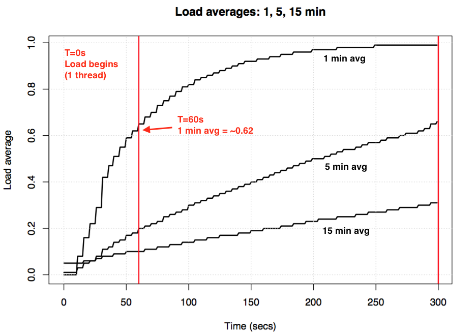
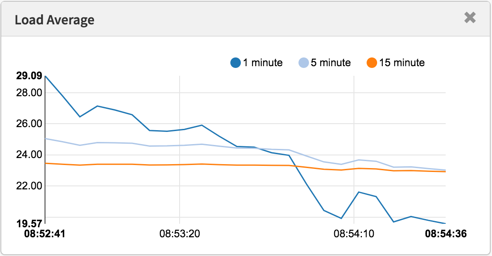

layout: post
title: 探究Load Average
date: 2021-1-8 21:00:00 +0800
description:  # Add post description (optional)
img: # Add image post (optional)
tags: [性能,Linux] # add tag
---

> 翻译http://www.brendangregg.com/


​		平均负载是一项行业关键指标，我的公司根据这些指标和其他指标花费了数百万个自动扩展云实例，但在Linux上却存在一些神秘之处。Linux平均负载不仅跟踪可运行的任务，而且还跟踪处于不间断睡眠状态的任务。为什么？我从未见过任何解释。在这篇文章中，我将解决这个奥秘，并总结平均负载作为每个尝试解释平均负载的参考。

​		Linux平均负载是“系统平均负载”，它显示系统上正在运行的线程（任务）需求为正在运行的平均数量加上等待的线程数量。这可以衡量需求，该需求可能大于系统当前正在处理的需求。大多数工具在1分钟，5分钟和15分钟内显示三个平均值：

```
正常运行时间
 16时48分24秒达4:11，1个用户，加载平均：25.25，23.40，23.46

顶部-16:48:42向上4：12，1个用户，平均负载：25.25、23.14、23.37

$ cat / proc / loadavg 
25.72 23.19 23.35 42/3411 43603
```


一些解释：

- 如果平均值为0.0，则您的系统处于空闲状态。
- 如果1分钟的平均值高于5分钟或15分钟的平均值，则负载正在增加。
- 如果1分钟的平均值低于5或15分钟的平均值，则负载正在减少。
- 如果它们高于您的CPU数量，那么您可能会遇到性能问题（取决于情况）。

以三个为一组，您可以判断负载是在增加还是在减少，这很有用。当需要单个需求值（例如云自动缩放规则）时，它们也很有用。但是，如果没有其他指标的帮助，则很难更详细地了解它们。单个值23-25本身并没有任何意义，但是如果知道CPU计数以及已知是CPU负担的工作负载，则可能意味着一些。

我通常不尝试调试平均负载，而是切换到其他指标。我将在结尾处的“更好的指标”部分中讨论这些内容。

## 历史

原始平均负载仅显示CPU需求：正在运行的进程数加上正在等待运行的进程数。1973年8月的[RFC 546中](https://tools.ietf.org/html/rfc546)有一个很好的描述，标题为“ TENEX平均负载”：

> [1] TENEX负载平均值是对CPU需求的度量。平均负载是给定时间段内可运行进程数的平均值。例如，每小时平均负载为10表示（对于一个CPU系统）在该小时内的任何时间，一个人可能期望看到1个进程正在运行，而其他9个已准备好运行（即，没有为I / O阻塞）等待用于CPU。

此版本在[ietf.org上](https://tools.ietf.org/html/rfc546)链接到1973年7月以来的手绘平均载荷图的PDF扫描，表明该行为受到了数十年的监视：


*资源： https://tools.ietf.org/html/rfc546*


如今，旧操作系统的源代码也可以在网上找到。这是[TENEX](https://github.com/PDP-10/tenex)（1970年代初）的SCHED.MAC的DEC宏程序集的例外：

```
NRJAVS == 3;我们保持的平均负载数量
GS RJAV，NRJAVS;活动过程数的指数平均值
[...]
;更新可运行的作业平均

DORJAV：MOVEI 2，^ D5000
        MOVEM 2，RJATIM;设置下一次更新时间
        MOVE 4，RJTSUM; NBPROC + NGPROC的当前积分
        SUBM 4，RJAVS1;与上次更新的差异
        EXCH 4，RJAVS1
        FSC 4,233;浮动IT
        FDVR 4，[5000.0];过去5000毫秒的平均值
[...]
;表EXP（-T / C）对于T = 5秒。

EXPFF：EXP 0.920043902； C = 1分钟
        EXP 0.983471344; C = 5分钟
        EXP 0.994459811; C = 15分钟
```


这是今天[Linux](https://github.com/torvalds/linux/blob/master/include/linux/sched/loadavg.h)的摘录（include / linux / sched / loadavg.h）：

```
＃定义EXP_1 1884 / * 1 / exp（5sec / 1min）作为定点* /
＃定义EXP_5 2014 / * 1 / exp（5秒/ 5分钟）* /
＃定义EXP_15 2037 / * 1 / exp（5sec / 15min）* /
```


Linux还对1分钟，5分钟和15分钟常数进行硬编码。

在较旧的系统（包括[Multics）中](http://web.mit.edu/Saltzer/www/publications/instrumentation.html)，也有类似的平均负载指标，它的平均调度队列指数是指数。

## 三个数字

这三个数字分别是1分钟，5分钟和15分钟的平均负载。除非它们不是真正的平均值，而且不是1分钟，5分钟和15分钟。从上面的资料中可以看出，1、5和15分钟是方程式中使用的常数，该方程式计算五秒平均值的指数阻尼移动总和。得出的1、5和15分钟的平均负载反映了远超过1、5和15分钟的负载。

如果您使用一个闲置的系统，然后开始一个单线程的CPU约束工作负载（一个线程在一个循环中），那么60秒后平均一分钟的负载将是多少？如果它是纯平均值，则为1.0。这是该实验，以图形方式显示：



*平均负载实验以可视化指数阻尼*


所谓的“一分钟平均值”仅在一分钟标记处达到约0.62。有关等式和类似实验的更多信息，Neil Gunther博士写了一篇有关平均负载的文章：[工作](http://www.teamquest.com/import/pdfs/whitepaper/ldavg1.pdf)[原理](https://github.com/torvalds/linux/blob/master/kernel/sched/loadavg.c)，以及[loadavg.c中](https://github.com/torvalds/linux/blob/master/kernel/sched/loadavg.c)有许多Linux源代码块注释。

## Linux不间断任务

当平均负载首次出现在Linux上时，它们反映了CPU需求，就像其他操作系统一样。但是后来在Linux上对其进行了更改，使其不仅包含可运行的任务，而且还包含处于不间断状态（TASK_UNINTERRUPTIBLE或nr_uninterruptible）的任务。希望避免信号中断的代码路径使用此状态，其中包括磁盘I / O上阻塞的任务和一些锁。您可能之前已经看到过这种状态：它在输出`ps`和`top中`显示为“ D”状态。ps（1）手册页将其称为“不间断睡眠（通常是IO）”。

添加不间断状态意味着Linux的平均负载可能会由于磁盘（或NFS）I / O工作负载而增加，而不仅仅是CPU需求。对于熟悉其他操作系统及其CPU平均负载的每个人来说，包括这种状态一开始都是令人困惑的。

**为什么？**到底为什么Linux会这样做？

关于平均负载的文章不计其数，其中许多指出Linux nr_uninterruptible陷阱。但我还没有人能解释甚至误解为什么要包含它。我自己的猜测是，它应该更一般地反映需求，而不仅仅是CPU需求。

## 搜索一个古老的Linux补丁

了解为什么在Linux中进行某些更改很容易：您阅读了有关文件的git commit历史记录并阅读了更改说明。我检查了[loadavg.c](https://github.com/torvalds/linux/commits/master/kernel/sched/loadavg.c)的历史记录，但是添加了不间断状态的更改早于该文件，该文件是使用早期文件中的代码创建的。我检查了另一个文件，但是那条路也很冷：代码本身跳到了不同的文件周围。希望借此捷径，我为整个Linux github存储库转储了“ git log -p”，这是4 GB的文本，然后开始向后阅读以查看代码何时首次出现。这也是一个死胡同。整个Linux回购中最早的更改可以追溯到2005年，当时Linus导入了Linux 2.6.12-rc2，而这一更改早于此。

有历史性的Linux仓库（[在这里](https://git.kernel.org/pub/scm/linux/kernel/git/tglx/history.git)和[这里](https://kernel.googlesource.com/pub/scm/linux/kernel/git/nico/archive/)），但是这些更改描述也都缺少。试图至少发现这种变化的时候，我在[kernel.org](https://www.kernel.org/pub/linux/kernel/Historic/v0.99/)上搜索了tarball ，发现它的变化是0.99.15，而不是0.99.13-但是，缺少0.99.14的tarball。我发现它在其他地方，并证实该变化是在Linux的0.99 PATCHLEVEL 14，1993年十一月，我希望由Linus为0.99.14发布说明会解释的变化，但是[这](http://www.linuxmisc.com/30-linux-announce/4543def681c7f27b.htm)也是个死胡同：

> “对最后一个正式版本（p13）的更改太多，以至于无法提及（甚至不记得）...” – Linus

他提到重大变化，但未提及平均负载变化。

根据日期，我查找了[内核邮件列表档案，](http://lkml.iu.edu/hypermail/linux/kernel/index.html)以查找实际的补丁程序，但是最早的电子邮件是1995年6月，当时sysadmin写道：

> “在研究使这些邮件档案更有效地扩展的系统时，我无意间破坏了当前的档案（哎呀）。”

我的搜索开始受到诅咒。幸运的是，我发现了一些较旧的linux-devel邮件列表归档文件，这些归档文件是从服务器备份中提取的，通常以摘要的压缩文件形式存储。我搜索了6,000多个摘要，其中包含98,000封电子邮件，其中30,000封来自1993年。但是不知何故，所有邮件中都没有。看起来原始补丁描述可能永远消失了，“为什么”仍然是个谜。

## 不间断的起源

幸运的是，我终于在[oldlinux.org上的](http://oldlinux.org/Linux.old/mail-archive/)1993年的压缩邮箱文件中找到了更改。这里是：

```
来自：Matthias Urlichs <urlichs@smurf.sub.org>
主题：平均负载坏了？
日期：1993年10月29日，星期五11:37:23 +0200


在计算平均负载时，内核仅计算“可运行”进程。
我不喜欢 问题是正在交换的进程或
等待“快速”（即不间断的I / O）也会消耗资源。

当您使用平均负载下降时，似乎有些不直观
用慢速交换磁盘替换快速交换磁盘...

无论如何，以下补丁似乎使平均负载更多
一致的WRT系统的主观速度。而且，最重要的是
没有人做任何事情时，负载仍然为零。;-)

--- kernel / sched.c.orig 1993年10月29日星期五10:31:11
+++ kernel / sched.c 1993年10月29日星期五10:32:51
@@ -414,7 +414,9 @@
    无符号长整数nr = 0;

    for（p =＆LAST_TASK; p>＆FIRST_TASK; --p）
-如果（* p &&（* p）->状态== TASK_RUNNING）
+ if（* p &&（（* p）->状态== TASK_RUNNING）||
+（* p）->状态== TASK_UNINTERRUPTIBLE）||
+（* p）->状态== TASK_SWAPPING））
            nr + = FIXED_1;
    返回nr;
 }
-
Matthias Urlichs \ XLink-POP N | rnberg | 电子邮件：urlichs@smurf.sub.org
Schleiermacherstra_e 12 \ Unix + Linux + Mac | 电话：...请使用电子邮件。
90491 N | rnberg（德国）\咨询+网络+编程+等42
```


阅读将近24年前这种变化背后的想法，真是太神奇了。

这证实了故意更改了平均负载以反映对其他系统资源的需求，而不仅仅是CPU。Linux从“ CPU平均负载”更改为“系统平均负载”。

他使用较慢的交换磁盘的示例很有道理：通过降低系统性能，对系统的需求（按运行+排队）可以增加。但是，平均负载有所下降，因为它们仅跟踪CPU的运行状态，而不跟踪交换状态。马蒂亚斯（Matthias）认为这是非直觉的，因此他将其修复。

## 今天不间断

但是，Linux的平均负载量有时是否过高，甚至超过了磁盘I / O所能解释的水平？是的，尽管我的猜测是这是由于使用TASK_UNINTERRUPTIBLE的新代码路径在1993年不存在。在Linux 0.99.14中，有13个代码路径直接设置了TASK_UNINTERRUPTIBLE或TASK_SWAPPING（交换状态后来从Linux中删除了）。如今，在Linux 4.12中，有将近400个设置TASK_UNINTERRUPTIBLE的代码路径，包括一些锁定原语。这些代码路径之一可能不应该包含在平均负载中。下次我的平均负载似乎过高时，我将查看情况是否如此以及是否可以解决。

我第一次给马蒂亚斯发电子邮件，问他对将近24年后的平均负载变化的看法。他在一小时内做出了回应（正如我在[Twitter上](https://twitter.com/brendangregg/status/891716419892551680)提到的那样），并写道：

> 从人的角度来看，“平均负载点”是一个与系统的繁忙程度相关的数字。磁盘密集型系统可能非常缓慢，但TASK_RUNNING平均值仅为0.1，这对任何人都无济于事。”

（这么快得到回复，甚至根本没有响应，真的让我很高兴。谢谢！）

因此，至少考虑到TASK_UNINTERRUPTIBLE过去的意思，Matthias仍然认为这是有道理的。

但是TASK_UNITERRUPTIBLE今天可以匹配更多的东西。我们是否应该将平均负载更改为仅CPU和磁盘需求？调度程序维护者Peter Zijstra已经向我发送了一个聪明的方法进行探索：将`task_struct-> in_iowait包含`在负载平均值中，而不是TASK_UNINTERRUPTIBLE中，以便与磁盘I / O更紧密地匹配。但这引出了另一个问题，我们真正想要的是什么？我们是要根据线程还是仅对物理资源的需求来衡量对系统的需求？如果是前者，则应包括等待不间断锁，因为这些线程是系统上的需求。他们不是闲着。因此，也许Linux平均负载已经按照我们希望的方式工作了。

为了更好地理解不间断的代码路径，我想一种方法来衡量它们的实际作用。然后，我们可以检查不同的示例，量化在这些示例中花费的时间，然后看看这一切是否有意义。

## 衡量不间断的任务

以下是生产服务器上[的CPU](http://www.brendangregg.com/blog/2016-01-20/ebpf-offcpu-flame-graph.html)脱离[火焰图](http://www.brendangregg.com/blog/2016-01-20/ebpf-offcpu-flame-graph.html)，显示了60秒，并且仅显示了内核堆栈，在这里我进行过滤以仅包括TASK_UNINTERRUPTIBLE状态（[SVG](http://www.brendangregg.com/blog/images/2017/out.offcputime_unint02.svg)）的堆栈。它提供了许多不间断代码路径的示例：


如果您不熟悉CPU外的火焰图：您可以单击框架以放大，检查显示为框架塔的完整堆栈。x轴大小与关闭CPU所花费的时间成比例，并且排序顺序（从左到右）没有实际意义。对于CPU外的堆栈，颜色为蓝色（我对CPU上的堆栈使用暖色），并且饱和度具有随机差异以区分帧。

我使用[bcc的](https://github.com/iovisor/bcc)offcputime工具（此工具需要Linux 4.8+的eBPF功能）和我的[火焰图](https://github.com/brendangregg/FlameGraph)软件生成了此文件：

```
＃./ bcc/tools/offcputime.py -K --state 2 -f 60> out.stacks 
＃awk'{print $ 1，$ 2/1000}'out.stacks | ./FlameGraph/flamegraph.pl --color = io --countname = ms> out.offcpu.svg b>
```


我正在使用awk将输出从微秒更改为毫秒。offcputime“ --state 2”在TASK_UNINTERRUPTIBLE上匹配（请参阅sched.h），这是我为此博文添加的一个选项。Facebook的Josef Bacik首先使用他的[kernelscope](https://github.com/josefbacik/kernelscope)工具做到了这一点，该工具还使用了密件抄送和火焰图。在我的示例中，我只是显示内核堆栈，但是offcputime.py也支持显示用户堆栈。

至于上面的火焰图：显示60秒中只有926毫秒用于不间断的睡眠。这仅会使我们的平均负载增加0.015。现在是时候在某些cgroup路径中了，但是该服务器没有做太多的磁盘I / O。

这是一个更有趣的示例，这次仅跨10秒（[SVG](http://www.brendangregg.com/blog/images/2017/out.offcputime_unint01.svg)）：


右侧的宽塔在proc_pid_cmdline_read（）中显示`systemd-journal`（读取/ proc / PID / cmdline），被阻塞，并为平均负载贡献0.07。左侧有一个较宽的页面故障塔，该塔也以rwsem_down_read_failed（）结尾（将平均负载增加0.23）。我已经使用火焰图搜索功能以洋红色突出显示了这些功能。这是rwsem_down_read_failed（）的摘录：

```
    / *等待获得锁* /
    而（true）{
        set_task_state（tsk，TASK_UNINTERRUPTIBLE）;
        如果（！waiter.task）
            打破;
        时间表（）;
    }
```


这是使用TASK_UNINTERRUPTIBLE的锁获取代码。Linux具有互斥和不间断版本的互斥锁获取功能（例如，mutex_lock（）与Mutex_lock_interruptible（）以及信号量的down（）和down_interruptible（））。可中断版本允许任务被信号中断，然后在获取锁之前唤醒以处理该任务。不间断的锁睡眠时间通常不会对平均负载增加太多，但是在这种情况下，它们增加了0.30。如果这个值更高，则值得分析一下是否可以减少锁争用（例如，我将开始研究systemd-journal和proc_pid_cmdline_read（）！），这将提高性能并降低平均负载。

将这些代码路径包含在平均负载中是否有意义？是的，我会这样说。这些线程在工作中，碰巧阻塞了一个锁。他们不是闲着。它们是对系统的需求，尽管需要软件资源而不是硬件资源。

## 分解Linux平均负载

Linux负载平均值可以完全分解为组件吗？这是一个示例：在闲置的8 CPU系统上，我启动了`tar`来存档一些未缓存的文件。它花费了几分钟的时间，大部分时间在磁盘读取上被阻止。以下是从三个不同的终端窗口收集的统计信息：

```
terma $ pidstat -p`pgrep -x tar` 60
Linux 4.9.0-rc5-虚拟（bgregg-xenial-bpf-i-0b7296777a2585be1）08/01/2017 _x86_64_（8 CPU）

10:15:51 PM UID PID％usr％系统％guest％CPU CPU命令
下午10:16:51 0 18468 2.85 29.77 0.00 32.62 3焦油

termb $ iostat -x 60
[...]
avg-cpu：％user％nice％system％iowait％steal％idle
           0.54 0.00 4.03 8.24 0.09 87.10

设备：rrqm / s wrqm / sr / sw / s rkB / s wkB / s avgrq-sz avgqu-sz await r_await w_await svctm％util
xvdap1 0.00 0.05 30.83 0.18 638.33 0.93 41.22 0.06 1.84 1.83 3.64 0.39 1.21
xvdb 958.18 1333.83 2045.30 499.38 60965.27 63721.67 98.00 3.97 1.56 0.31 6.67 0.24 60.47
xvdc 957.63 1333.78 2054.55 499.38 61018.87 63722.13 97.69 4.21 1.65 0.33 7.08 0.24 61.65
md0 0.00 0.00 4383.73 1991.63 121984.13 127443.80 78.25 0.00 0.00 0.00 0.00 0.00 0.00 0.00

termc $正常运行时间
 22:15:50最多154天，23：20、5个用户，平均负载：1.25、1.19、1.05
[...]
termc $正常运行时间
 22:17:14最多154天，23：21、5个用户，平均负载：1.19、1.17、1.06
```


我还收集了不间断状态（[SVG](http://www.brendangregg.com/blog/images/2017/out.offcputime_unint08.svg)）的CPU外火焰图：


最后一分钟的平均负载为1.19。让我分解一下：

- 0.33来自tar的CPU时间（pidstat）
- 0.67是从tar的不间断磁盘读取得出的（offcpu火焰图在0.69处有此推断，我怀疑是因为它开始收集的时间稍晚，并且跨越了稍微不同的时间范围）
- 0.04来自其他CPU使用者（iostat用户+系统，从pidstat减去tar的CPU）
- 0.11是来自内核工作人员的不间断磁盘I / O时间，刷新磁盘写操作（offcpu火焰图，左侧有两个塔）

总计为1.15。我仍然缺少0.04，其中一些可能是舍入和测量间隔偏移误差，但是很多可能是由于平均负载是指数衰减的移动总和，而我使用的其他平均值（pidstat，iostat）是正常的平均值。在1.19之前，一分钟的平均值为1.25，因此其中有些仍然会拖累我们。多少？根据我之前的图表，在1分钟标记处，指标的62％是从那分钟开始的，其余则是较旧的。因此0.62 x 1.15 + 0.38 x 1.25 = 1.18。这非常接近报道的1.19。

这是一个系统，其中一个线程（tar）加上更多线程（有时在内核工作线程中）正在工作，Linux报告的平均负载为1.19，这很有意义。如果它正在测量“ CPU负载平均值”，则系统将报告0.37（从mpstat的摘要中推断），该值仅对CPU资源正确，但是掩盖了一个线程需要大量工作的事实。

我希望这个示例表明数字确实意味着某些故意的事情（CPU +不间断），并且您可以对其进行分解并弄清楚。

## 了解Linux平均负载

我在操作系统中长大，平均负载意味着平均CPU负载，因此Linux版本一直困扰着我。也许一直以来的真正问题是，“平均负载”一词与“ I / O”一样模棱两可。哪种类型的I / O？磁盘I / O？文件系统I / O？网络I / O？...同样，平均负载是多少？平均CPU负载？系统平均负载？这样澄清一下，我就可以这样理解：

- 在Linux上，平均负载是（或试图成为）整个系统的“**系统平均负载**”，用于衡量正在工作并等待工作的线程数（CPU，磁盘，不间断锁）。换句话说，它测量未完全空闲的线程数。优势：包括对不同资源的需求。
- 在其他OS上，平均负载为“ **CPU平均负载**”，用于衡量CPU运行+ CPU可运行线程的数量。优点：可以更容易理解和推理（仅适用于CPU）。

请注意，还有另一种可能的类型：“**物理资源平均负载**”，它将仅包括物理资源（CPU +磁盘）的负载。

也许有一天，我们将为Linux添加其他平均负载，并让用户选择他们想要使用的负载：单独的“ CPU平均负载”，“磁盘平均负载”，“网络平均负载”等。指标。

## 什么是“好”或“坏”的平均负载？


*使用现代工具测得的平均负载*

有些人发现了适用于他们的系统和工作负载的价值：他们知道，当负载超过X时，应用程序延迟很高，客户开始抱怨。但这并没有真正的规则。

使用CPU平均负载，可以将该值除以CPU计数，然后说如果该比率超过1.0，则说明您正在饱和运行，这可能会导致性能问题。这有点模棱两可，因为它是一个长期平均值（至少一分钟），可以隐藏变化。一个比率为1.5的系统可能运行良好，而在1.5分钟内突然爆裂的另一个系统可能表现不佳。

我曾经管理过一个两CPU电子邮件服务器，该服务器在一天中的平均CPU负载为11到16（比率为5.5到8）。延迟是可以接受的，没有人抱怨。这是一个极端的例子：大多数系统的负载/ CPU比率仅为2。

至于Linux的系统平均负载：由于它们涵盖了不同的资源类型，因此它们甚至更加模棱两可，因此，您不能仅仅将其除以CPU数量。对于*相对*比较*而言，*它更有用：如果您知道系统在20的负载下运行良好，而现在是40，那么该是时候深入研究其他指标以了解发生了什么。

## 更好的指标

当Linux平均负载增加时，您就会知道对资源（CPU，磁盘和一些锁）的需求更高，但是您不确定哪一个。您可以使用其他指标进行澄清。例如，对于CPU：

- **每CPU利用率**：例如，使用`mpstat -P ALL 1`
- **每个进程的CPU利用率**：例如`top`，`pidstat 1`等。
- **每线程运行队列（调度程序）延迟**：例如，在/ proc / PID / schedstats，delaystats，`perf sched中`
- **CPU运行队列延迟**：例如，在/ proc / schedstat中，在`perf sched中`，我的[runqlat ](http://www.brendangregg.com/blog/2016-10-08/linux-bcc-runqlat.html)[bcc](https://github.com/iovisor/bcc)工具。
- **CPU运行队列长度**：例如，使用`vmstat 1`和'r'列或我的runqlen bcc工具。

前两个是利用率指标，后三个是饱和度指标。利用率指标可用于工作负载表征，而饱和度指标可用于识别性能问题。最佳的CPU饱和度度量标准是运行队列（或调度程序）延迟的度量：任务/线程处于可运行状态但必须等待其运行的时间。这些允许您计算性能问题的严重程度，例如，线程在调度程序延迟中花费的时间百分比。相反，通过测量运行队列长度可以表明存在问题，但是估计幅度更困难。

schedstats工具在Linux 4.6中已成为内核可调参数（sysctl kernel.sched_schedstats），默认情况下已更改为关闭。延迟计帐公开了与[cpustat中](https://github.com/uber-common/cpustat)相同的调度程序延迟度量标准，我只是建议也将其添加到[htop中](https://github.com/hishamhm/htop/issues/665)，因为这将使人们更容易使用。比从（未记录的）/ proc / sched_debug输出中刮取等待时间（调度程序延迟）度量标准更容易：

```
$ awk'NF> 7 {if（$ 1 ==“ task”）{if（h == 0）{打印; h = 1}}其他{print}}'/ proc / sched_debug
            任务PID树键切换     prio等待时间             sum-exec sum-sleep
         systemd 1 5028.684564 306666 120 43.133899 48840.448980 2106893.162610 0 0 /init.scope
     ksoftirqd / 0 3 99071232057.573051 1109494 120 5.682347 21846.967164 2096704.183312 0 0 /
    kworker / 0：0H 5 99062732253.878471 9 100 0.014976 0.037737 0.000000 0 0 /
     迁移/ 0 9 0.000000 1995690 0 0.000000 25020.580993 0.000000 0 0 /
   lru-add-drain 10 28.548203 2 100 0.000000 0.002620 0.000000 0 0 /
      看门狗/ 0 11 0.000000 3368570 0 0.000000 23989.957382 0.000000 0 0 /
         cpuhp / 0 12 1216.569504 6 120 0.000000 0.010958 0.000000 0 0 /
          xenbus 58 72026342.961752 343 120 0.000000 1.471102 0.000000 0 0 /
      khungtaskd 59 99071124375.968195 111514 120 0.048912 5708.875023 2054143.190593 0 0 /
[...]
         dockerd 16014 247832.821522 2020884 120 95.016057 131987.990617 2298828.078531 0 0 /system.slice/docker.service
         dockerd 16015 106611.777737 2961407 120 0.000000 160704.014444 0.000000 0 0 /system.slice/docker.service
         dockerd 16024 101.600644 16120 0.000000 0.915798 0.000000 0 0 /system.slice/
[...]
```


除了CPU指标外，您还可以查找磁盘设备的利用率和饱和度指标。我将重点放在[USE方法](http://www.brendangregg.com/usemethod.html)中的此类指标上，并有一个[Linux清单](http://www.brendangregg.com/USEmethod/use-linux.html)。

尽管有更明确的指标，但这并不意味着平均负载没有用。它们已成功用于云计算微服务的扩展策略以及其他指标。这有助于微服务响应不同类型的负载增加，CPU或磁盘I / O。使用这些策略，错误地扩大规模（花费金钱）比不扩大规模（使顾客花费）更安全，因此，希望包含更多信号。如果扩展过多，我们将在第二天调试原因。

我一直使用平均负载的一件事是它们的历史信息。如果要求我在云上检查性能不佳的实例，然后登录并发现平均一分钟的时间比十五分钟的平均时间低得多，这是一个很大的提示，我可能来不及看到性能问题生活。但是在转向其他指标之前，我只花了几秒钟的时间来考虑平均负载。

## 结论

1993年，一位Linux工程师发现了一种非直观的情况，即平均负载，并且通过三行修补程序将它们从“ CPU平均负载”永久更改为“系统平均负载”。他的更改包括处于不间断状态的任务，因此平均负载反映了对磁盘资源的需求，而不仅仅是CPU。这些系统平均负载对工作和等待工作的线程数进行计数，并总结为指数阻尼移动和平均值的三元组，这些平均值在方程式中使用1、5和15分钟作为常数。这个三元组数字使您可以查看负载是在增加还是在减少，并且它们的最大值可能是与它们自己的相对比较。

从那以后，不中断状态的使用在Linux内核中得到了发展，如今包括不间断的锁原语。如果平均负载是根据运行线程和等待线程（而不是严格地说需要硬件资源的线程）来衡量需求的指标，那么它们仍然按照我们希望的方式工作。

在这篇文章中，我挖掘了1993年的Linux平均负载补丁-很难找到它-包含了作者的原始解释。我还使用现代Linux系统上的bcc / eBPF测量了处于不间断状态的堆栈跟踪和时间，并将这段时间可视化为CPU外火焰图。该可视化提供了许多不间断睡眠的示例，并且可以在需要时解释异常高的平均负载时生成。我还提出了其他指标，可以用来更详细地了解系统负载，而不是平均负载。

最后，我将引用Linux源码中调度程序维护者Peter Zijlstra的[kernel / sched / loadavg.c](https://github.com/torvalds/linux/blob/master/kernel/sched/loadavg.c)顶部的注释：

> *此文件包含计算全局loadavg
> *图所需的魔术位。**这是一个愚蠢的数字，但人们认为它很重要。**我们要
> 竭尽全力使它在大型计算机和无滴答的内核上运行。

## 参考文献

- Saltzer，J。和J. Gintell。“ [Multics中的仪器](http://web.mit.edu/Saltzer/www/publications/instrumentation.html)，”中美洲共同市场，1970年8月（说明指数）。
- Multics [system_performance_graph](http://web.mit.edu/multics-history/source/Multics/doc/privileged/system_performance_graph.info)命令参考（提及平均1分钟）。
- [TENEX](https://github.com/PDP-10/tenex)源代码（平均负载代码在SCHED.MAC中）。
- [RFC 546](https://tools.ietf.org/html/rfc546) “ 1973年7月的TENEX平均负载”（解释测量CPU需求）。
- Bobrow，D。等。“ TENEX：PDP-10的分页时间共享系统”，ACM通讯，1972年3月（解释了平均负载三重态）。
- N. Gunther，N。“ UNIX平均负载第1部分：如何工作” [PDF](http://www.teamquest.com/import/pdfs/whitepaper/ldavg1.pdf)（解释指数计算）。
- Linus关于[Linux 0.99补丁程序级别14](http://www.linuxmisc.com/30-linux-announce/4543def681c7f27b.htm)的电子邮件。
- 平均负载变化电子邮件位于[oldlinux.org上](http://oldlinux.org/Linux.old/mail-archive/)（在alan-old-funet-lists / kernel.1993.gz中，而不是在我首先搜索的linux目录中）。
- 前后的平均负载变化后的Linux内核/ sched.c中源：[0.99.13](http://kernelhistory.sourcentral.org/linux-0.99.13/?f=/linux-0.99.13/S/449.html%23L332)，[0.99.14](http://kernelhistory.sourcentral.org/linux-0.99.14/?f=/linux-0.99.14/S/323.html%23L412)。
- Linux.0.99发行版的Tarballs在[kernel.org上](https://www.kernel.org/pub/linux/kernel/Historic/v0.99/)。
- 当前的Linux平均负载代码：[loadavg.c](https://github.com/torvalds/linux/blob/master/kernel/sched/loadavg.c)，[loadavg.h](https://github.com/torvalds/linux/blob/master/include/linux/sched/loadavg.h)
- 该[BCC](https://github.com/iovisor/bcc)分析工具包括我[offcputime](http://www.brendangregg.com/blog/2016-01-20/ebpf-offcpu-flame-graph.html)，用于跟踪TASK_UNINTERRUPTIBLE。
- [火焰图](http://www.brendangregg.com/flamegraphs.html)用于可视化不间断路径。
