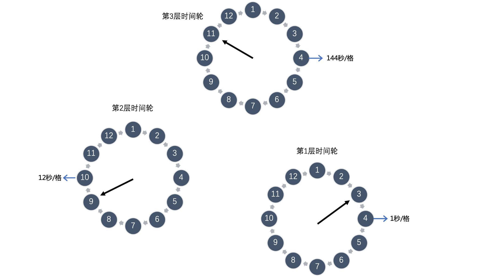

定时调度的应用场景其实也非常的广泛，如以下的场景：

1. 新建的订单，如果用户在 15 分钟内未支付，则自动取消。
2. 公司的会议预定系统，在会议预定成功后，会在会议开始前半小时通知所有预定该会议的用户。
3. 安全工单超过 24 小时未处理，则自动拉企业微信群提醒相关责任人。
4. 用户下单外卖以后，距离超时时间还有 10 分钟时提醒外卖小哥即将超时。

### DelayQueue

Java的延迟队列

缺点：单点状态持久，无分布式


### **Redis ZSet**

会有

我们知道 Redis 有一个有序集合的数据结构 ZSet，ZSet 中每个元素都有一个对应 Score，ZSet 中所有元素是按照其 Score 进行排序的。

那么我们可以通过以下这几个操作使用 Redis 的 ZSet 来实现一个延迟队列：

1. 入队操作：`ZADD KEY timestamp task`, 我们将需要处理的任务，按其需要延迟处理时间作为 Score 加入到 ZSet 中。Redis 的 ZAdd 的时间复杂度是`O(logN)`，`N`是 ZSet 中元素个数，因此我们能相对比较高效的进行入队操作。**（优先级队列）**
2. 起一个进程定时（比如每隔一秒）通过`ZREANGEBYSCORE`方法查询 ZSet 中 Score 最小的元素，具体操作为：`ZRANGEBYSCORE KEY -inf +inf limit 0 1 WITHSCORES`。查询结果有两种情况：
   a. 查询出的分数小于等于当前时间戳，说明到这个任务需要执行的时间了，则去异步处理该任务；
   b. 查询出的分数大于当前时间戳，由于刚刚的查询操作取出来的是分数最小的元素，所以说明 ZSet 中所有的任务都还没有到需要执行的时间，则休眠一秒后继续查询；
   同样的，`ZRANGEBYSCORE`操作的时间复杂度为`O(logN + M)`，其中`N`为 ZSet 中元素个数，`M`为查询的元素个数，因此我们定时查询操作也是比较高效的。**（定时刷符合的元素）**

这里从网上搬运了一套 Redis 实现延迟队列的后端架构，其在原来 Redis 的 ZSet 实现上进行了一系列的优化，使得整个系统更稳定、更健壮，能够应对高并发场景，并且具有更好的可扩展性，是一个挺不错的架构设计，其整体架构图如下：


### RabbitMQ

依靠 RabbitMQ 的**TTL**以及**死信队列**功能，来实现延迟队列的效果。

- TTL（Time-To-Live）是 RabbitMQ 的一种高级特性，表示了一条消息的最大生存时间，单位为毫秒。

  - 有两种不同的方式可以设置消息的 TTL 属性 :

    - 一种方式是直接在创建队列的时候设置整个队列的 TTL 过期时间

    ```java
    Map<String, Object> args = new HashMap<String, Object>();
    args.put("x-message-ttl", 6000);
    channel.queueDeclare(queueName, durable, exclusive, autoDelete, args);
    ```

    - 另一种方式是针对单条消息设置，参考代码如下:

    ```java
    AMQP.BasicProperties.Builder builder = new AMQP.BasicProperties.Builder();
    builder.expiration("6000");
    AMQP.BasicProperties properties = builder.build();
    channel.basicPublish(exchangeName, routingKey, mandatory, properties, "msg content".getBytes());
    ```

    

不过需要注意的是，使用这种方式设置的 TTL，消息可能不会按时死亡，因为 RabbitMQ 只会检查第一个消息是否过期。比如这种情况，第一个消息设置了 20s 的 TTL，第二个消息设置了 10s 的 TTL，那么 RabbitMQ 会等到第一个消息过期之后，才会让第二个消息过期。

解决方法：装插件https://www.rabbitmq.com/community-plugins.html


使用 RabbitMQ 来实现延迟队列，我们可以很好的利用一些 RabbitMQ 的特性，比如消息可靠发送、消息可靠投递、死信队列来保障消息至少被消费一次以及未被正确处理的消息不会被丢弃。另外，通过 RabbitMQ 集群的特性，可以很好的解决单点故障问题，不会因为单个节点挂掉导致延迟队列不可用或者消息丢失。


### 时间轮算法 

TimeWheel 时间轮算法，是一种实现延迟队列的巧妙且高效的算法，被应用在 Netty，Zookeeper，Kafka 等各种框架中。


如上图所示，时间轮是一个**存储延迟消息的环形队列**，其底层采用数组实现，可以高效循环遍历。这个环形队列中的每个元素对应一个延迟任务列表，这个列表是一个**双向环形链表**，链表中每一项都代表一个需要执行的延迟任务

时间轮会有表盘指针，表示时间轮当前所指时间，随着时间推移，该指针会不断前进，并处理对应位置上的延迟任务列表。


#### **添加延迟任务**

由于时间轮的大小固定，并且时间轮中每个元素都是一个双向环形链表，我们可以在`O(1)` 的时间复杂度下向时间轮中添加延迟任务。

如下图，例如我们有一个这样的时间轮，在表盘指针指向当前时间为 2 时，我们需要新添加一个延迟 3 秒的任务，我们可以快速计算出延迟任务在时间轮中所对应的位置为 5，并添加到位置 5 上任务列表尾部。


#### **多层时间轮**

上面的时间轮的大小是固定的，只有 12 秒。如果此时我们有一个需要延迟 200 秒的任务，我们应该怎么处理呢？直接扩充整个时间轮的大小吗？这显然不可取，因为这样做的话我们就需要维护一个非常非常大的时间轮，内存是不可接受的，而且底层数组大了之后寻址效率也会降低，影响性能。

为此，Kafka 引入了多层时间轮的概念。其实多层时间轮的概念和我们的机械表上时针、分针、秒针的概念非常类似，当仅使用秒针无法表示当前时间时，就使用分针结合秒针一起表示。同样的，当任务的到期时间超过了当前时间轮所表示的时间范围时，就会尝试添加到上层时间轮中，如下图所示：





第一层时间轮整个时间轮所表示时间范围是 0-12 秒，第二层时间轮每格能表示的时间范围是整个第一层时间轮所表示的范围也就是 12 秒，所以整个第二层时间轮能表示的时间范围即 12*12=144 秒，依次类推第三层时间轮能表示的范围是 1728 秒，第四层为 20736 秒等等。

比如现在我们需要添加一个延时为 200 秒的延迟消息，我们发现其已经超过了第一层时间轮能表示的时间范围，我们就需要继续往上层时间轮看，将其添加在第二层时间轮 200/12 = 17 的位置，然后我们发现 17 也超过了第二次时间轮的表示范围，那么我们就需要继续往上层看，将其添加在第三层时间轮的 17/12 = 2 的位置。

Kafka 中时间轮算法添加延迟任务以及推动时间轮滚动的核心流程如下，其中 Bucket 即时间轮中的延迟任务队列，并且 Kafka 引入的 DelayQueue 解决了多数 Bucket 为空导致的时间轮滚动效率低下的问题：


使用时间轮实现的延迟队列，能够支持大量任务的高效触发。并且在 Kafka 的时间轮算法的实现方案中，还引入了 DelayQueue，使用 DelayQueue 来推送时间轮滚动，而延迟任务的添加与删除操作都放在时间轮中，这样的设计大幅提升了整个延迟队列的执行效率。
