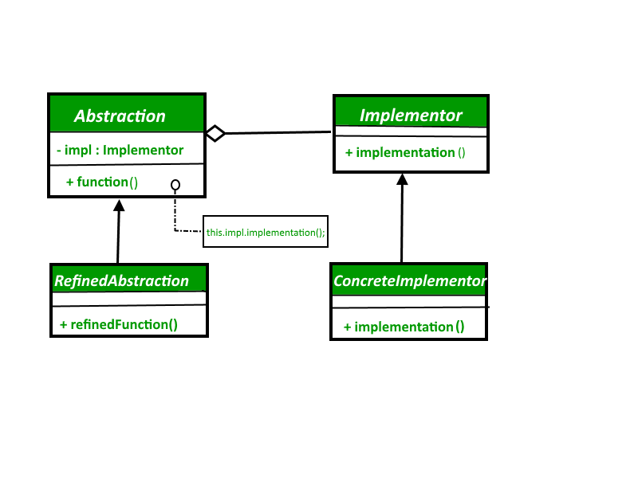
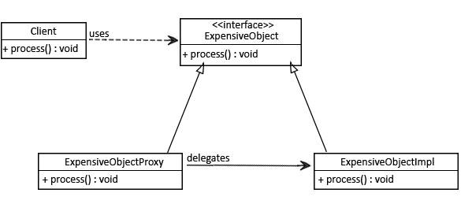

# 设计模式

设计模式是在软件设计中常见问题的解决方案的总结和经验总结。根据Gang of Four（GoF）的分类，可以将设计模式分为以下几类：

1. 创建型模式（Creational Patterns）：
    - 单例模式（Singleton Pattern）：确保一个类只有一个实例，并提供全局访问点。
    - 工厂模式（Factory Pattern）：通过定义一个公共接口来创建对象，而具体的对象创建过程由子类或工厂类负责实现。
    - 抽象工厂模式（Abstract Factory Pattern）：提供一个接口来创建一系列相关或相互依赖的对象，而无需指定其具体类。
    - 建造者模式（Builder Pattern）：将对象的构建过程与其表示分离，以便可以使用相同的构建过程创建不同的表示。
    - 原型模式（Prototype Pattern）：通过复制现有对象来创建新对象，而无需显式地使用构造函数。

2. 结构型模式（Structural Patterns）：
    - 适配器模式（Adapter Pattern）：将一个类的接口转换成客户端所期望的另一个接口。
    - 桥接模式（Bridge Pattern）：将抽象部分与其具体实现分离，使它们可以独立变化。
    - 组合模式（Composite Pattern）：将对象组合成树形结构以表示“部分-整体”的层次结构。
    - 装饰器模式（Decorator Pattern）：动态地将新功能添加到对象中，通过创建包装器对象来包含原始对象并提供额外的功能。
    - 外观模式（Facade Pattern）：提供了一个统一的接口，用于访问子系统中的一组接口。
    - 享元模式（Flyweight Pattern）：共享细粒度对象，以便在需要时有效地支持大量的细粒度对象。
    - 代理模式（Proxy Pattern）：为其他对象提供一种代理以控制对这个对象的访问

3. 行为型模式（Behavioral Patterns）：
    - 观察者模式（Observer Pattern）：定义了对象之间的一对多依赖关系，当一个对象状态发生变化时，其所有依赖对象都会得到通知并自动更新。
    - 策略模式（Strategy Pattern）：定义一系列可互换的算法，并将每个算法封装起来，使它们之间可以互相替换。
    - 命令模式（Command Pattern）：将请求封装成对象，以便可以使用不同的请求、队列或日志来参数化其他对象。
    - 迭代器模式（Iterator Pattern）：提供一种顺序访问集合对象元素的方法，而无需暴露其内部表示。
    - 职责链模式（Chain of Responsibility Pattern）：将请求的发送者和接收者解耦，以便多个对象都有机会处理该请求。
    - 状态模式（State Pattern）：允许对象在内部状态改变时改变其行为，看起来像是改变了其类。 
    - 备忘录模式（Memento Pattern）：在不违反封装的情况下捕获和存储对象的内部状态，以便稍后可以将其恢复。 
    - 访问者模式（Visitor Pattern）：定义了对对象结构中各元素的操作，使得可以在不改变元素类的情况下定义新的操作。

## 创建型模式（Creational Patterns）
### 工厂模式
提供了一种创建对象的接口，但将**对象的具体类型推迟到子类**来决定。这样可以通过工厂方法来创建对象，而不是直接使用new关键字，从而实现松耦合和更好的扩展性。

## 结构型模式（Structural Patterns）
### 适配器模式

```java
public interface Enumeration<E> {
    
    boolean hasMoreElements();

    E nextElement();

    default Iterator<E> asIterator() {
        return new Iterator<>() {
            @Override public boolean hasNext() {
                return hasMoreElements();
            }
            @Override public E next() {
                return nextElement();
            }
        };
    }
    
}
```

### 桥接模式
桥接模式通过将**继承关系改为关联关系**，将**抽象与实现分离**，从而达到解耦的效果。
优先使用组合而不是继承”的老建议的应用。当必须以与彼此正交的方式对不同维度进行子类化时，桥接模式非常方便.

在传统的面向对象编程中，我们通常使用继承来扩展现有的类，以添加新的功能或行为。然而，继承关系是静态的，它在编译时就被确定下来，而且子类与父类之间的关系是紧密耦合的。这导致了继承关系的一些问题，比如难以管理、扩展性差、继承层次复杂等。

桥接模式提供了一种解决方案，即通过使用组合关系来替代继承关系，将抽象部分和实现部分分离开来。这样，抽象部分和实现部分可以独立变化，而且它们之间的关系是松散耦合的。桥接模式将继承的问题转化为组合的问题，从而提供了更大的灵活性和可扩展性。

“**当您必须以与彼此正交的方式对不同维度进行子类化时**”，指的是当我们需要在不同的维度上进行扩展时，而这些维度是相互独立且不相关的。使用继承关系会导致类爆炸的问题，而使用桥接模式可以将这些维度的扩展分离开来，使得每个维度的扩展都是独立的，彼此之间没有依赖关系。

因此，桥接模式是应用“优先使用组合而不是继承”原则的一种实践，它通过将继承关系转化为组合关系，解决了继承关系带来的一些问题，并提供了更好的灵活性和扩展性。
例如：


用了桥接模式


以下是桥接模式的一些实现特点：
1. 分离抽象和实现：桥接模式通过将**抽象部分和实现部分分离**，使它们可以独立地变化。抽象部分是指高层逻辑，实现部分是指底层实现。这样，抽象部分和实现部分可以独立地进行扩展和修改，而不会相互影响。
2. 桥接接口：桥接模式定义了一个**桥接接口**（Bridge Interface），该接口位于抽象部分和实现部分之间，通过该接口可以将抽象部分和实现部分连接起来。桥接接口允许抽象部分调用实现部分的方法，从而实现抽象与实现的通信。
3. 增加灵活性：桥接模式增加了系统的灵活性。通过将抽象与实现分离，可以在运行时动态地选择不同的实现，而不会影响到客户端代码。这使得系统更加灵活，能够适应变化的需求。
4. 对于扩展的支持：桥接模式对于扩展非常友好。由于抽象部分和实现部分相互分离，因此可以很容易地扩展新的抽象部分或实现部分，而不需要修改已有的代码。
5. 提高可维护性：由于桥接模式将抽象部分和实现部分分离，使得系统的结构更清晰，代码更易于理解和维护。对于复杂的系统，使用桥接模式可以降低系统的复杂性，提高代码的可读性和可维护性。



## 行为型模式（Behavioral Patterns）
### 访问者模式
访问者模式（Visitor Pattern）是一种行为型设计模式，它允许你定义一系列操作，而无需修改被操作的对象的类。通过将操作封装在访问者对象中，可以在不改变被操作对象的类的情况下，定义新的操作。
以下是访问者模式的一些实现特点：
1. **分离数据结构和操作**：访问者模式通过**将数据结构与操作分离**，使得可以在不修改数据结构的情况下定义新的操作。数据结构通常是一个复杂的对象结构，而操作则由访问者对象表示。
2. **双重分派**：访问者模式使用双重分派（double dispatch）机制，即在**运行时根据具体的元素类型和访问者类型来确定要执行的操作**。这种机制使得可以根据元素类型和访问者类型的组合来决定具体的操作，从而实现了动态的多态性。
3. 增加新的操作：访问者模式对于增加新的操作非常方便。通过定义新的访问者对象，可以在不修改元素类的情况下，为元素类添加新的操作。这使得系统更加灵活，能够适应新的需求和变化。
4. 简化元素类：访问者模式可以简化元素类的设计。通常情况下，元素类需要包含各种不同的操作方法，从而导致元素类的复杂性增加。而使用访问者模式，可以将这些操作方法转移到访问者对象中，使得元素类变得更加简单和清晰。
5. 扩展性：访问者模式具有良好的扩展性。由于操作被封装在访问者对象中，因此可以很容易地添加新的访问者对象来实现新的操作。同时，也可以很容易地添加新的元素类，而不需要修改已有的访问者对象。
总之，访问者模式通过分离数据结构和操作，使用双重分派机制，提供了一种在不修改元素类的情况下定义新操作的方式。它可以增加系统的灵活性、可扩展性和可维护性，同时也简化了元素类的设计。访问者模式在需要对复杂对象结构进行多种操作的场景中非常有用，例如编译器、解析器、图形界面等。

```java
public class Document extends Element {

    List<Element> elements = new ArrayList<>();

    // ...

    @Override
    public void accept(Visitor v) {
        for (Element e : this.elements) {
            e.accept(v);
        }
    }
}
```

```java
public class JsonElement extends Element {

    // ...

    public void accept(Visitor v) {
        v.visit(this);
    }
}

```

```java
public interface Visitor {
    String visitDot(Dot dot);

    String visitCircle(Circle circle);

    String visitRectangle(Rectangle rectangle);

    String visitCompoundGraphic(CompoundShape cg);
}
```

```java
public class VisitorDemo {

    public static void main(String[] args) {

        Visitor v = new ElementVisitor();

        Document d = new Document(generateUuid());
        d.elements.add(new JsonElement(generateUuid()));
        d.elements.add(new JsonElement(generateUuid()));
        d.elements.add(new XmlElement(generateUuid()));

        d.accept(v);
    }

    // ...
}

```

### 代理模式

当我们需要创建一个包装器，从客户端覆盖主对象的复杂性时，就会使用代理模式。



与代理模式相似的设计模式包括：

- 适配器模式（Adapter Pattern）：适配器模式和代理模式都涉及到对对象的包装，但它们的**目的略有不同**。
   - 适配器模式旨在将一个接口转换成另一个接口，以便与不兼容的类进行协同工作。
   - 代理模式旨在控制对对象的访问，并在访问对象时提供一些额外的功能（**行为没有增加，只是行为原有的能力上增加新的能力**）。

- 装饰器模式（Decorator Pattern）：装饰器模式和代理模式都通过包装对象来实现功能增强，但它们的关注点不同。 
  - 装饰器模式旨在动态地添加或修改对象的行为
  - 代理模式则着重于控制对对象的访问(例如：**少暴露行为，控制改行为不能访问**)，并在访问对象时提供额外的功能（**行为没有增加，只是行为原有的能力上增加新的能力**）。

- 外观模式（Facade Pattern）：外观模式和代理模式都涉及到对其他对象的访问，但它们的目的和使用方式不同。
  - 外观模式提供了一个统一的接口，用于访问一组复杂子系统的功能，以简化客户端与子系统之间的交互。
  - 代理模式则是在访问对象时引入了间接层，用于控制对对象的访问和提供一些额外的功能。

这些模式都与代理模式有某种相似之处，但它们各自关注点和使用方式上有所不同。尽管它们之间有一些相似性，但每个模式都有其特定的应用场景和解决方案。